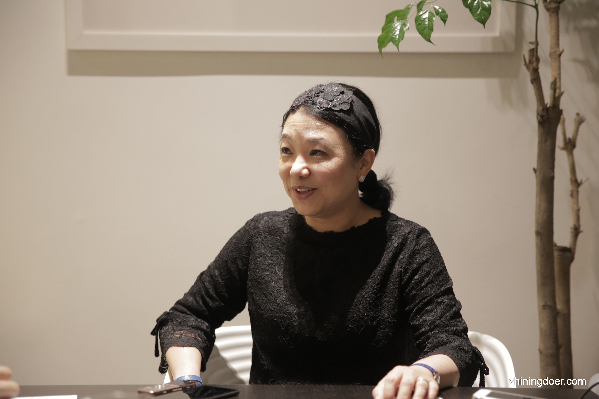

**“一个有经验的创意者应该告诉自己我不是think out of the box, 我是think within the box。因为这个限制已经给你了，在think within the box的时候，我能做到多大的极致。”- 林少芬**

> 【编者按】
> 
> 林少芬算得上新加坡广告界的一姐，她的故事我听闻已久，自从她创办无界限讲堂后，更是期盼着能和她当面聊聊，尤其是她的经历和新加坡的方方面面。最终我们新悦读（后简称"新"）一行四人在她的工作室见到了她。时间约在晚上六点，我们早到了些她还在开会，一进门就看见室内精美的装饰，四周墙上挂满了的画和远处陈列的大大小小的奖杯。不久她从楼上走了下来，一身很素的黑，她说这是她的工作装，上面不少花纹还是她亲自绣上去的。一见到我们她就用她极其柔和的语调向我们问好并将名片一一递到我们手上，寒暄了一阵她又把她亲自做的两款糕点拿出来给我们吃。说实话，我不怎么爱吃甜食，不过一尝之下也是不禁多吃了几口，又觉得林少芬（后简称“林”）是个十分懂得生活的女人。

##Feature|特写

**新: 可以谈谈您的家庭背景吗？幼时的你是如何爱上华文与古典音乐的？**

林：我的曾曾祖父是潮汕过来的，我应该算是第四、第五代新加坡华人，从小我的父母就会花很多时间栽培我，所以我从小弹钢琴、跳芭蕾舞、画画。更重要的是我爸爸从小就把我送去学普通话，因此我也比较多的接触华文的东西。我一接触就很喜欢华文，所以对华文比较偏心，再加上我小时候参加学生演讲比赛都有得到一些奖品，那个奖品就是书，儿童读物、连环故事书，我以前最大的消遣活动就是看书，因此整个人就进入到华文的世界里面。
古典音乐是因为我学钢琴，很早就接触古典音乐，所以就接触贝多芬啊、肖邦等等，也是很自然而然就喜欢。我爸爸也很喜欢音乐，他年轻的时候是口琴队的。我从小就听很多童谣、民谣，也因此对音乐比较多一点认识。我常常跟我公司的小朋友说，当你在年轻的时候听一些不怎么好的音乐，等到你年纪大的时候，你的品味就很糟。所以我喜欢跟年轻人接触，我喜欢他们在很年轻的时候加入我的公司。因为这个时候你还有机会塑造他，把他磨得很不一样。你请一个三四十岁的创意人，如果他来的时候已经带着些坏品味，会很难改。所以从小培养好的品位是非常重要的。

**新: 新加坡经历了一个华文教育一度衰落的时期，您作为过来人有什么体会？**

林: 像我们八十年代在新加坡国立大学的时候，那是一个比较动荡的年代，因为所有的科目都是用英文的，还好我在初级学院的时候已经改用英文了，但我看到那些大我几届的华校背景的学长学姐们都挣扎的很辛苦。
你想想本来你用中文读社会学、心理学、政治学，突然间，都改成了英文，马克思主义成了Marxism，历史唯物主义成了Historical Materialism，这是蛮恐怖的对不对。还好我小时候也比较喜欢英文，所以都一一地克服，我记得我在大学时，都随身带着一本英汉字典，每天对着字典查生字。在这方面比起那些纯英文背景的学生花的心思肯定是更多的。

**新：我在您身上看到的是一个中西文化结合的典范，这样的思想在您的广告设计中有起到特别的作用吗？**

林：有啊，我记得中央电视台第一次找到我的时候，是因为他们看到我拍的中国银行的广告，说要我替他们做一个形象广告，后来我就做了那个心有多大舞台就有多大。之前我也有问过那个负责人，我说国内不是有很多广告人吗，为什么要千里迢迢地找到远在新加坡的林少芬哦，他说因为我在你的广告里边看到的就是你对我们中华文化的认识，但更重要的是我在你的作品里看到西方的美学，讲的浅一点就是不土，我说哦，原来如此。这个是不知不觉表达出来的，可能就像我常说的法国人，他们每天一睁眼接触到的，无论教堂也好，博物馆也好，都是很美的东西，在美食里看到马卡龙，五颜六色，然后你看爱马仕的品牌，它可以把把那些最可怕的颜色放在一起但是得到一个漂亮和谐的感觉，为什么，因为他知道什么颜色跟什么颜色碰撞可以激出怎么样的火花。那这个美学是很自然而然的形成，是因为那个环境。而当我去其他一些地方的时候，也是用同样的颜色，却怎么看怎么不顺眼，为什么呢，我想这就是品味的问题，是自然而然形成，因为你的环境造就了你。品味呢你要从上走下来比较容易，你要从下走上来其实是很困难的，所以要融会贯通中西文化最好的方法就是大量的阅读，大量的涉猎，大量的去接触。

**新：那你会碰到灵感枯竭的时候么？**

林：我其实每天都在挣扎着怎么样去做新的东西，去做不一样的东西。其实有很多很多的限制，时间是个限制、预算是个限制，客户的品味是个限制，员工的能力是个限制，自己本身的拿捏也是个限制。一个有经验的创意者应该告诉自己我不是think out of the box, 我是think within the box。因为这个限制已经给你了，在think within the box的时候，我能做到多大的极致。我举个例子，最近我们在做潮州节的广告，开会时每个人都会给你很多很多的意见，还好这一次有我们潮州八邑会馆的会长郭明忠，他是个很有远见的人，他说少芬你就放心做吧，我挺你。这样的一个保证让我在做的时候压力比较小，这个box就变得比较大了一点，但是这个box又缩水了因为没有足够的budget，所以我以为很大的box，结果又biu地变小了，最后告诉我多两个星期就要上片了，box biu又变小了。所以这个box有时候大有时候小，像我们找不到演员啊或者演员很贵啊，找不到合适的怎么办，找不到的时候那个box就会变得很小很小，于是就开始在身边找朋友啊，亲戚啊，谁可以就抓来做演员，唱歌啊，表演啊，就到处抓啊抓（做抓的手势），做创意就是这样。你每天其实就是在解决问题，因为你每天都会遇到不可预见的问题，好的创意人是解决问题的高手。两个创意人比较，如果两个都是天马行空，但其中一个懂得收回来，那么最后成功的一定是这个，所以你看我们做的创意不是一个人的天马行空，作为一个老板，创意总监，你一定要知道这里面的框框架架在哪里，你怎么把它定下来到最后作为一个可以执行出来得的idea，而且可以执行的好，这个就是你能够做的事情。

**新：听起来您是亲历亲为参与项目每一个细节的人？**

林：对，我是会亲力亲为的，所以我的公司是慢工出细活，我从来没办法接好大好大一个项目我做不来，我宁可量力而为，我知道我公司和我个人的能力在哪，我能够做到多少，我就接适合我的工作。

**新：难怪，很多人也一直好奇您为什么没有把生意做得更大，没有在中国开设工作室？**

林：因为我的个性，我没有想过要做跨国企业，我没有那企图心。我真的就是自得其乐啊，做我喜欢做的东西，甚至有时候赔本做我也很享受那个过程，因为人生到一个阶段的时候你追求的东西不一样。其实广告人有很多idea，有些如果应用在商场上，应该是可以驰骋多年的，但那不是我的个性。

**新：你如何看新加坡现在的广告业氛围？2000年你曾谈过这个问题，提到有很多scam ads，到今天有什么变化吗？**

林：没改变，他们都还在玩飞机稿的游戏，这是一个恶性循环。在新加坡里打开电视机，很好的广告真的很少。每天翻开各个报纸也没有找到很厉害的广告。可是新加坡的广告却能够在全世界的大奖里大放异彩，那些拿奖的广告很多都是假的都是一些飞机稿，因为它们都不曾刊登过。从入行到现在，这种恶性循环的情况一直都没有改变。有些公司全公司的人都在做假广告。那些花进去的钱及心血远远超出一般人所能想象的。你接了一群给钱的客户，却把广告都丢给了junior们去做，而senior却在那里做些假广告去赢奖。其实（做飞机稿）有帮助一些做广告人在构思的时候跳出一些固定的思维模式，可是它并没有让做广告的人的情操变得高贵。作为一个有责任感的广告人，当你拿了客户的钱就是要替他们解决产品推销的问题。同时也必须很专心、很诚恳地把每个广告做好。得奖并不是一个goal而是一个bonus。很多年轻人认为广告得奖后能够引起关注，并且被人挖角而薪水就能两级、三级跳，这个情形会导致广告人做广告只是为了自己。我想如果我当年没有那么幸运地做了林子祥广告并且得奖了，或许我也会变成scam queen。因为我当初做了那些真的广告又得了大奖所以我不懂如何做假的广告。

**新：那回到最初，您从小的梦想是什么，和您现在想做的一致吗？**

林：我以前想做的和我现在想做的完全不一样。我不是从小就是那种优秀的模范生，我不是，我是每天都在做梦的孩子，就在想怎么逃学，怎么回家吃一顿好吃的啦，买一个巧克力啊，冰淇凌啊，跟妈妈去shopping啦，哪个衣服念念不忘啊，因为从小很喜欢打扮嘛。我不是那种将来要做总统，要做名人，我从来没有，我只想说过一天是一天。我爸爸妈妈给我的教育是挺放任的，他们从来不会干涉我要做些什么，而我爸爸他就是个老顽童，他很多东西都鼓励我玩，我上学的时候逃课他都无所谓，偶尔我爸爸妈妈还会到学校接我一起逃学，他们不会很管我的功课，当时我读中学的时候是读理科班，是因为学校觉得你很聪明所以读理科班，可是我很厌恶理科，什么化学啊物理啊，我读得很痛苦，我就告诉我爸爸说我可能会不及格，会留班怎么办，我想转文科怎么办，我爸爸就说可以啊，反正女孩子不用做医生，律师什么的，将来做歌星也可以啊，文星也可以啊，我说那好啊，我就转到文科，我转到文科以后就去CJC（Catholic Junior College）读商科，我也不是很喜欢，读三个月之后我说我要转科了，可以吗？我爸说可以啊，没问题啊，所以他就是这样放任，只要我做得好就好，只要我高兴就好。也因此我有很多free time，我可以花一个月的时间去收集贝壳，一段时间很喜欢仙人掌，买了几百盆仙人掌在那记录，他们也不管。明天要考试，我今天还在研究邮票什么的。

我就是只想做我喜欢的东西，所以你问我从小的梦想是什么，我真的没有梦想，我只想过得快快乐乐，所以大学的时候大一到大四，我都在电台兼职古典音乐的主持，放古典音乐等等，我蛮喜欢这个工作，当时大学毕业以后很多同学都说要找一份工作，我不想找工作，就拿奖学金去教育学院混了一年，之后就去教书，教了一年书之后我每天都比学生更想逃课，每天背着一个包就在等下课，一下课就冲啊冲出去，校长常叫我，Ms.Lim，回来，为什么你每天都第一个跑。我经常迟到，因为很讨厌上课，我的车经常都被挡在外面不能进去，因为迟到以后大门就关了，校长就会说，Ms.Lim you are late，一面说一面继续祷告(笑) ，后来我想我怎么可以教书呢，虽然我很喜欢学生，但是我教不来，后来我就开始找工作，他们说你懂一点音乐，懂一点美术，喜欢服装，你喜欢中文喜欢英文，去广告公司最适合，而我完全不知道广告公司是怎么一回事，就这样阴差阳错去了奥美。我应聘时还以为copywriter就是替别人抄文案的，我的字写得还OK啊，我就想着去帮别人抄字，听说一个月还有两千多块的薪水，还不错，我就去了。第一个campaign就是做那个林子祥的（健力士红舌狗黑啤酒广告），突然间一炮而红，我也是莫明其妙，红了后我老板就给我做副创意总监，第三年就让我做创意总监，那个时候很年轻啊，就管一批人，而我就是无为而治，因为我也不知道该怎么管，他们给我看创意，OK就这样，我自己做我自己的，他们做他们的，就这样平平安安度过了11年。这里面有自己的努力，也有客户的欣赏，还有就是幸运。这个过程里面我发现我还是蛮喜欢创意的，当我每天早晨一起来，我觉得又是一天，我要快快乐乐去上班，因为今天很好玩呐，又可以写东西，又可以做曲，又可以碰到这么多有趣的人，每天上班是一个很愉悦的经历啊，整个过程是很欢心的，一转眼就过了那么多年。

**新：您在奥美得初期没有遇到任何困难吗？**

林：有啊，当然有遇到困难。我去的第一年就是替人家泡咖啡，老板叫我做什么我就做什么。我老板是全世界排第一的创意总监嘛，我东西做好给他看，我觉得很好，但他可以拿着东西丢我，反正他骂人就很凶，我脸皮很厚啊，我也给他骂啊。也有碰到过很坏的客户，曾经有一个案子，我的同事把它做坏了，客户是一家跨国公司的大老板，他大发脾气就抓我去，他说把她关起来，关到那个房间，给她两个小时想idea，想不出不可以回家！啊啊啊，我吓死了，那时还没手机，然后看会议室又没电话，我就在那哭，啊啊啊哭了一个小时，叫天天不应，然后不哭了，乖乖写脚本，两个个小时之后他们就真的来看，有没有写啊，有啊，就给他们了。“你可以回家了。”我一回家就哭啊，一直在想要不要辞，要不要辞，可第二天起来以后觉得自己又是一条好汉啊，然后我就不太在乎地继续上班去。所以也是碰到很多挫折。

**新：觉得您是个非常乐观的人。**

林：我是蛮正面的。

**新：那您现阶段还有什么想做的东西吗？**

林：我现在其实是比较喜欢文创的东西，因为广告是一个很虚很短暂的东西。你看广告的寿命，即使做的再好也就那几年，它的意义其实对整个社会而言不大，经济不景气的时候客户第一个砍掉的就是广告，经济很好的时候广告只是锦上添花。所以我现在比较喜欢一些文创的东西，就好像我们举办无界限讲堂，一方面我是觉得你要回馈社会，另一方面我自己在二十几年的广告生涯中积累了不少客户，有一国之尊，也有凡夫俗子，一直从新加坡到美国到欧洲，到马达加斯加，在这个过程中我发现你的视野越开阔，你看东西的角度就会不太一样，这是个很好的经验，所以办无界限讲堂最大的目的就是想带不同的领域的人来新加坡进行分享，在这样的一个交流里面可以看到些不一样的东西。我们第一次带陈丹青来，第二次带台湾、马来西亚的导演（周青元、齐柏林、魏德圣），下一次我可能会找一些科学家啊，艺术家什么的。

**新：一直很关注无界限讲堂，但我注意到举办的频率不是很高，是什么原因呢？**

林：每一次都很累，都要亲力亲为。除了广告设计的工作以外，还要加上这个，这个是纯义务的，完全就是亏钱的，办一场亏一场。我们也得到郭明忠和其他一些艺人的资助，但剩下的就自己自掏腰包，我有很努力做因为从中得到的满足感是不一样的，但是就是得知道自己的pocket有多深，可能一年不能办那么多场，因为公司也会累。so far我只做了两场，反应还不错，几乎都是爆满。

**新：我们也希望通过新悦读这个平台可以帮到您！**

林：好啊好啊！

**新：说起无界限讲堂，我想延伸下问问您关于新加坡的华文文化。您过去也担任过新加坡推广华语理事会会长，您认为新加坡在华文文化推广方面处于怎么样的box，我们应该如何跳出这样的box?**

林：要学好华文必须真心诚意地热爱华文。如果只是以功利的目的而学的话，那个是很假的也会是很短暂的。从事华文教育的工作者和在新加坡的华社必须想办法，怎么把学华文的这一件事弄得更加地charming，更加地性感。每一年的农历新年，到处都是播放着那些年年都相同并且很俗的新年歌“咚咚酱~咚咚酱~”。而那白色的圣诞，却是那么地美丽，那么地有气质。如果将华文弄得很美、很有气质，像法文一样，就会自然而然地产生吸引力。很多老外在学华文的时候，都把华文捧上天，因为他们都觉得华文是一个很美的语言。**而新加坡却还未看见华文的美，都觉得有关华文的东西都很俗。**

有时候，人是要到某个年龄的时候才能够领悟（华文的美）。身边有很多朋友在年轻的时候都不怎么主动接触华文，可是到了现在已经四、五十岁的时候突然开窍了，读起了三国演义、红楼梦之类的书。他们都看不太懂中文，都是从英文版读起，理解了意思再读中文版。

我也注意到有很多新加坡人去到中国大陆发展，他们都把自己定位在一个很奇怪身份。他们见到老外的时候就会变成了中国通，可是当他们碰到内地的中国人的时候就变得很洋派，顿时变得对华文一窍不通。

在新加坡的华文媒体工作者也得扛起责任，应该认真用心地去做，如果没有把这个华文媒体做好就会是个恶性循环。如果进去的一批都是无心、无热情的工作者，在里面混日子，就算再有多么热衷的人进去了这个圈子，被这整个体质给污染以后也会产生放弃的念头。曾经见过一些很有抱负的朋友，进去了以后两、三年就离职了，因为他们都做不下去了。无论你做什么东西都需要有一群跟你一样有热情、一样拼的朋友，这样做起来比较有力量。所谓孤掌难鸣，当你一个人的时候做不了很多事情。媒体这个东西真的需要大刀阔斧，一大群人愿意一起去做才可以。

现在中国的电视媒体进步得很快，譬如超女、中国好声音等，不管是买别人的产品也好或者是学的、抄的也好，至少在制作上花了很多心思去做。新加坡这里有赌场、滨海湾花园、圣淘沙，这些都很美，可是如果谈到文化这方面，它却是很虚的。新加坡已经建国快五十年了，硬体都做得那么好，应该更有自信地把软体的部分给做好。**软文化是一个很有力量的东西，也是一个必然的发展趋势。**

**新：那您又是这么看待Singlish的呢？**

林：Singlish只要用得好，是很有特色、很亲切也很搞笑的，我并不排斥但也不赞成。就好像新加坡的一个连续剧Phua Chu Kang，它是真的很好笑。如果你是道道地地的新加坡人，你看的时候会慧心一笑。很多新加坡人在新加坡的时候都讲Singlish，可是他们去到外国就会转去proper English。如果你在新加坡跟同事或朋友说proper English，我想他们都会晕了。所以(Singlish)登不登大雅之堂，都是见仁见智。

**新：您对新移民有什么看法？**

林：新移民我接触很多，不同层次的都有，我的公司现在还有不少马来西亚的，还有一位武汉来的。之前有来自韩国、日本，比利时的，都有，我很喜欢不同国籍的人，因为不同背景的人才会碰撞出火花。我觉得作为一个新移民，**如果下定了决心要在这里立足，那就用一个破釜沉舟的态度把自己融入，不用太过勉强，但是用自己最舒服的方式找出一个生活的空间，这是最重要的。**不用刻意和新加坡人结合在一起，因为毕竟成长的背景不一样，不可能和新加坡人一模一样，但是得彼此尊重，人和人之间总是需要空间的，留得刚刚好的时候是最舒服的。**新移民的过渡时间往往是几十年，是需要一个时间的，慢慢blend in，不用刻意去做什么，就是去爱这片土地。**新加坡不是一个好地方，但也绝不是一个坏地方，她千疮百孔，但也有她可爱的地方，你在这里也找得到一些很舒服很美好的东西。我其实很高兴，因为我从新移民身上看到了希望，看到了华文文化可以继续在这里传承下去。

**新：结合广告、创业和互联网趋势问您两个问题。移动互联网和社交媒体正在改变大众了解和传播信息的方式，传统广告业有受到哪些冲击？**

林：其实媒体只是一个载体，不是content。有一个名言是说你的诉求对象在哪你就去哪边。如果你的一群诉求对象是互联网的一群人，你的世界就围绕着一台电脑，那你就去那边（新媒体）。如果你的诉求对象是一群边烫衣服边看电视阿姨们，你就得去传统媒体。这是一个技术上的一个拿捏。以前电台广告的声音是很美的，电视出来后多人都说电台肯定会死，但是电台至今依然还蓬勃发展。因为电台还有生存的空间，只是这个空间被刮分了一些。

**新：有些朋友在创业时面对市场推广的困难，他们的考量是以低成本高效推广他们的产品。如果他们找到您的公司，成本会很高吗？**

林：我对收费并没有那么看重，我更看中公司的老板和他的诚意，合作过程中也可以相互磨合。与客户一起成长，you grow I grow 也是一件不错的事。新加坡有很多品牌，看了以后就会技痒，心想说假如他们来找我就帮他们免费做修改。但也有时候客户找来说帮他们改，可是却要保留一些很土的东西还要加很多额外的东西。找我就是要打破那些东西，如果什么都依他们的话去做，又何必找我。

整个采访持续了两个小时，能聊得还很多，但考虑到我们的故事主人公很有可能还没吃饭，我们也是克制住继续聊的愿望，起身准备离开。离开前林少芬还带我们参观了她的工作室，一栋五层楼高的独立小洋房，一楼是客厅和厨房，二楼和三楼是工作室和剪辑室，四楼是给她丈夫彭文淳导演的，五楼是个小阁楼。印象很深的是她办公室，透明玻璃做墙，里面摆满了书和各种海报，一个像树的枝桠的灯如月牙般弯到她办公桌上方，显得十分俏皮可爱。彭导一直醉心于摄像和电影，我们去时他还在看片子，令人敬佩。

让我们感动的是，在告别时，她拿出了为我们每一个人准备好的由她团队设计的红包和笔记本（如下图）。我在她身上看到的是一个真诚、乐观、博学且极力把自己想做的事情做好的小女人，她不注重物质，更多的是精神层面的享受和一份有所成之后回馈社会的责任感，这样的人没有理由不幸福，这样的人没有理由不受人尊敬。

