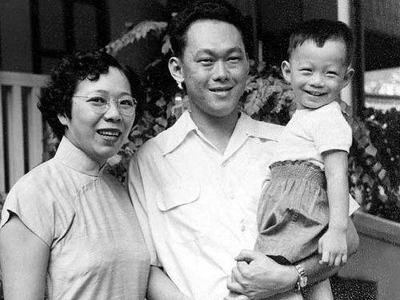
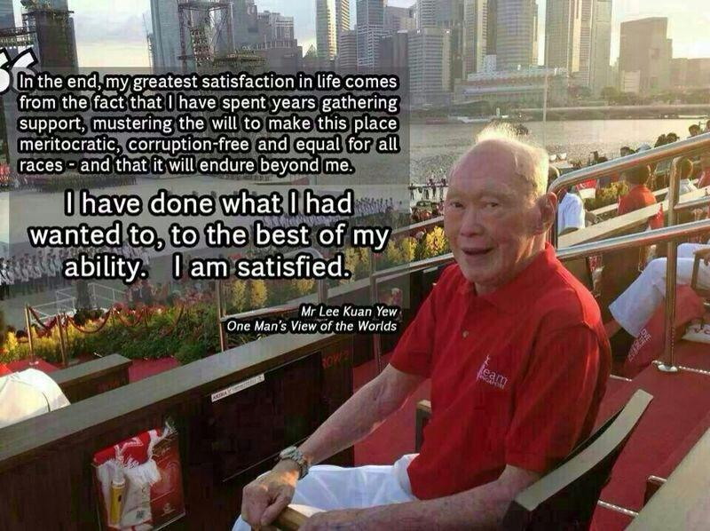
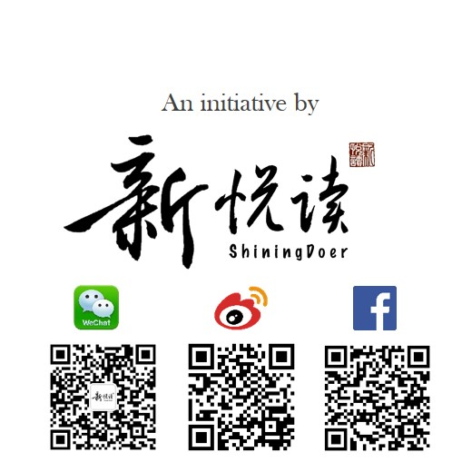

大学期间因各种原因曾多次见到李氏父子。印象较深的几次包括09年李光耀先生来参加Kent Ridge Ministerial Forum，那时的他头发早已白了，说话却还十分利落。当时的我对这位新加坡的伟人了解不多，他的“We’ll make it, do or die”的做事态度却给我留下了深刻的印象。

后来在选读Singapore Foreign Policy时见识到了他的强硬和坚毅，他有着自己固有的思考体系，站在他的角度这是极度务实的体现，而最后事实也证明，他做到了，新加坡也做到了。他深爱着这个自己亲手创造的国家，对外如巨人般护卫着她，对内却也直言陈弊。

11年4月他的儿子也是现任总理李显龙来到了Kent Ridge Ministerial Forum，与李光耀相比，李显龙显得亲切得多，那身粉色的衬衣尤其亲民，成为各大开幕式的焦点。

同年9月李光耀先生在NTU对话会上问出那句耐人寻味的问题:“Have you got a boyfriend?” 那一次让我记住了他的幽默。

14年新加坡国庆，李光耀先生身体欠佳，大家都翘首以盼他的出现。最终当他缓慢地走进现场出现在看台上时，那一刻掌声雷鸣、欢声鼓舞，所有人都起立致敬。而他在大部分时间里握着一面小小的新加坡国旗，在人潮鼎沸中安静地坐着。

最后一次见他却是在14年11月，Marina at Keppel Bay，出海回来被告知有贵宾通过需要暂时在船上等待。于是在夜幕下见着瘦弱的他坐在golf car上经过我们前面又驶向远方，那一头银发格外显眼。所有人都在一旁肃静地等他经过，等他经过后又不禁激动地讨论起来。

而今早，当看到高大的李显龙总理哽咽着念完对父亲的哀悼，我想正如李光耀先生自己所说，他的这一生，无悔。

> “I have no regrets. I have spent my life, so much of it, building up this country. There is nothing more that I need to do. At the end of the day, what have I got? A successful Singapore. What have I given up? My life.”

愿他走好。祝福新加坡。

2015年3月23日 夜
于新加坡

----------
<iframe width="560" height="315" src="https://www.youtube.com/embed/qaLf9lBAYfw" frameborder="0" allowfullscreen></iframe>
（Youtube 视频）

<embed src="http://static.video.qq.com/TPout.swf?vid=o01491ikkt0&auto=0" allowFullScreen="true" quality="high" width="480" height="400" align="middle" allowScriptAccess="always" type="application/x-shockwave-flash"></embed>

（腾讯 视频）

《视界》解说：

2010年，無界限講堂策划人彭导和少芬邀约李光耀资政，为上海EXPO新加坡馆拍摄了这个关于新加坡城市可持续发展的短片《City Made From the Sky》(中文名：雨后天霁）。影片中呈现了新加坡最澄澈的天空，最多变的云彩，最漂亮的绿化，与最干净的水源。

李光耀先生面对镜头，娓娓道来，叙述新加坡这个天然资源匮乏的弹丸之地，如何在短短40多年时间，从第三世界的小镇一跃成为第一世界的国际大都市。真的叫人钦佩、感动和骄傲。

李光耀做到了。新加坡做到了。

这部影片，作为無界限講堂近年来最重要的代表作品之一，为毕生奉献给新加坡的李光耀资政晚年留下了珍贵的影像记录。

