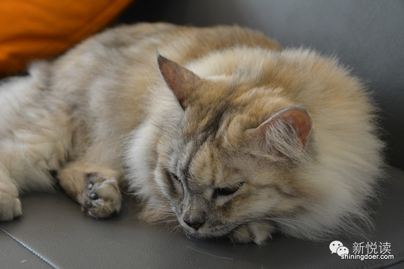

(嘘，内有喵星人款待，客官留步且留神)

<iframe width="560" height="315" src="https://www.youtube.com/embed/KV18HYy13bI" frameborder="0" allowfullscreen></iframe>
(Youtube 视频）
<iframe width="560" height="315" src="https://www.youtube.com/embed/KV18HYy13bI" frameborder="0" allowfullscreen></iframe>
（腾讯 视频）

“咖啡馆”一贯是聊天、读书和发呆的小世界。然而在酒吧餐馆林立的Boat Quay，有一间特别的Cafe，不仅有咖啡、有靠椅，以及诱人的三明治或蛋糕，还有可爱的喵星人在你啜饮拿铁時悄悄懒在你身边——这个混搭的组合，只有在像Neko no Niwa这样的猫咖啡店才能看得到。

一阵清脆的叮当声起，轻拉日式风铃，Neko no Niwa之门随之打开，十三只可爱的猫咪正在装修简约的客厅里各自占着一隅，仰、坐、侧、卧、躺，带着几分自恋享受着它们的正午时光。阳光透过迎河的玻璃窗，放肆地洒进来。不大的店面满溢着猫咪的安逸和舒适。随处可见的小玩意儿都是他们的专属物品；空心的立方体茶几上面盛放食物，下面就是他们领地。墙上的书架是他们曼妙踱步的“T台”，就连你杯中的咖啡，也只是他们欢呼雀跃的陪衬。
乍一看，还以为他们才是店主。

**这就是 “Cat Therapy”治愈心灵的魔力**。

	
 
Sam说：“开始只是想找一种方式纪念我们死去的Marbles。” Sue带着Marbles走进他的生活时，Marbles已经是一只十二岁的“乐龄”猫咪，却依旧可爱得厉害。每当Sam和Sue回到家，Marbles总是在门口迎接，还会用上整整五分钟喵喵汇报这一天的经历。到了睡觉时，Marbles往枕头上一跳，整只身体就那么环在Sue的头上，睡得像一顶皮草帽子。Sam就这样爱上了爱人Sue的Marbles。

失去Marbles无疑是心痛的，但是，很快Sam和Sue就发现，猫咪咖啡馆不仅能够让客人跟猫咪一起嬉戏玩耍,忘却生活中的烦恼与压力，也会让更多的人和他们一样，从一点一滴享受到和猫咪相处的乐趣。

**猫咪咖啡馆这一概念源自台湾，但最早是在日本形成一个产业体系，就连红极一时的女仆咖啡馆也无法企及猫咪咖啡馆的高人气，全日本有超过两百家，只是在东京就有四十多家。**

日本人爱猫是众所周知的，不仅机器猫当上了文化大使，就连和歌山县的火车站站长也由流浪猫来担当。在传统的神道教里，猫被尊为“猫神”，守护着粮库、船舱，甚至是制蚕业，可以说，猫一直活跃在日本人的生活中。Neko no Niwa在日文中是“猫之庭“的意思，Sam和Sue在开咖啡店之前非常喜欢去日本旅游，每次去到不同的城市一定会去找猫咪咖啡。

Sam和Sue曾经在日本看到过，顾客走进猫咪咖啡馆，只是为了在猫咪环绕下睡个轻松解压的午觉。他们特别喜欢日式猫咪咖啡的氛围，而且也在接触猫咪咖啡的过程中，渐渐变成了“猫咪放松疗法”的拥趸，才最后决定要将这一特殊的概念引入新加坡。

	
 
与日本猫咪咖啡不同，Neko no Niwa所有的猫都是领养的，除了两只是从一个家庭领养，其他都是从街上救回来的流浪猫和弃猫。作为爱猫之人，Sam说：“不管是流浪猫还是纯种猫，都是值得呵护的小生灵，流浪猫也可以做我们乖萌的小伴侣。”只是没想到，“小流浪猫”的街头经历给它们带来了各种各样的疾病和寄生虫，在Neko no Niwa筹备的前三个月，Sam和Sue的全部精力都放在看顾这些小生命上，悉心地守着他们康复痊愈，重新变回一个个活泼可爱的小天使。
短短的一年里，新加坡已经开了四间猫咪咖啡馆。**但是在Neko no Niwa，猫咪是绝对的主角，No.1 priority。**

在开店之前，两位店主就做了很多功课，关于猫的习性、如何交流、如何养育等等，更因为自己十五年与猫咪共同走过的经历，希望未来的咖啡馆成为一个有爱又专业的地方，让爱猫人能细细体验与猫咪相处的愉悦。
虽然Neko no Niwa的猫咪们来自各种各样的地方，有着千奇百怪的脾气，但Sam和Sue对它们一视同仁，像自己的孩子一样无微不至地照顾。他们降低沙发的高度，准备了足够数量的猫窝、猫爬架和玩具，还设有猫咪专用通道和卫生室。Sam和Sue还为每只猫咪起了名字，为它们系上代表其性情的彩色项圈。

	
 
最疯的是暹罗猫Monkey，上蹿下跳一刻不停，跑来跑去直到小爪子发烫，还特别好奇。花斑猫佳佳会发嗲，最喜欢睡在你膝盖上求抚摸。全身纯白的Emma最漂亮，高贵而骄傲，你拿起相机对着她，她也只会漫不经心地用蓝眼睛瞟你一眼。还有巨大的缅因猫Muffet和Baloo懒洋洋地从店里走过……Sam说不会勉强让猫咪做什么，“让它们能按着自己的意志行事，才是它们在这里的意义。”

猫咪咖啡馆的规矩特别多，因为不只要向顾客提供与猫咪交流的舒适环境，还要最大限度保证猫咪的生活质量。比如:

    •不能打扰睡觉的猫咪，不能大声喧哗，不能抱猫咪，不能喂猫咪食物等等。

    •客人只能尊重猫咪的喜好，吸引它们凑到自己身边，而不能硬把猫咪抱到自己膝盖上。

有的顾客可能确实不太熟悉如何和猫咪相处，如果调皮的小孩子来，也可能会伤害到猫咪。所以Sam努力保证店里一直有店员紧密照看着，既是为了猫的安全，也是为了顾客的安全。

	
 
许多时候，顾客并没有考虑过自己的某些行为会给猫咪带来深刻的影响，不过开张一年多以来，Neko no Niwa并没有接到任何客人的投诉。这里的猫咪在收养时已经经过挑选，只有性格适合的才留在咖啡馆里，所以它们通常不会有过度的反应。对于不能接受的行为，它们可能会用叫声警告，也可能会把爪子放在你手上表示抗议。即便一些客人难免被轻微抓伤，店主和店员们都会为客人彻底清洗伤口，消毒，保证伤口不被感染。

> “我想光顾这里的所有顾客都明白，和猫咪玩耍会有可能受伤。猫咪并不会有意去伤害人。虽然很多人认为猫咪不亲近人，但它们只是对人类的行为作出反应而已，如果人类的行为在无意中刺激到了猫咪，那猫咪也会有自卫性行为。”

自从2013年的圣诞节，Neko no Niwa第一天开张，到现在已经运营了一年多，被问及咖啡馆的盈利情况，Sam笑说只能算马马虎虎吧。在新加坡做餐饮业不是很简单，因为Neko no Niwa是第一家猫咪咖啡，政府对这一行业暂时没有明确的定位，需要一段时间的理解，所以他们就按照一切从简的原则开起了店。但是一年下来房租、员工的花销还是居高不下，猫咪们的日常开销也不少。虽然猫咪们的生命是十五到二十年，食物和水也不昂贵，但是它们很脆弱很敏感，天天都需要精心的照顾。至于要不要开发新的卖点、增加更多咖啡和餐点的选择来提高利润，Sam认为这也要看顾客的需求，毕竟作为一家猫咪咖啡，主要的关注点还在猫咪们身上。
 

	

猫咪咖啡看似轻松，每天只要抱抱猫咪打理店面，其实和普通的餐饮业一样工作时间特别长，也很辛苦，所以Sue辞了职专心经营猫咪咖啡，而Sam则每天下班后就第一时间奔向猫咪咖啡帮Sue。但是看着店里的十三只猫咪一天天变大，就像看着自己的孩子成长一样，充满了成就感。
一年下来，Sam仍然觉得很多细节可以更完美。比如刚开张的时候，店内的一些设计，还有给进店客人做的介绍和注意事项。有了一年以来积累的经验，现在的Sam要求自己每天都要做得更好，因为眼下才是猫咪咖啡真正的开始。

	
 
Neko no Niwa为新加坡引入了一个全新的概念，这在以前是不可能的。Sam说“一个国家、一个社会发达与否，多少也会体现在人们对待小动物的方式上。而Neko no Niwa展现出了新加坡积极的这一面，让大家意识到新加坡不是一个冷漠的社会，尤其是对于Boat Quay熙熙攘攘的外国游客来说。在这一意义上，我们是相当骄傲的。”
借助Neko no Niwa这个平台，两位创始人希望通过分享他们十五年来和猫咪相伴的经验和知识，帮助人们去理解猫咪。许多人仍然对猫咪抱有偏见，觉得它们又脏又吵，不像其他宠物一样忠诚。打破偏见的唯一方法就是让人们亲自来到店里，亲眼见到猫咪们实际上是多么聪敏可爱的伴侣。当然它们不只需要人类的爱，也需要人类给予相应的尊重。Sam表示不会过分强调这种尊重，但是会尽最大努力帮助人们了解，该如何和猫咪们一起生活。

	 

> **“猫咪并不只是宠物，而是我们的伴侣”**

去年在NUS演讲时，Sam曾这样开场：
“通常人们提起宠物，总是说‘这是我的宠物’还有‘好可爱的宠物’，就像提起一件好玩的东西，忘记了它们也是活生生的生命，在不知不觉中物化了它们。但是假如我们主动去改变自己对这些小生灵的称呼，我们的想法也会跟着改变。假如我们称猫咪为伴侣，而不是宠物，也许能带动更多的人改变看法，开始视猫咪为伴随我们走过生命之旅的小伙伴。这样一些原本要抛弃自己宠物的人，也许不会那么容易、那么快就放弃它们。”
作为本地第一家猫咪咖啡店，Neko no Niwa让喜爱猫咪却不能将它们养在身边的人体验了这种幸福温馨的感觉。但他们想做的还更多，希望在不久的将来，爱猫的人更多，弃猫的人更少。

	
