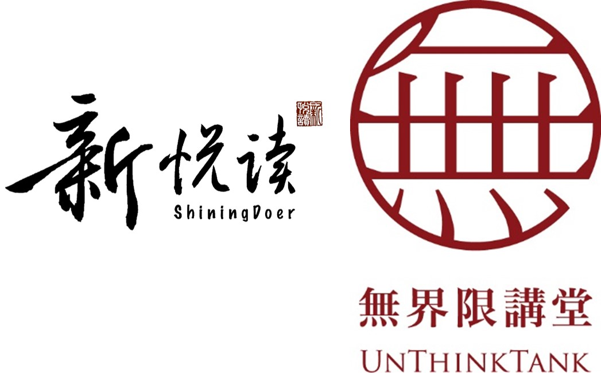
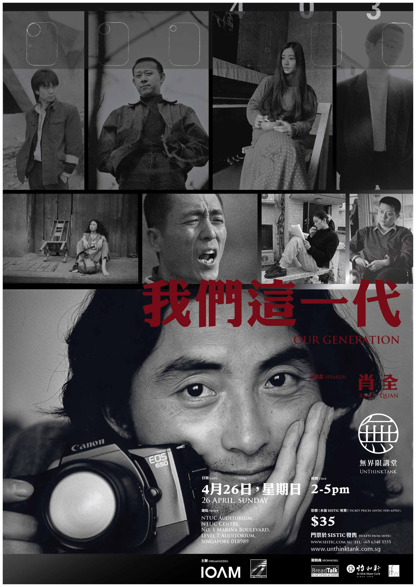

> 

##**【合作伙伴】**
> 
> **新悦读和無界限講堂（UnThinkTank）达成合作伙伴关系。新悦读获授权独家负责無界限講堂在微信平台的宣传推广，也将适时推出对無界限講堂演讲嘉宾的追踪访问报道。**
> 

有人说，“他拍谁，就是那个人一生最好的肖像！”

也有人写道：“如果说，肖全留下了我们这一代最好的照片，毋宁说，他留下了我们这一代最好的记忆。”

这一次，被誉为“中国最好的肖像摄影师”的肖全，首度造访新加坡，亲自与我们分享那些经典作品背后的故事，讲述那些人，与那个时代。

It has been said that whomever Xiao Quan photographs, that will become that person’s best portrait. His photographic documentation of our generation’s best will undoubtedly become our generation’s best memories.

On his inaugural visit to Singapore, Xiao Quan, regarded as the best portrait photographer in China, will discuss the stories, the people, and the times behind his defining book, Our Generation.

> **肖全**
> 
> 1958年出生成长于四川成都。《我们这一代》摄影集的问世与成功，让他得到“中国最好的肖像摄影师”的美誉。据说，不少外国人认识当代中国文化圈，就是从这本摄影集开始。
> 
> Born in 1958 in Chengdu, Sichuan, Xiao Quan is regarded as the best portrait photographer in China. His critically acclaimed book, Our Generation, captures the most intimate portraits of celebrated icons in China. The book has also become a precious document of China’s cultural arena, providing a rare insight into the country’s most important cultural contributors.

> **“我希望在我的墓碑上写道：这就是一个喜欢拍照片的人。”**

老天赐他一张偶像般俊俏的脸庞，极度敏锐的思维，高雅风趣的表述能力，容易被他人亲近的强大磁场，还有，最重要的，一双能穿透灵魂的眼睛。

更令人钦羡的是，他在对的时间点上，做了对的事情。

上世纪八零年代，偶然间被杂志上一张美国诗人Ezra Pond的肖像照所打动、启发，他立志在中国为他所倾心的文化人留下可传世的肖像。于是毫不犹豫地付诸行动，走访多位已成名或未成名的艺术工作者，与他们不断互动、深入交流，终于成为好友，从而将镜头对准他们，在最不经意的剎那捕捉到最赋神思的瞬间，成为经典的摄影作品。这个过程，历经十个寒暑。

三毛、顾城、谭盾、王安忆、张艺谋、巩俐、姜文、陈丹青、崔健、窦唯、陈凯歌、杨丽萍，朱哲琴、艾敬、史铁生、唐朝乐队…

今天，我们再看到这些响铛铛的名字，大家就明白这是多么不可思议的一件事：中国当代最出类拔萃的文化菁英都在这串摄影计划的名单上。

这个“清单”就是《我们这一代》。
里面每一幅肖像作品，皆出自这位摄影家：肖全。

> **“I hope my epitaph would read: This is a man who loves taking photographs.”**

Endowed with good looks, cutting insight, and quick wit, Xiao Quan has a unique magnetism that draws people to him. Perhaps it’s those eyes, that piercing gaze that can penetrate the soul. But what is most captivating about Xiao Quan, both as a person and a photographer, is his impeccable timing – he is gifted with the ability to do the right thing at just the right moment.

Interestingly, it was a moment of serendipitous discovery that paved the way for Xiao Quan’s entry into the world of photography. While browsing through a magazine in the 1980s, the young Xiao Quan was so captivated by a portrait of the American poet Ezra Pound that he too wanted to permanently capture the images of important intellectuals, artists, and cultural literati in China. Inspired and determined, he put his ideas into action, acquainting himself with his subjects and winning their trust. In the process, they became friends and he entered their innermost world.

The resulting collection of timeless portraits, which took 10 years in the making, captures the best of celebrated figures like Sanmao, Gu Cheng, Tan Dun, Wang Anyi, Zhang Yimou, Gong Li, Jiang Wen, Chen Danqing, Cui Jian, Dou Wei, Chen Kaige, Yang Liping, Dadawa, Ai Jing, Shi Tiesheng, and heavy metal band Tang Dynasty. Today, these names have become important figures in China’s cultural arena, and their most intimate moments are captured and published to critical acclaim in Xiao Quan’s book, Our Generation.

##讲座信息：
**时间（Time）：2015年4月26日 14:00至17:00**

**地点（Venue）：Singapore NTUC Auditorium**

**入场方式：凭票入场，订票请点击[这里](http://www.sistic.com.sg/events/ourgen0415#rd?sukey=39297060d6d3d5575f96c6ed21bd2dbb006e9dbf6685686ec0e002055e4fb7bcf96b3bee596bae999f7d98833632533c)**