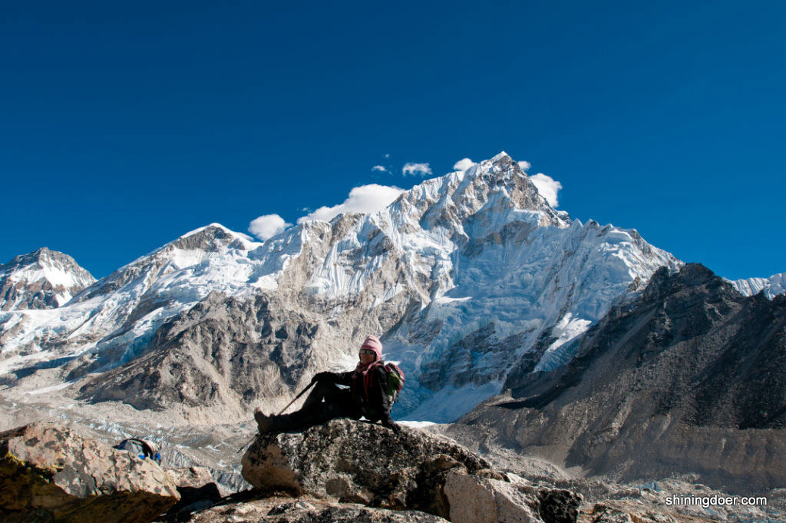
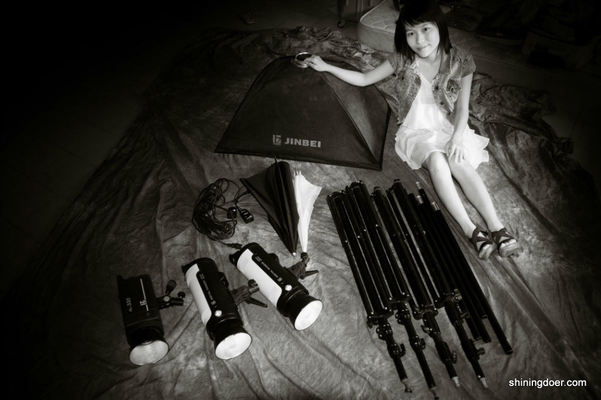

> 【编者按】
> 
> 在一个从追梦向“落定”过度的年纪，我们心照不宣地接受着现实的腐蚀和挑衅。这个“现实”远不是你所生存的外在，而是你蠢蠢欲动却欲语还休的内心。升学、工作、娶妻、生子，似乎要比离开、追随、较真、固执来得容易得多。当下我们习惯称后者为“任性”，因为不论是物质还是精神，它都需要资本，需要一种为了什么而放得下自己的甘愿。作者的文字也算是写给她平行时空里的另一个你。也许，你正走着她想走却没有走完的路；又或许她正走着你想走却还未踏足的桥。

前段时间在纽约时报中文网上看到一篇关于《傲骨贤妻》的神剧评，说到男主角Will的突然死亡是因为饰演这个角色的演员（乔希•查尔斯）的合约期满了，于是该剧评的作者义愤填膺：「他们说，乔希•查尔斯想“转去做其他有创造性的工作，比如说，他想去当导演。”谁不想当导演啊？我敢打赌，要是我的狗会说话，它也会说自己想当导演。」

叫着想当导演也叫了十年了，高中毕业那阵子就十分羡慕去北影导演系的同学。但我也就从此心安理得的开始了经济学本科硕士商学博士的漫长留学路。十年下来，除了所谓的“思维训练”，无所长，在通向导演和电影制作的道路上也未能迈出即便很小的一步。刘瑜的那篇《七年之后》让我很有感触，同样的在留学六年之后没有爱上学术，但我会不会像她一样继续走上学术之路，还是会像她所说的「下一座山再上一座山」，耗费心力去做一件会花大气力又不见得有回报的事，但也许是很想做的事情，比如做导演。

###生活，还是漂泊

有个闺蜜群是我很长时间以来的人生支柱。连我在内五个大龄单身女青年，共同点就是一把年纪穷折腾，各自驾着一叶扁舟逆流而上。我们每人有个群昵称，多少代表了自己的人生走向。其他四个分别叫“辞了职的小白领”，“精神病领袖”，“姓胡的黄老邪”和“粉丝过亿知名博主”，我叫王导。几番纠结之后，她们今年都有点峰回路转尘埃落定的意思。精神病一直在路上，做着蛊惑小青年儿们辞职寻梦的小领队，在世界范围内开疆辟土；小白领在精神病的鼓舞下真的辞了职，回了国，也要开疆辟土了；黄老邪去创业团队做了核心管理工作，眼见着就改掉了拖延症走上职业经理人的康庄大道；博主从南周记者到市场领域无缝衔接华丽转身。只有我，一成不变，空背负王导的绰号叫嚣着梦想，被她们“嘲笑”，却仍旧艰难地独自挣扎在PhD的生死场里。而此时电影工业对我来说还只是个梦，遥远的挂在天边，既不具备技能也不具备机会，没有一条可见的道路通向那里。

**我承认自己不是许三多那种一条路走到黑的人，光是犹疑不定就已经花掉了大部分的气力。**

艺术创作的各种方式都是对抗空虚的解药。回顾在新加坡的日子，摄影玩了六年，拍过十余次婚纱照和百多人证件写真；组乐队做主唱键盘手，也登台表演了数回；背包上路穷游，走马观花遍历东南亚，徒步西藏尼泊尔珠峰南北边；一路上听故事，记录，拍照，写小说，给自己看。倒也是一直都没闲着，像是在给以后的某个事业做积累，也像是在太多地方浪费了精力和时间。**当从前这些方式都不再奏效时，拍电影的想法却越来越清晰地浮出水面。**看到《三体》时想的是有朝一日要把这部恢弘的作品视觉化。说起怎样算是没有白活时，脱口而出的是有生之年能拍出一部《盗梦空间》那样的作品来。电影就像在自己身外生造出逼真的，曲径分叉的额外人生。

###“如果非拍不可，那就去拍。”

李安本身就是个激动人心的好莱坞式励志故事。他的各种访谈看了不少，从他身上似乎可以看到屌丝逆袭走上云端的希望。他说，问自己是不是非得拍电影，如果非拍不可，那就去拍。

李安和张艺谋曾在纽约大学进行了一场对话。印象较深的是李安说电影要有两个层次，第一个层次是谁都能看得懂的故事，逻辑通畅，自圆其说。第二个层次是导演自己真正想要表达的东西。李安游刃有余地做到了这两个层次，以至于他霸气的说：“我的电影作品里，卖座的得了奖，得奖的都卖座”。我的感觉是，李安的《卧虎藏龙》在第一层次说的是中国人的武侠传奇故事，表现的是具有中国古典美学的布景和音乐，第二个层次却是夹着西方思想的内核。所以它比传统武侠电影更受到西方认可。我也在思考，如果横坐标是从东方到西方，纵坐标是从过去到未来，我的定位会在哪里？

对比李安和张艺谋的对谈，三个金马导演——魏德圣，齐柏林和周青云的讲座更像一场逆袭之后的诉苦大会，每人都含着笑却难掩心酸地说着一桩桩血泪往事。

三位导演都不约而同拍不同时期的本土电影，都对从小生长的地方有深厚的情谊。很多导演的处女作或者早期作品都和自己的亲身经历有关，比如托纳多雷的《天堂电影院》，岩井俊二的《情书》。这是最简单也是最难的部分，最容易触发，但要拍得鲜活，接地气，让同时代的人认同却不易。齐导的《看见台湾》略有不同，这是部纪录片，全篇用飞机航拍完成，得益于他多年的空中摄影经验。因为对台湾环境破坏的现象十分忧虑，他出于环保动机想要拍摄这部电影。过去的积累，人生的阅历，所有的点点滴滴都是有它存在的意义。

魏导是基督徒，齐导信佛。我想从全世界导演圈来看这可能只是巧合，但从他们的经历来看，在一将功成万骨枯的节骨眼上，是不是要坚持下去，能不能成，信仰也许是唯一可以信赖的东西。魏导在海角七号之后，把自己所有的钱都砸进了赛德克巴莱的拍摄，他说：我已准备好再次不名一文。投资方在开拍前两周撤资，他四方借债，向周杰伦借了4000万新台币，女主角徐若瑄不仅不要片酬，还倒贴1000万新台币。电影拍摄以每天100万新台币的速度在烧钱。过年的时候他曾因为发不出工资给剧组，在家醉生梦死五天，每天喝醉了便睡，醒了继续喝。在成片之前，没有人觉得这部电影能够被拍成。齐导原本是公务员，却在快要退休的时候辞了职，抵押了房产，用所有积蓄买回了美国的航拍机器。他的儿子曾经给他写字条说：爸爸，你还会有钱帮我付学费吗。台湾人都有很重的家庭责任感，他们从事电影工业，冒这么大的风险，觉得最对不起的就是家人。魏导和李安觉得对不起老婆，齐导觉得对不住儿子。

魏导说，**人生在世100年，做些荒唐事也没什么，即便负债也可以活下去的。**周导的拍摄花絮中有一段放飞热气球的过程，演职人员试了好多次都失败了，当中有个人说，只要不成功就不是最后一次。

李安的那句如果非拍不可那就去拍，细想来很有道理。理想需要积淀，需要被打磨，被阻挠，经历百般无奈，如果不是非做不可的，就自然而然淡忘了，如果还想去做，那便是真爱了。在沉积的过程中，思绪被简化，井喷般的激情受到理性的考量，更知道自己想要什么。

魏导从开始写剧本到拍摄用了十二年之久，在这十二年的过程中除了等待机会以外，他也不停地完善剧本，把生活经验融入进去，于是剧本越来越丰富立体、有血有肉。李安在家待业的六年也不是白过，在不断的自我否定中写出了台湾三部曲的剧本。这些时间成本以及所有可预见和不可预见的难题都是为了鉴别是否是真爱的最好标准。

**如果我最终走向了导演之路，说明这是我的真爱。**

> 【编者的话】
> 
> 正如电影中所说，有些东西未必真的走了，也许他一直都在，只是我们未曾理会。你懵懂的爱情，你模糊的希望，你那从未开过口的潜意识里，兴许就藏着一个“非做不可”的梦想。平安夜这一晚，许一个愿，为理想，珍重。

----------
<embed src="http://static.video.qq.com/TPout.swf?vid=j0142ss047o&auto=0" allowFullScreen="true" quality="high" width="480" height="400" align="middle" allowScriptAccess="always" type="application/x-shockwave-flash"></embed>

王导的第一部微电影《永夏|Endless Summer》正在参选联合早报主办的微电影大赛，如果你想帮她找到真爱，请访问官网并将视频分享到Facebook， Google+, Twitter和微博。

官网：[http://microfilm.zaobao.com/videos/open/1097893/Endless-Summer）](http://microfilm.zaobao.com/videos/open/1097893/Endless-Summer）)

Facebook Page: https://www.facebook.com/microfilmendlesssummer

