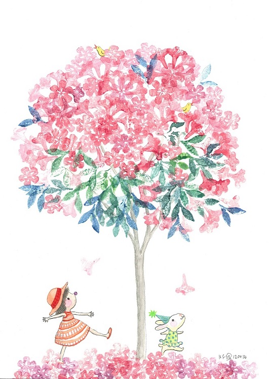

风唱着白色的挽歌 

如洒落的叮咛错落而纷繁

绿色的树都更深绿了

看得远一些就得更贴近夕阳的云

在渐寒的宁静中

不忍回看不知前往
                         

---阿果《听风的歌》

草根书室一直受到文学艺术业内人士的关注和支持，重新出发的草根迎来本地绘本艺术家 - 阿果先生的鼎力相助作为首波主打。水彩画展《听风的歌》将在2014年12月5日4pm于[草根书室] 盛大开幕，展出约一个月。

所创作的作品将作为[草根书室]今后的独家明信片进行出售，如果你听说过在《猫的天空之城》有寄往未来的明信片，那这里贩售的就是寄给过去的童真。

###阿果

阿果，本名李高豐，义安理工学院人文科目讲师，新加坡国立大学中文系毕业，考取南洋理工大学翻译专业文凭，之后负笈英国剑桥艺术学校（Cambridge School of Art, AngliaRuskin University），攻读童书绘画硕士学位。平时喜欢涂涂写写，创作图文与读者分享美的喜悦。目前正积极投入新加坡绘本创作与推广的工作。
已出版的绘本包括《飞飞的快乐星空》、布布系列之《布布爱上动物园》、《布布有个大问题》、《布布想要养宠物》、《布布鼻子不见了》及《布布找到好朋友》；百果香系列之《这是什么呢？》及《圆圆的》，画集《幸福的秘密花园》，以及《Drax the Grey Dragon》。现为《联合早报》专栏“三读空间”作者。

**听风的歌. The Songs of Wind: watercolour illustration**

**夏日空想。Summer Daze: water-colour illustration**

**读静。Reading Tranquillity: Ink + Marker**

**空中梦语。Dream in the Air: water-colour + acrylic**

**如风。Breeze: water-colour doodling**

**唱歌野餐去。Sing the Picnic Song: water-colour illustration**

**听见了……I can hear....: water-colour doodling**

**鸟语花香。Singing Blossom: stamp printing+water-colour illustration**

**Tribute Trilogy 1: "Into the Garden, He Built": water-colour+ gouache on water-colour paper 致敬3部曲之1“背影行渐远，兰馨清如故”**

**Tribute Trilogy 2: "Into the Garden, In Hands": water-colour+ gouache on water-colour paper 致敬3部曲之2“满园落英缤纷，执手漫步黄昏”**

**Tribute Trilogy 3: "Into the Garden, Riding the Rainbow": water-colour+ gouache on water-colour paper 致敬3部曲之3“万里晴空，追逐彩虹”**