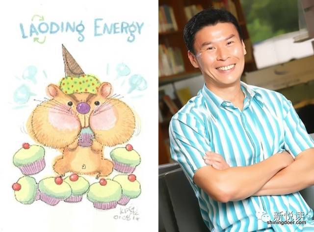
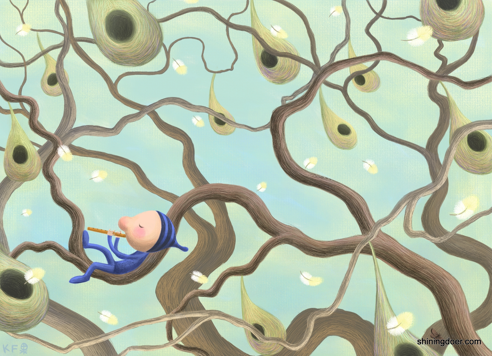
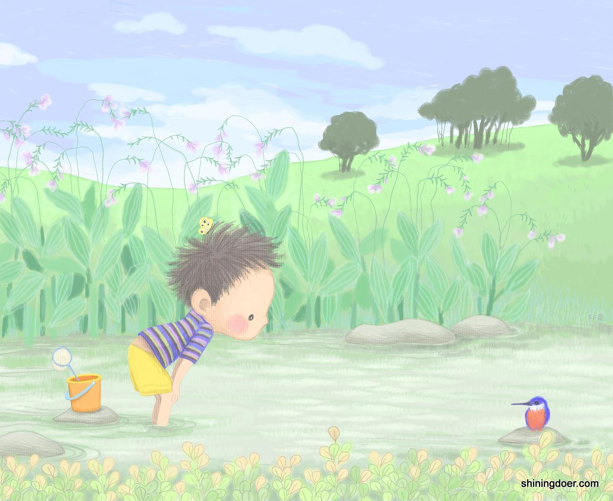

这是新加坡绘本艺术家阿果先生发表于2014年2月14日的绘本作品。
恰巧这一天是中国的元宵节与西方的情人节汇合的焦点。

如同节日带给人的双重温暖一样，原生的“淳朴”与西方的“浪漫”似乎可以为阿果现有的作品做注脚。

阿果是一位新加坡绘本艺术家，画风清新梦幻、充满童话色彩，却又擅长为自己的画作配上耐人寻味的文字。
文与图的双重呈现，使得原本被称作“给儿童看”的绘本，成人读起来也颇觉意味深长。

##文学出身的画家
谈及自己的学派出身，阿果先生坦言自己根本不是“学画画”的，也不会教“画画”，只是兴趣使然。
但是似乎是文学的修养为他的艺术创作铺上了特殊的底色，让其既不缺创作灵感，又充满人文关怀。
正所谓“画逢知己，琴遇知音”，阿果说，自己的作品只是想传递一种美，欢乐、悲伤都是美。真实可感方为美、方能获得读者的认同感。
“我不会写虚假的东西。我写的东西必须是真实的。情感要真实，形式才可以包装。
”阿果创作绘本更在乎自我和“陌路知己”的对话，笔者不禁猜测这也是他的儿童绘本同样适合成人阅读的原因。

孩子看到的也许是勉强认识的几个汉字和一幅充满想象力的美好风景；而大人则是从文字中恍然体悟到心底深处的共鸣，也从图画中找回了丢失已久的童心。
阿果始终坚信，“每个人都应该有童心，无论多大。”
相信这也是他以成人视角创作绘本的初衷之一。

##笑谈创作灵感
但凡优秀的艺术品，都绕不开灵感和创意的话题。
但似乎灵感这个词，只适用于艺术的“门外汉”。
对于作者来说，他们向来是不缺乏灵感的。
泉涌般的灵感也许正是诠释他们身份的底牌。
尽管对于“新加坡的几米”这个称谓阿果谦虚地说远不能与偶像几米相提并论，但作为一个绘本画家，他揭露的个人创作世界仍能带给观者许多深刻的思考。
“美的灵感来自于破坏。一张纸你不去破坏它，不去尝试为它着色，它就永远是一张A4纸，不去剪开它成为一幅剪纸作品，他就永远只有A4纸的属性。
我们这些‘手痒’的人是在试图用美感来破坏它……”。
诚如阿果先生所言，正所谓“不破不立”、“破旧立新”，也许艺术家就是在用他们对“美”的理解来破除日常物品的常规属性，从而为之赋予新的艺术生命，成为一件艺术品。
而这一对心中“美”的实现过程，阿果称之为“灵感。”

##寄语绘本行业
采访中的一个问题勾起了阿果先生受邀出访意大利国际绘本展览会的回忆。
他不禁感叹：“最大的感受是，竟然在意大利找到这么多同仁，原来自己真的不孤单。”
这样的回答让人不得不产生对新加坡的绘本行业的担忧。
阿果坦言，自己创作不为营收，而实际上绘本行业对画家来说本身也不是可以盈利的市场。
“大人们喜欢把孩子们放在书店里面观赏书籍，但并不会把书带回家。”
这很大程度上来源于大众对于绘本的误读。
正如阿果所说，一部好的绘本在不同人生阶段阅读都会收获新知，而并非是我们看到的几幅图片画作而已。

谈到这里，阿果再次回忆起他和“三读绘本”之间的故事。
“好些年前，我在书局找到柳田邦男所著的《绘本之力》与《在沙漠中寻找一本绘本》二书，颇受影响。
柳田先生提出三读之说，认为每个人一生应该三读绘本，一读孩提时，二读为人父母时，三读鬓角泛白望尽千帆时。
这三读总让我想起蒋捷的歌楼听雨，客舟听雨与僧庐听雨。心境转变，观物体会自有不同。
柳田先生摆脱世俗观念，否定绘本仅是幼稚无聊毫无深度的儿童读物。
绘本其实蕴含美好单纯的感发力量，无论是谁均能读出属于自身的领悟与感动。”

联想到阿果曾经在早报专栏写的一段话：我们需要在相乘与减除的态度之间，寻索生存的平衡及文明的真谛。
绘本的简约、单纯与清新，能唤醒我们逐渐蛰伏的最初灵魂。
特此为专栏取名“三读空间”，以鼓励所有朋友放胆反其道而行，提起勇气纯粹为自己而翻阅绘本，安于让生命变得更渺小、更简单、更少暴力。

