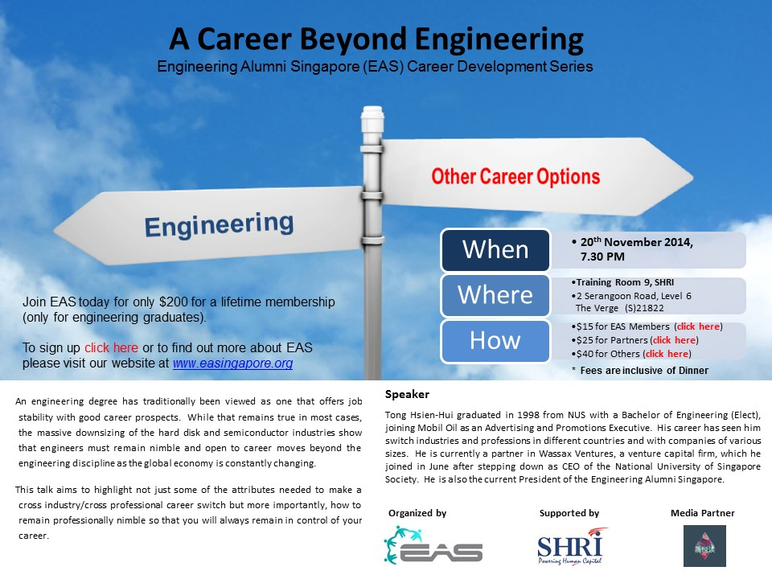

很多朋友都在问新悦读什么时候会有线下活动，其实早前已经预告了会在11月20号。主办方是Engineering Alumni Singapore（EAS）, 演讲嘉宾是新悦读第一期访问嘉宾汤显辉，主题是“A Career beyond Engineering”。他是个非常有意思的人，见多识广，很能打动人，为什么这么说呢，举个例子，EAS背后是新加坡国立大学工程学院，每次开会必有教授到场，所以一直以来都是积极宣扬工程专业的。然而这次他主讲的A Career “beyond” Engineering（相信大家都能理解标题为何会如此委婉;D）却可以得到工程学院的支持。想对汤显辉先生有更多了解的朋友可以参看之前的采访实录。小编相信和他一聊会为大家带来收获。

> ###汤显辉
> 
> 现任Wassax Ventures 亚太区管理合伙人，EAS主席。新加坡国立大学电子工程系毕业生，拥有过短暂的工程师经历，后长期从事广告宣传和商业发展相关工作，先后加入过美孚石油（MobilOil）、SAS 软件研究所（SAS Institute）、Nippecraft Limited, Corporate Express Asia 和新加坡国立大学协会（NUSS），期间还创办了自己的公司Tong& Company，从事市场咨询业务。

多的不说了，上图。

活动信息如下，
   
An engineering degree has traditionally been viewed as one that offers job stability with good careerprospects.  While that remains true in most cases, the massive downsizing of the hard disk and semiconductor industries show that engineers must remain nimble and open to career moves beyond the engineering discipline as the global economy is constantly changing.

This talk aims to highlight not just some of the attributes needed to make a cross industry/crossprofessional career switch but more importantly, how to remain professionally nimble so that you will always remain in control of your career.
 
**时间**：11月20日 7:30 PM

**地点**：Training Room 9, Singapore Human Resource Institute, 2 Serangoon Road, Level 6, The Verge (S)218227
 
**报名链接**[点此](http://www.eventbrite.sg/e/a-career-beyond-engineering-tickets-5263882414)。

接下来重点来了！在enter promotional code里输入**xinyuedu**你会神奇地发现入场费变成了25，包晚饭。（小编会告诉你这是作为新悦读读者才有的特别折扣吗:P）

名额有限，感兴趣的朋友就赶紧报名吧！
