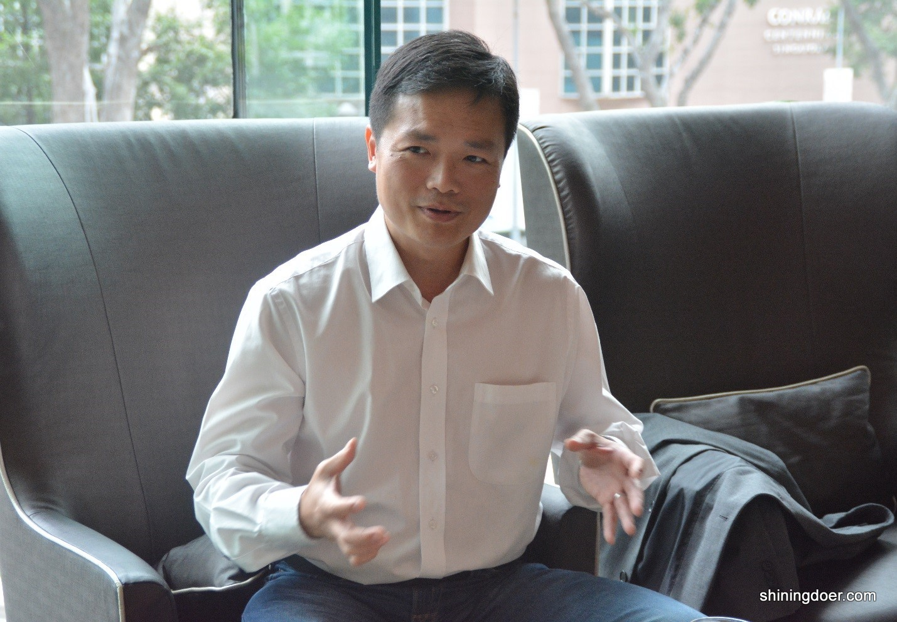
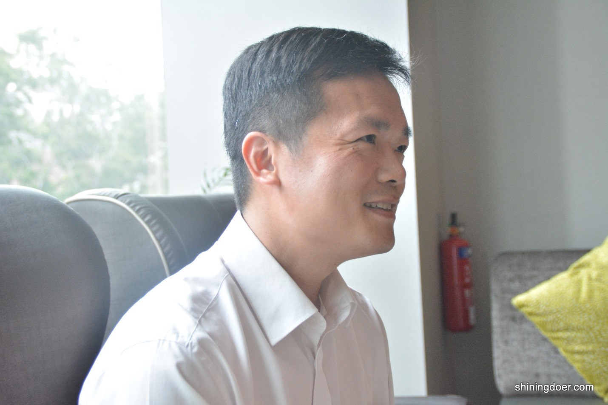
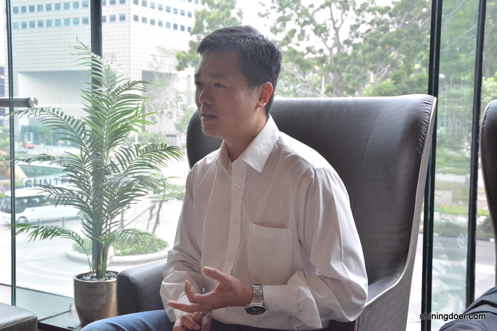
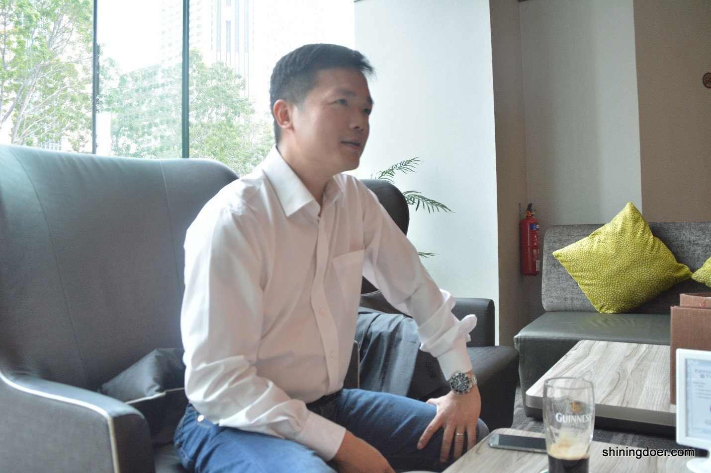
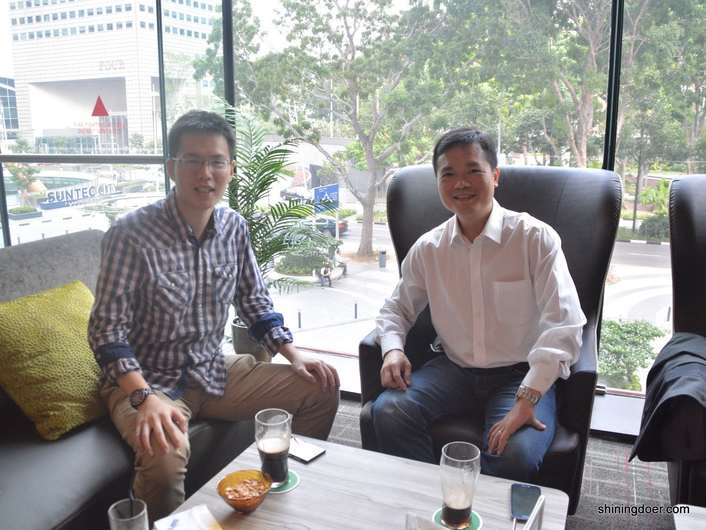

**职业选择**是个永恒的话题，大多数人或许在将要走入职场前才会考虑这个问题。能够早早知道自己的兴趣所在，选择学习并从事相关行业的人是幸运的。但笔者相信依然有不少人抱着对自己专业、职业的迷惘在学习和工作着，即便是在工作几年之后心中依然会有不知是不是该转行或不知如何才能转行的困惑。

本期《新悦读》的访谈嘉宾汤显辉先生（Mr. Tong Hsien-Hui ）结合他自身丰富的职业和创业经历为我们提供了一系列极具参考价值的宝贵经验。汤显辉，现任Wassax Ventures 亚太区管理合伙人，新加坡国立大学电子工程系毕业生，拥有过短暂的工程师经历，后长期从事广告宣传和商业发展相关工作，先后加入过美孚石油（Mobil Oil）、SAS 软件研究所（SAS Institute）、Nippecraft Limited, Corporate Express Asia和新加坡国立大学协会（NUSS），期间还创办了自己的公司Tong & Company，从事市场咨询业务。笔者深入挖掘了汤显辉（以下简称显辉）先生职业生涯中的一些有趣的故事，以期从不同角度为读者们提供较为实际的借鉴例子并能对自身的职业选择有所启发。

**（新悦读将协同EAS在11月20日带来汤显辉先生“A Career Beyond Engineering”线下分享会，关注新悦读，以获得分享会最新信息和优惠票价！）**

**新：为什么要选择学习工程（电子工程）？**

**显辉**：最初我想学历史，因为那是我很感兴趣的科目。但不幸的是，当时的历史系毕业生在新加坡就业前景相当惨淡。工程专业因为它可跨行业的灵活性加上当时有跨行业招聘经理的需求而成为我的第二选择。我那时的数学和物理学得还不错，于是就这样被新加坡国立大学工程系录取。第一年是综合工程课程，学生们在第一年之后才选择具体学科。那时我觉得我更适合电子工程, 因为那些电路和逻辑门让我很着迷。老实说，我也觉得学电子工程会给我在即将到来的互联网时代中奠定坚实的技术基础。

**新：刚毕业时你都在想什么？**

**显辉**：那时的我并不清楚我想要做什么。事实上毕业前我申请了很多不同行业的公司，并有幸得到了IBM，埃森哲和美孚（现在的埃克森美孚）的工作邀请。这些工作机会都是管理培训生计划，所以它并不需要我具备任何工程经验和知识。我必须很诚实地说，我决定加入哪家公司的判断标准是基于哪家公司给的钱最多。美孚是一个很伟大的公司，有着优秀的员工和文化。但如果以我现在的理解再选一次，我会加入埃森哲，通过咨询项目让我在职业早期获得更广泛的业务知识，和埃森哲相比，美孚只是教给我了一种做事情的方式。当时的我基于公司的知名度和薪水，而不是工作本身可以带给我的经验做出了选择，这是我过去的一个遗憾，但与此同时，我也明白，如果现在年轻人基于同样的原因选择了自己的职业，这没有什么不妥。但是如果在工作三年后，你基于同样的原因做了下一个职业选择，那你可能需要重新考虑下你的长期目标。

**新：可以谈谈那段非常短暂的工程师经历吗？**

**显辉**：我唯一在工程方面的经验，是作为一名实习生在惠普工作了六个月，期间我被分配去负责建立一个来自美国的新的半导体沉积工艺生产线。我很幸运能够在一间制造当时最先进的半导体激光器和发光二极管的工厂工作。实习所获得知识让我能够做关于蓝光激光的研究论文，这是当时最新的东西。虽然生产线的按时完工带给了我极大的满足感，但我知道它不会是我喜欢的事业。所以当我毕业的时候我没有选择申请这份工作。

**新：可以讲讲你早期的职业经历吗？特别是你的创业经历？**

**显辉**：在美孚，最初我被分配到广告促销部门，在那里我负责美孚1号品牌和每年100万美元的广告赞助预算。美孚像大多数的跨国公司一样，他们并不介意你是否有这方面的经验或训练，他们会把你放在职位上去做然后看你的表现如何。在工作的最开始，我就像离开水的鱼。我对广告的东西一无所知，根本不知道该如何推广促销产品。因此我变得非常谦逊，午餐时候经常向前辈们了解他们的思路和想法。由于管理培训生计划的性质，我的很多前辈已经经历了一轮广告宣传项目，给了我很多建议。另外在支持我的同事中建立起的人脉也对我很有帮助，所以在我工作仅仅几个月后我便被派去负责车展上的美孚展台。

对于不懂的东西要敏而好学不耻下问，这点非常重要，如果你想跨行，这也是一个必要的潜质。还有一点至关重要，作为年轻人，你要尽早建立你的社交网络和专业人脉，不要将自己只局限在一个朋友圈子。

在美孚和与埃克森兼并后不久我就离开了。在离开前，由于一个非常成功的车展，我已经被提拔去做一个很有吸引力的销售职位，所卖的船用润滑油畅销于世界各大航运公司。当并购发生后，我才知道我会被分配去做区域分析师，一个坐办公室的工作。我将这视为一个降职，所以当SAS愿意提供给我一个IT相关的销售职位时，即使我的主管试图说服我留下来，我也辞职了。直到后来，我才知道在埃克森文化里，分析师是远高于销售人员的，而且当时我被给予了一份高于我的薪酬等级的职位。这件事我明白了不同的企业有不同的价值体系，不能根据自己当时的角度草率的做决定，而是在做决定之前需要更多的考虑。那时候我还年轻，浮躁和自大，以为我知道的就是最好的。在兼并时一位比我资深同事被赋予了相同的职位，现在他已经是位于得克萨斯州的埃克森美孚公司总部的润滑油事业部主管。如果当初我留下来，在那职位上的也许就是我。

转换行业是很不容易的。你必须学习新的商业模式，新的销售结构，新的人际关系等等。我在加入SAS时有一个非常体恤下属的老板，但即便如此，为了完成销售任务我仍然顶着巨大的压力。对于我之前从未从事过IT相关的工作的事实公司从不关心。最难的是，SAS卖的数据挖掘软件，是当时是最抽象最难出售的软件之一。不像现在每个人都知道数据挖掘和大数据，在2000年我加入SAS的时候，即便是对于经验丰富的IT销售人员，这也是个迷。幸运的是我电子工程方面的背景使我更容易地去掌握它。我时常和我们的IT顾问一起午餐，他们不仅帮助我了解的公司的产品，还帮助我了解我们的客户。我想我是唯一一个与技术员共进午餐的销售人员，我相信他们也很愿意和我聊。我可以告诉你，如果早期没有这些IT顾问的支持，帮助我说服客户购买的我们的软件，我一定会失败。在我当销售的这段期间我形成了一些直到今天我仍秉承的商业价值观：

*1. 永远说真话。在销售方面，谎言往往很容易被发现，尤其在当今互联网世界中更是如此。*

*2. 你的话是你的（信誉）凭证。一旦你做出承诺，这是你的个人信誉，而不是公司的。即使你的公司会面临亏损又或是你必须自掏腰包付出赔偿，你都必须确保不仅你的客户和老板，还有你的下属都可以相信你说的话，这点至关重要。无论你走到哪里，这样的信誉都会跟着你。这听起来或许很容易，但这也是最难以坚持的价值观。*

*3. 当事情出错时（必然会有事情出错的时候）一定要老实地说出原因，而且始终要确保给你的客户一个很好的理由让他们可以给自己的老板说明！这是在咨询项目面临延迟或出了问题时，我为了帮助技术同僚们而学到的一个技能。他们真的很感激这样的帮助，因为在过去销售人员更多地是站在客户的一边而不是他们那边....支持永远是双向的！*

就在这个时候，我遇到了一个一直在寻找机会自己出来创业的麦肯锡的高级顾问。他很欣赏我的销售技巧并建议我们一起开一个营销咨询公司，着重以客户已有的数据进行深入挖掘并以此为基础去发掘新趋势（机会）。说实话那时的我有着不错的收入但我（更）希望接受新的挑战和学习新的东西。因此，我们建立了伙伴关系，他建议用我的名字去注册一个新加坡公司。因为我们对这个行业都很了解，去拿一些大公司的项目并不是很难。但也正是在创业的过程中，我们学到了现金流的重要性。当我们需要每三十天就给我们自己的顾问支付工资时，一些公司需要150至180天才能支付我们的款项。

当我们不得已去催款时，我们甚至被告知如果要提早支付，我们需要承担5%的额外费用所以我们拒绝了。那是一个令人沮丧的时期以至于我们曾一度严肃认真地考虑是否要回到企业界（放弃创业）。就在此时，我们从一个高收入客户那里得到了一个机会去参与一个在美国的项目，于是我们决定把业务重心放在美国市场（更具体地说是是在纽约）。纽约是一个完全不同的环境。那时依然是牛仔的时代—— 金钱为王，而华尔街是一个（金钱）帝国。我曾经在前一天才看到项目书第二天就从同一个人那里拿到数百万美元的合同。当时的华尔街给与那些饥饿的（拥有竞争力的）企业以丰厚的回报，而我们当时心态是饿的都快要发疯了！在这个细分行业内，我们的业务份额持续地增长，直到有一天我们的一个客户意识到比起一直雇佣我们，买下我们的业务并把它整合成自己的一个部门更划算。

我的搭档（对于要不要卖公司）很犹豫，但我一心想着在年轻的时候就拥有足够财务保障于是便极力促成了这笔交易。具有讽刺意味的是那家公司支付给我的搭档一笔钱让他留任2年，继续领导由我们公司整合而成的部门。然而那家公司给了我一笔更大数额的钱让我离开，因为他们不需要销售人员！

**从这次的创业经历中我想强调的是有一个好的合作伙伴是非常重要的。**我的合伙人和我从来没有争论过我们的个人薪水问题，我们工作时没有多余的坏情绪并且大多数时候相处得非常融洽。如今，他依然是我最好的朋友之一，并已退休与他的家人在菲律宾居住。**创业并不适合每一个人。这是一个艰苦的工作，压抑、孤独。而且钱永远是紧张的，你需要自己亲力亲为每一件事。在跨国公司，在诸如人力资源的部门都会有进一步的细分部门。而创业意味着一个人做的一切。然而，成功后的满足感也是无法比拟的。**

**新：你怎么看待“跳槽”？你认为跳槽太多次会有什么负面影响吗？**

**显辉**：回想起来，我总结了一下我跳槽的原因：

- 优厚的待遇（美孚）
- 感觉不被重视的（从美孚至SAS软件研究所）
- 想创业（从SAS 软件研究所到Tong &Company）
- 想要了解一个新的行业（Nippecraft）（NUSS）（Wassax Ventures）
- 可以参与一个令人兴奋的新项目（Nippecraftto Corporate Express）

我很幸运地在大多数情况下，当我选择离开时公司会给与更好的待遇挽留我，但我所学到的一件事是，一旦你已经明确表达你想离开的意愿时，无论待遇多好最好都不要留下。
你在离开时最好给公司一个好的印象。这绝对是至关重要的，因为世界很小，我们做出的事情说出的话总会以另一种方式来到我们身边，对我们造成影响。因此要学会控制你的愤怒然后继续向前，永远不要批评你的前公司，因为它会对你造成很不好的影响。
当我评估简历的时候，我很少担心候选人有太多的工作经历的问题，只要他的简历能展示出其专业的进步或者经历了不同的行业。我将这个视为一个优势，这表明他适应性强，并愿意不断学习。但这有一个限制，你不可能在一年时间内对一份工作有充分了解并做出贡献。一个聪明的人通常可以做到2年（1年完整的学习，1年做出贡献），平均（在一家公司时间）为3年。对于那些进公司还不到一年便跳槽的人，我会认为他在这段期间没有好好工作。

**新：对于想转行进入商业领域的工程师，您可以给一些建议吗？**

**显辉**：我认为无论什么专业的工程师，我们都会被训练以能够用一套系统而明确的方法去思考、解决问题。这在很多行业都是备受追捧的特质，这也是为什么很多工程师被银行挖走的原因。与此同时，从事商业领域还需要具有一些特质，而这些特质并非所有工程师都具有。
1) 良好的沟通技巧。你是否具有良好的沟通和写作能力？
2) 演讲技巧。您是否能够地将你的想法轻松而明确地表述给你的上级、同事和客户？你是否可以将你的演讲专注于核心问题，而不（仅仅是）技术问题？
3) 合作和人际交往能力。商业领域的各部门往往彼此之间相互依赖，你和其他部门同事的合作是至关重要的。
4) 对不确定性和缺乏透明度的适应能力。工程师的角色的定义更加明确，工作性质很明确只要你能做到你自己的那一部分就可以了。商业领域不是这样。很少是明确的，并且可能随时改变。
5) 娱乐的（性格）。这是一个有争议特质，在任何MBA课程中都不会学到。你必须喜欢会见和招待客户（股东）或者你很会假装让他们认为你很喜欢这么做。我见过很多工程师具备1-4的特质却不能取得进展，是因为他们在这一点失败了。实际上我在晚餐时间完成的交易远比在办公室完成的多。因此，作为一个工程师，你必须非常认真的考虑转换行业是不是你真正想要的。

**新：作为WassaxVentures的管理合伙人，你对目前在新加坡的风险投资环境有什么看法？你投资的重点是什么？**

**显辉**：Waassax按全球风投公司标准来看只是一间小型风投公司，我们主要关注的是生物技术和数码技术领域内的初创企业。新加坡的风险投资环境已经被政府资金和政府项目所扭曲。这导致对新加坡的本地企业的估值远高于此领域其他同行的企业，我认为这是为什么自创新科技（Creative Technologies）之后没有什么具有影响力的初创企业诞生于新加坡的原因之一，而且就连创新也是在美国孵化的。由于有丰富的政府资金供给，初创企业失去了追求利润的动力而是转而把精力用在如何申请到政府资金上。这是我个人观察的结果，如果有不对的地方，我也欢迎指正。作为亚太区管理合伙人，我关注的重点是那些活跃在更问哦广阔市场上的，能为我的公司提供更好价值的初创企业。

汤显辉先生在百忙之余依然抽出时间欣然接受了我的采访要求，交流中他语速略快，思维缜密，时不时穿插些深入浅出的例子，让人醍醐灌顶且越发想和他聊，或许这正是他一路走来所磨练出的一项特质吧。
