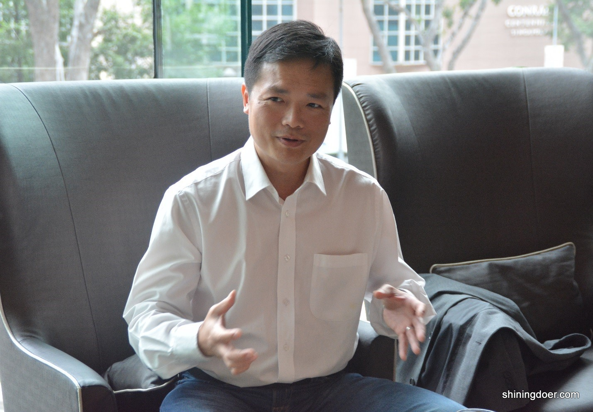
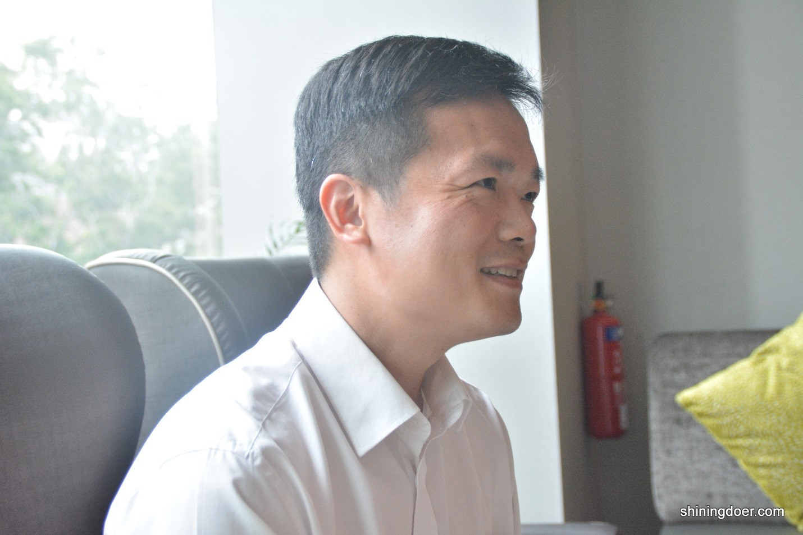
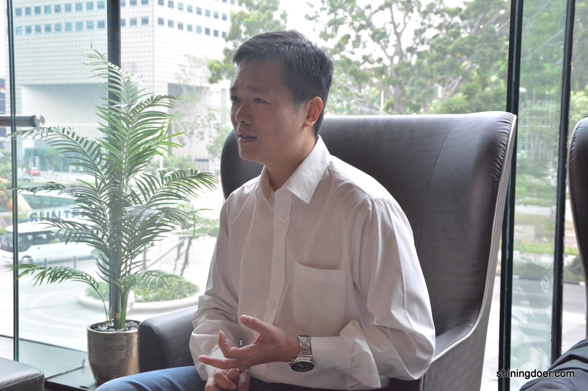
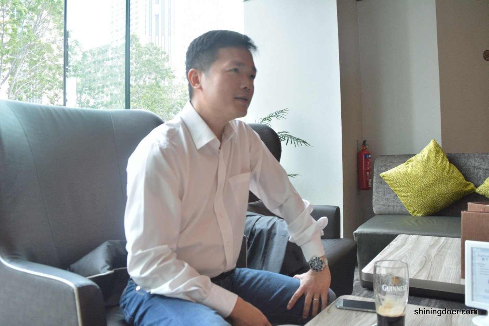
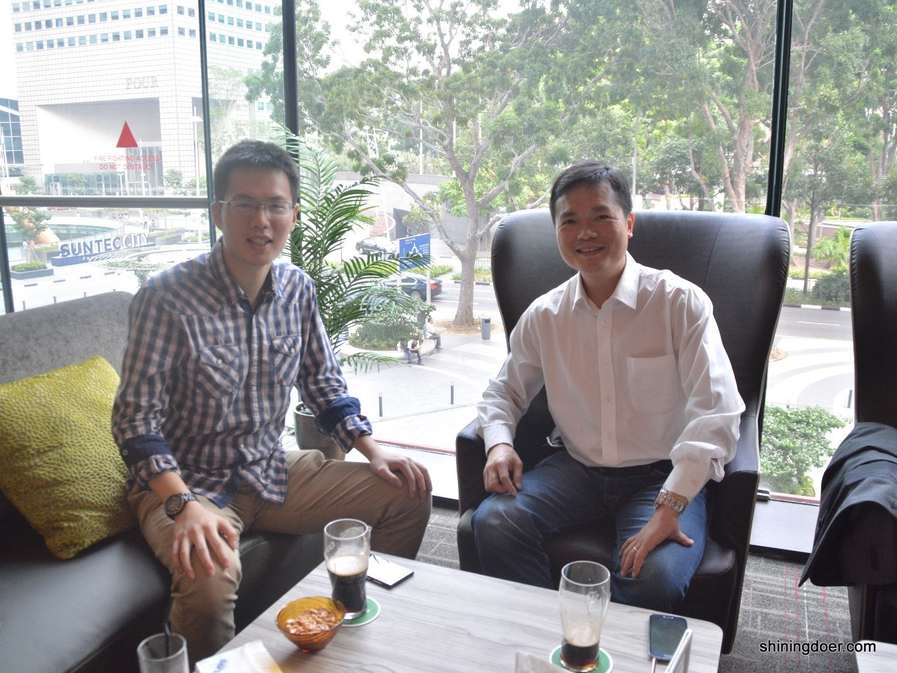

**采访英文实录**

新悦读将协同EAS在11月20日带来汤显辉先生“A Career Beyond Engineering”线下分享会，关注新悦读，以获得分享会最新信息和优惠票价！

以下是英文原版稿件，以飨读者。

**1 Why studied Engineering(electrical engineering)?**
 
I had initially wanted to study history as it was a subject that I was interested in, but unfortunately, job prospects for history graduates in Singapore were pretty poor at the time.  Engineering was a second choice because of its flexibility and its broad based appeal for hiring managers across industries.  I was also fairly decent at mathematics and physics so got accepted in NUS Engineering.  The first year was a general engineering course. Students chose their discipline of choice only after the first year. After that first year, I felt that I was more suited for electrical engineering as circuits and logic gates fascinated me.  Honestly, the practical side of me also knew that electrical engineering would give me a solid technical foundation for the coming internet boom.
 
**2** **What were you thinking when you were graduating?**
 
I wasn't really sure what I would like to do. I actually applied and interviewed with many companies across many industries before graduating and was fortunate to be made offers at IBM, Accenture and Mobil (now ExxonMobil).  All were for management trainee schemes so it was not a given that I would need my engineering experience and knowledge.  I have to be very honest and say that my decision on which company to join was based on who paid the best. Mobil is an excellent company with great people and culture but with what I know today, I would have joined Accenture to gain a broader based knowledge of business at an earlier stage by working on consultancy projects for several companies, compared with Mobil which only showed me one way of doing things.  I had made a choice based on company reputation and salary rather than the type of experience that the job could have given me.  That perhaps would be one regret I had.  At the same time, I also understand if young people make their career decisions for the same reason.  There is nothing wrong with that.  However, if after three years working experience, you make your next career move for the same reasons then you may want to reconsider your long term objectives.
 
 
**3 How was your rather short full-time engineer experience?**
 
My only engineering experience was as an intern at Hewlett Packard for six months where I was assigned to set up the manufacturing line for a new semiconductor deposition process from the US.  I was fortunate enough to be working in a fab which was manufacturing the latest semiconductor lasers and LEDs. This knowledge would allow me to do my research thesis on blue lasers which was at the time the very latest thing.  While it gave me great satisfaction when the line went live on time, I knew that it may not be something I would enjoy doing as a career.  It was for this reason that I chose not to reapply when I graduated.   
 
 

 
**4 Can you share with your career experiences in the early stage? How about your start –up experience?**
 
In Mobil, I had initially been assigned to Advertising & Promotions where I handled the Mobil 1 brand and a sponsorship/advertising budget of $1M a year.  Mobil,like most MNCs, have a culture whereby they don't bother if you have any experience or training in that area but throw you in and see how you perform.  When I was first given the job, I was a fish out of water. I knew nothing of advertising and didn't know anything about how to develop a promotion. I therefore ate humble pie and went round to my seniors to pick their brains and ideas during lunch time.  Given the nature of the management trainee scheme, a lot of my seniors had already done a cycle in A&P and could advise me.  It was also good to build up a network of support among my colleagues which stood me in good stead when I was tasked to set up and run the Mobil booth at the Motor show just a few months after I was posted to my job.  It is important that if you do not know something, tobe humble and ask people.  This is the one underlying trait that is necessary if you wish to cross industries. It is also important as young people, that you start building up your social and professional network as early as possible and not restrict yourself to just one group of friends. This is absolutely vital.
 
I left Mobil shortly after their merger with Exxon.  By that time, I had already been promoted after a highly successful motor show and been transferred to a high profile sales position in Marine lubricants, selling to the major shipping lines of the world.  When the merger took place, I learned that I would be transferred to a regional analyst position, a desk job.  I saw this to be a demotion and when offered a position in IT sales with SAS, I left even though my management tried to convince me to stay.  Again, on hindsight, I realize that Exxon value analyst far above field sales people and what I was being given was a position above my pay grade.  Here I learned that different companies have different values and not to make hasty decisions based on what your personal perspective of the situation is, but to give changes a chance before deciding.  At that time I was young, impetuous and arrogant, believing that I knew best.  One of my more senior colleagues who was given the same position when we merged with Exxon is now heading a lubricants division in Exxonmobil's HQ in Irving Texas.  Who knows...if I had stayed,that could have been me.
 
Switching industries is never easy.  You have to learn new business models, new sales structures, new contacts, etc....I had a very understanding boss when I joined SAS, but even then there was a tremendous pressure to deliver sales.  That I had never been in IT before was not something they cared about.  On top of that SAS sold data mining software which at the time was one of the most abstract and difficult software to sell.   Unlike today when everyone knows about data mining and big data, in 2000 when I joined SAS,such terms were a mystery to even experienced IT sales people. Fortunately with my electrical engineering experience it was easier to pick it up.  That and my regular lunches with our IT consultants helped me to understand not only the products but our customers as well.  I think I was the only sales person that went for lunch with tech people and I believe they appreciated it.  I can tell you that I would have failed if these IT consultants had not supported me during this early period, helping me to convince our customers to buy more of our software and going out of their way to prioritize my proofs of concept over those of my colleagues.  Some of the business values I hold true today were developed during this period when I was in sales:

-         Always tell the truth.  In sales, lies are too often found out and in today's connected world, even more so.     
-         Your word is your bond.  Once you make a commitment, it is YOUR reputation on the line, not the company's.  Even if your company loses money or you have to pay out of your own pocket, it is vital to ensure that not only do your customers and bosses can trust your word but also your staff.  This reputation will follow you wherever you go.  It sounds easy, but this is one of the hardest of values to adhere to.
-         When things go wrong...and they will; be honest about the reason but always make sure you give your customer a good reason to give to their bosses!  This is one of the skills I developed to help my tech folks when consulting projects got delayed or went wrong.  They really appreciated it because in the past sales people were more likely to be on the side of the customers than on their side....support is a two way street!

 
It was at this time that I met a senior consultant from McKinsey who was looking to venture out on his own.  He appreciated my sales technique and suggested we start a company together that would focus on marketing consultancy emphasizing data mining as a foundation for discovery of new trends within customer data.  At this time, I was honestly, making a very comfortable amount of money but wanted a new challenge and to learn something new.  So we formed a partnership and he suggested putting my name up instead of his as it would be a Singapore registered company.  As we both knew the industry well, it was not too hard to get some projects with big companies.  It was here however that we learned the importance of cash flow.  Some of these companies did not pay us for 150 to 180 days when we had to pay our own consultants on a 30 day basis.  When we pushed for payment, we were even told that to be paid earlier, we would need to take a 5% charge which were fused.  It was such a depressing time that we were seriously thinking of packing it in and going back to the corporate world. Instead, an opportunity to take a project in the US came from one of our better paying clients and we decided instead to focus on the US market (more specifically NY).  Here was a totally different environment.  It was still the cowboy days where money was king and Wall Street was an empire.  I've had binders thrown at me one day and been given a multimillion dollar contract the next by the same person.  Wall Street at that time rewarded those that were hungry and we were starving.  Our share of business kept on growing in this niche sector till one of our customers decided it would be cheaper to buy our operation and fold it into one of their departments.  My partner was hesitant but I was all for having financial security at a young age and pushed for the sale to go through.  Ironically the company paid my partner a sum of money to stay on for 2 years to head the department that our company would be part of...whereas I was given an even bigger sum to leave because they didn't need sales people!  I want to emphasize from this experience that having a good partner is vital.  My partner and I never argued about our own personal compensation, we worked problems out without emotion and generally got along very well.  To this day, he is one of my best friends and has retired to the Philippines with his family.  A startup however is not for everyone.  It is hard work, depressing and lonely.  Money is always tight and you need to do everything yourself.  Having come from MNCs where HR, etc...are nicely compartmentalized into departments, working for a startup means one person does everything.  However, the satisfaction of success is incomparable.   
 
 
**5 What would you say when it comes to “jump ship”? Is there any negative side if someone has too many“jump ship” experience?**
 
Looking back, I have switched companies for the following reasons: 
1. Money (Mobil)
2. Feeling of not being valued (Mobil to SAS)
3. To start a business (SAS to Tong & CO)
4. To learn about a new industry (Nippecraft) (NUSS) (Wassax Ventures)
5. To be part of an exciting new project (Nippecraft to Corporate Express/Staples)
 
I have been fortunate that in most instances where I chose to leave, the company would make a counteroffer to keep me but one of the things I have learned is that once you have articulated your desire to leave, it is best to leave no matter how good the counteroffer is.  
 
You also always have to leave on a good note.  This is absolutely vital as things have a way of coming around and the world is small.  So control your anger and move on...and never ever criticize your ex-company because it will reflect badly on you as well.
 
When I evaluate resumes, I seldom worry if a candidate has had too many jobs as long as it shows him/her progressing professionally or moving to different industries.  I see that as a strength that he/she is adaptable and willing to learn.  However there is a limit to that.  It is impossible to learn and contribute to a job in less than a year.  A smart person can usually do it in 2 years (1 year to learn the full cycle and 1 year to contribute) and the average is 3 years.  For those who change jobs after less than a year, I consider it to be as if the person was not working during that period.  

 
**6 What’s your advice to one engineer who wants to switch career to business track?**
 
I think that as engineers of whatever discipline, we have been trained to solve problems in a systematic way and to think in a clear manner.  This is highly sought after attribute in a lot of industries which is why a lot of engineers get approached to work in banking. That said, a business track also requires people with certain attributes that not all engineers have. 
1)     Excellent communication skills.  Do you speak and write well? 
2)     Presentation skills.  Are you comfortable presenting to top management, colleagues, customers?  Can you structure your presentation so that it focuses on key business issues rather than technical ones?
3)     Collaboration and Networking. Business units are often reliant on each other and working with your colleague sin other departments is vital.  
4)     Uncertainty and lack of clarity.  Engineering roles are clear cut and black and white.  A job is parceled out and as long as you can do your part, it fits into the whole.  Business isn't like this.  Roles are seldom clear and can change on a regular basis.
5)     Entertainment.  This is a controversial one and not found in any MBA class, but you have to either like meeting and entertaining clients/stake holders or pretend so well that they think you like it.  I have seen many engineers with attributes 1-4 that can't progress because they fail at this one.  I have closed more deals over dinner than in offices.
 
So as an engineer, you have to think very carefully if switching is indeed what you want to do. 
 
 
**7 Now as managing partner of Wassax Ventures, what is your view of current venture capital environment in Singapore? What is your focus of investment?**
 
Wassax Ventures by global standards is a very small VC.  We focus primarily on startups in the digital tech and biotech verticals.  The VC environment in Singapore is distorted by the presence of Government funding and their grants and programs.  This has led to the valuation of Singapore startups to be far above of those in the region in similar industries.  I believe personally that this is one of the reasons why there is no big startup to come out of Singapore since Creative Technologies and even they were incubated in the US.  With this abundance of funding, startups lose their appetite to chase after revenue and channel their energy towards chasing after funding instead.  This is my personal observation and I stand to be corrected on it.  My focus as head of the partnership for the Asia Pacific is that regional startups will offer my company better value and are embedded in bigger markets.   

