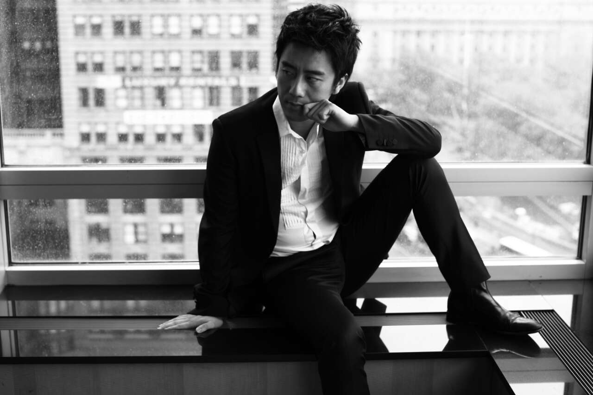
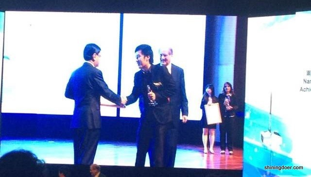

由南洋科技创业中心（Nayang Technopreneurship Center）主办的 Dialogue with Chen Ou 反响热烈，陈欧学长在轻松逗乐的气氛下回答了一系列和创业相关的问题，以自身经验为同学们提供了宝贵的参考建议。
 

陈欧学长此次是受母校南洋理工大学邀请在百忙之中抽出时间前来领取南洋校友成就奖（Nanyang Alumni Achievement Award）的。在报名链接发出后极短时间内迅速积累了众多关注（仅微信平台就有2000多阅读量），注册席位也瞬间爆满，主办方在收到不少询问邮件后，又增加了座位再次开放链接，在现场更是临时拆除了房间的隔墙，以容纳更多的听众。新悦读(shiningdoer.com)小编们作为校友有幸现场聆听，获益良多，特地连夜赶稿，将对话活动精彩回顾摘录如下，希望和大家共享，愿下一个陈欧就出自我们中间，

**主持人：我们事先汇集了很多同学们的问题，现在先统一来问一下，第一个就是能谈谈南大的学习和创业经历对后来在中国创业的影响吗？**
 
**陈欧**：当时谈创业是一个很被鄙视的事情，同学们都想着要进大公司。那是一段靠着番茄炒蛋活下去的日子，天天吃着楼下的鱼片米粉。我讲个我的故事吧，当时就在Jurong west 租屋下面吃着两块钱新币的鱼片米粉，现在应该不止两块钱了吧（台下：四块）。现在四块，物价翻了一倍是吧，工资没翻一倍（台下笑）当时其实是人生最辛苦但学习最快的时候，也实实在在的，像这些成本控制啊、艰苦朴素啊都成为后面创业包括管理公司的一些基本foundation，带来很多帮助。如果没有那段时间和生活，我是永远没法做到最低成本地把一件事做大的。后来在中国做聚美优品的时候，我们只融了1300万美金，1300万美金意味着什么呢，它是非常少的一笔钱，但就是靠着这1300万美金在四年时间我们把销售额做到了六十亿人民币。
 
**主持人：看来这个番茄炒蛋要火了，非常好。那么第二问题是，聚美优品一路走来，你认为哪几个环节对你来说最重要？**
 
**陈欧**：其实我觉得，做创业啊最重要的环节永远是找人，我常说，咱们南大的教育其实是非常好的，很多foundation是非常不错的，而且很多学科是集中了最优秀学生，这里的教育到今天为止，都为我提供了很好的帮助。回到中国的时候，我对国内情况不熟，我当时选择北京而不选择上海的原因是，北京我之前呆过两个月，上海没呆过，仅此而已。在南大经受的教育让我学会能够快速地去把一件事做好，这是一个方面，而且这些特质真正很好地让我去找到我的合伙人、我的团队，包括以前有一个南大的师弟也帮助了我。这是第一个环节找人。
 
第二就是在聚美优品最缺钱的时候，就是我们早期做的不是聚美优品项目，是一个游戏内置网络项目，当时只剩下30万人民币，5个月就要烧死的时候，我们就快速利用当时在南大积累的“屌丝创业生存法则”找到了新的方向，这也是最艰险的时刻，在历史上虽然无数次比如说是爆仓啊，出问题啊，被攻击啊很多次都可能是生死关的时候，但对任何一个创业者，回头看，它们都是插曲了，而最早期的时候，当你确定方向的时候，才是最关键的环节。
 
**主持人：好，刚才听到两个关键的，一个是团队，你周围的同学，都可能是将来的团队，第二我们宿舍里边的“屌丝”，南大“屌丝”（台下哄笑）。大家一定要好好的趁现在这个还有宿舍的环境，好好地体会一下啊。现在好好把这个“屌丝生存法则”练习好，将来创业的时候，我们这个基因就好。**
 
**陈欧**：现在在南大谈创业还会被鄙视吗？（台下：不会不会）挺好的，环境变得不一样了。
 
**主持人：现在聚美优品已经在纽交所敲钟了，那么这个模式是只能是这个中国才能实现吗，还是说也可以复制到新加坡，复制到东南亚？**
 
其实我觉得做企业啊不要太看商业模式，因为以前很多人回到中国创业，就从美国回去，叫C2C, 叫Copy to China 就是模式拷贝，做的第一个事就是美国拷贝到中国，但最后模式全部都是在中国当地创新的，也就是根据市场发挥的。我觉得大家不要太多的去关注于模式，而关注市场，关注需求。前段时间我在飞机上看一个视频，讲multibillionaire，就是告诉大家一个十亿美金的富翁的那种生活，是不错，是比较高大上，够奢侈，它这个其实是一个访谈，里面有一个非常成功企业家说这样一句话：如果你想成为一个十亿美金的富翁，你得去解决一个百亿美金的问题，市场需求在哪里，有什么问题后面没有解决，就是不用看什么商业模式成功我要把它拷贝过来，而是看社会中有什么问题没有解决，有什么问题还不够美满，我的能力和才华可以怎样让世界变得更好，去改变世界，而这时候的话你自然而然会创造出你自己的聚美优品，创造出属于你自己的机会，而你自己的名字也会留了下来，载入史册（鼓掌）。
 
**主持人：非常好！这也就是我们现在所谓互联网思维里面的一个用户思维：一切为用户着想，所以这个是我们TIP (Technopreneurship &Innovation Program)在design thinking中强调的那几门课，一定要好好学（台下笑）。另外创业时候一定要进行破坏式创新，因为你的资源很少。**
 
**陈欧**：另外再补充一下啊，像雷军也好这些大佬，所有大佬他们说的一句话都是“顺势而为”！所有科技企业，都是有时间需求的，肯定是这个节点它有需求产生了，当你能踩住这个点，实实在在去满足需求的时候，你就能成功。千万别完全从自己兴趣爱好出发，虽然我们鼓励兴趣爱好和事业是放在一起的，一定要从事出发，一个优秀的、真正好的企业家，他的判断力可能比起他的技术能力更加重要，这是做大事，就要找到真正百亿美金市场在哪里，这是一个非常重要的一个能力。
 
**主持人：对！你的判断能力比你手上的技术更重要，所以特别是我们学理工科的同学啊（台下笑），不可以只是局限在自己眼前的专业上面，而要把你的这个脑筋放在更大的一个格局面。**
 
现在聚美优品也在这个纽交所敲钟了，想问一下你上市前和上市后的心态，有什么不一样？
 
**陈欧**：上市前我们在国内是比较低调，就是把财报放出来，别人可能会觉得你们公司就是一个可以上电视的公司，上市之后当你把财报放出来的时候，别人看了以后会很尊重，会觉得你是一个非常优秀的非常成功的公司，当然区别是上市前别人骂我可能是骂几千条微博，上市后就骂一万条就比较讨厌了。在一些环境中可能会对过早成功的人有一些不同的想法，这也会带来一些困扰。（所以）现在上市之后就选择比较低调了，对。
 
**主持人：好的，还有就是聚美优品今后发展方向有什么新的想法吗？**
 
**陈欧**：其实简单讲啊，我觉得一个好的企业家是会随着时代的变化去变化你的企业的，像聚美第一天是一个只卖一款产品的网站，但现在已经是国内几个最大的综合电商网站之一了。方向是围绕用户去满足他们的需求，是去找到真正的转换空间。我觉得聚美优品更大的是一个平台，有非常成熟团队的一个平台。做好化妆品、做好时尚。也是一个科技与创新的平台，也许有一天会从这个平台上走出下一个改变世界的科技项目，我们也是拭目以待。
 
**主持人：女孩子的爱美和科技也可以互相有交集。同时我们非常关心现在一个比较时髦的话题，互联网思维和O2O，聚美优品是一个基于化妆品的一个电商平台。你们有没有一个新的基于O2O的这样一个想法？**
 
**陈欧**：其实我们现在也在做一些O2O尝试，比如说和国内一些比较优秀的，出名的美容美发机构（合作），那消费者通过手机端找到一些更好的让自己变美的方式。我们现在手机上的成交量有百分之六七十左右，在电商中算非常高的，所以说这是一个自然的我们肯定会去做的东西，互联网思维有时候还是忽悠太多了，不要学。
 
**主持人：其实现在互联网思维很多人把它当成一个热门的hot topic，但实际上他的互联网其实是跨越了我们Internet互联网，更多的是把生产要素进行重新的组合，所以感兴趣的同学可以进一步思考，把商业模式画布中的9个要素要研究清楚（台下大笑，鼓掌）**
 
主持人：由于时间有限，我们现在最后一点点时间我们留两个问题给在座的听众，
 
**问题一：在创业的时候，你是如何解决面对的问题的？**
 
**陈欧**：我们现在这个团队在中国算超一流的，其实解决问题最核心的是找到共事人和钱，足够的钱和好的人就能解决问题，去年三月份爆仓之后，我们当时找到了我们公司现在的物流副总裁Tony，他原来是亚马逊中国区的物流负责人，其实当你找到一个人的时候他够优秀，他就能创造奇迹，而之后聚美类似的问题在没发生过了。爆仓没爆过了，所以什么意思呢？在创业过程中，会发现所有问题都是人的问题，当人靠谱，人优秀，人的能力强的时候，什么问题都不是问题。真正的问题在于人，这个人有可能是你自己，也可能是你的伙伴，怎么处理人的问题是一个创业者、企业家最棘手，也是必经之路。
 
**问题二：能给我们一些建议，如何去寻找创业合作伙伴？**
 
**陈欧**：其实一般几方面了，一方面是学习能力，另一方面是他的性格，我特别相信性格决定命运，因为性格决定你的选择，决定你的世界观，所以你找的人最核心的是他的价值观世界观，他对事儿的态度，他是否能够去承担责任，而咱们这些身边的同学他们的学习能力和聪明程度都不会是问题的。
 
**补问：那你一般花多长时间去了解这个伙伴？**
 
**陈欧**：我明确地说对你来说有可能身边最好伙伴就是身边同学，因为他们是你唯一能够长时间去了解的人，而真正外面超级大牛啊，他真的不会怎么理你的，你找他来的话他是老大你是老二啊，这是实在的，所以团结好身边的同学，找真正适合的人，他们能陪你走很远很远，而只要是他够聪明，够优秀，够好的话，相信三年之后，他也会让你觉得刮目相看的。
 
**主持人：所以大家一定要珍惜这个南大的同学啊！**
 
由于时间有限，最后请陈欧为我们的同学们说一段寄语吧：
 
**陈欧**：就是希望未来在这群人中能走出下一个更优秀的企业家吧，因为所有的创业环境它是需要有人去鼓励的，什么时候你敢更加大胆地走上创业道路，是因为你的师兄，你的学长，你的朋友们能够创业成功，他们是能够真正鼓励你的人，而不是书上互联网上微博上那些名人大V发言，所以说当有一天，有更多的“陈欧”之后，相信你们也可以更好地激励你们的下一代，你们的学弟学妹，真正创立一个融资和创业好环境，可能未来新加坡，真正创业的黄埔军校就是这里，希望你们取得巨大成功，谢谢！ 

----------
对话之后，陈欧学长前往参加颁奖典礼，从南洋理工大学校长Professor Bertil Andersson和新加坡教育部长王瑞杰手上接过了校友成就奖。

颁奖典礼结束后，小编们有幸在VIP专区和陈欧学长进行了对话。其中部分关于创业的内容，小编们谨凭记忆将内容分享如下：
 
- **为什么七年之后才第一次回新加坡**

- **陈欧**：主要是从斯坦福回来，创业重心就在国内，而且实在很忙，这次因为受母校邀请过来领奖。
 

- **关于新加坡的创业环境**
 
- **陈欧**：新加坡的创业评估体系还没形成，与之相比硅谷的体系很成熟，创业公司和VC都很多，现在在北京，体系也逐渐形成。
 

- **小编**: 新加坡的创业气氛已经逐渐起来了。
 

- **陈欧**：对，而且会越来越好。
 

- **小编**：东南亚市场的潜力也很大。
 
- **陈欧**：是的。
 
- **关于融资**
 

- **陈欧**：因为我很年轻就进了斯坦福，而且加上之前的创业经历，后来再找融资不是很困难，而且很多天使投资人会主动找你。所以一开始还是得做好自己的产品，有一个积累，到后来就好办了。
 

- **关于申请斯坦福MBA**
 

- **陈欧**：一个月搞定GMAT，斯坦福这样的顶尖学校其实不要求很高的GMAT分数，重要的是经历。我当时在新加坡已经把自己Business（Garena前身）做成了一定的规模，这对于他们（斯坦福）而言还是很有吸引力的。
 
- **会做天使投资吗**
 
- **陈欧**：会考虑，无论是通过公司还是以个人名义都会。
 
期间小编们也诚邀陈欧学长未来有机会再到新加坡做分享，学长也表示很乐意，希望用自己的经验激励到更多的学弟学妹和创业中的年轻人们。
 
至于有没有要到名片，小编们只能笑而不语，引用陈欧学长的话：有些事要随缘！