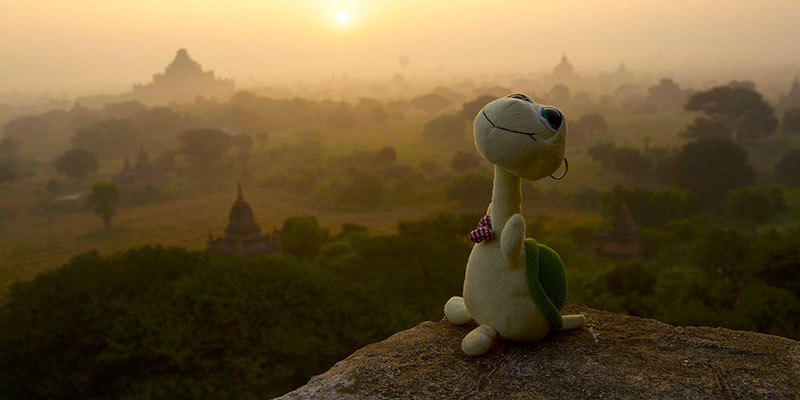

任悦说，走之前写一篇你在新加坡的7年所感吧。我说，好。
我坐下来。坐着。看着我的电脑屏幕。7年。

7年。国大读博4年半，加入创业公司半年，禁不住薪水诱惑，转投新大博士后项目，国大的博士转了硕，博士后又做了近两年，现在，打算回国去当个旅游小领队。9月把当导游的简历写了，写完手痒就递了出去，10月1日国庆交了辞职信，第二天收到新加坡永久居民批准信。从小乖到大，直到今天，我用了一种几近跳楼的姿势转了个行。若干朋友说到国内的生活环境：“你会回来。”我说：“我暂时没这个打算。”

**7年。为何而来，为何而去呢？**

来的时候，我不大知道自己为何而来。

我走得太顺，在各种艳羡和怀疑的眼光中一不小心就走（chūliū）到了将近30岁，我不大知道自己想要啥，从未有过强烈的愿望说想要得到什么。我没有意识到我的自负，我只是觉得很多事情都可以做，心里不那么守规矩；我没有意识到我的自卑，我只是习惯性地把不顺的事儿都自己扛，扛不下来也可以嗤之以鼻。我只知道我喜欢学习，喜欢知道更多，像喜欢吃东西一样（所以臣妾有点小胖！）所以当国大给了我奖学金的时候，我屁颠屁颠就来了。

**可是我错了，错在不知己。**

在新加坡的日子，我认识了几个改变我很多的人。一个是从宝洁辞职去当领队的老吉。老吉评价我说：“你骄傲，其他什么都好。”另一个是带我们在新加坡徒步的师父，师父经常说，“现在很多人的问题是，把自己不当人了，都觉得自己是凹凸曼。”于是我从那些诸如名校学历薪水的高台上撤（gǔn）下来，从众星捧月一般吵嚷“教主组织活动吧”的嘈杂声中逃脱出来，看看自己脱了这些看似光鲜的衣服之后光溜溜的还剩什么，我的内心又在渴望着什么。

我想要的学习和研究是一码事么？我能在新大的研究岗位上写出好文章么？我的文章能有多大的价值？会比我做一次西藏分享会的价值更大么？我又有做旅游领队的天资和真诚的兴趣么？

今年5月在西藏的时候，我跟着老吉去尝试带了个队。在车上队员都昏昏睡着的时候，我看着雅鲁藏布江，蓝色绸缎一般在我眼前划过去，绵延不绝，江边生长着红色的灌木，晚春翠绿的树，眼泪跟着就流了下来。把自己放在一个高大上的位置，要做那些不会“屈才”的事，要做那些光鲜靓丽的工作，这些想法在此时发出了清晰的碎裂声，
**碎得真tmd好听啊！**我希望可以一年四季走在世界上最美丽的地方，在想要唱歌的时候可以唱出声音，遇见不同的人，讲述那些感动过我的故事。如果有一天我将死去，我希望是死在路上，而不是在装着空调、有着传说中即便久坐也不会造成腰痛的座椅的办公室里。

我每多工作一天，就多攒一点钱，但心里也多一分亏欠。于是在越来越多的星期一的早上，我不想上班，想要生病，于是真的生病。我想起老吉说的一句话：“当钱不能让我感觉到快乐的时候，我意识到，不是钱的问题，是我的问题。”

我想念那些走在路上尽管疲累但是兴致勃勃的日子，想念在路上素昧平生但是迅速建立的友谊，越来越想念。如果说成就感来自于你的能力能否满足社会的需要，幸福感来自于你的能力能否满足你自己的需要，我想，是时候在成就和幸福之间做个取舍了。于是，如前所说，我写了份跟旅行相关的简历。当我惊讶地发现自己悄无声息默默去过的地方就罗列了小半张A4纸，组织过的活动又列满了剩下的半张A4纸的时候，我有些许自得，但也小心翼翼地意识到，或许这些作为入门也还凑合吧。

接下来的这段日子，我一边狠命啃导游考试复习的书，一边等着迎接我无业游民的日子。我知道我要恶补的课还很多，无论是关于领队导游这一行，还是关于我远离了7年的祖国，甚至关于自己，我都还知之甚少。
**但是，我知道我不是想要投机，不是玩一把就算，我想要一步一步在这条路上走下去。**这世界充斥着各种吵吵闹闹的广告信息、各种想要大赚一笔的人，我知道这些我都做不来，我只管埋着头做好我真心喜欢而且觉得有价值的事情，我想把我喜欢的路推荐给更多的人，让人们在每一条与我同行的路上感到简单而真诚的快乐。

于是我去了。不想太多，做，坚持下去。

我知道我的所谓叛逆期来太晚了些，我多么希望它可以早一点。

老吉一扭头，说她不要对我的选择负责，可是我义无反顾跟她走了，赖都赖不掉。师父对我说：“你这个选择我不懂呀。”但是师父对别人说：“她有她自己的想法。”

即便是这叛逆，也被家里无条件支持了。在我没有办法回到武汉的时候，他们帮我去旅游局报了导游考试的名，帮我办了临时户口等着我回去考驾照，效率高得威武霸气。老爸老妈你们是有多爱我啊！

**而我，就真诚地爱着这个世界。**

 
 

<h3>献给世界(写于 14 年初离开缅甸之际)</h3>

在氤氲的气息里

你躺倒的身躯是河

在迷朦的暗夜里

你眯缝的眼睛是星

你笑的时候是溪流

你沉默的时候是山

你明媚时是高原上的海子

你狂妄时是大漠里的风

你是宽广的沼泽, 饱含吸纳一切的力量

你是盘飞的鹰, 拥有锐利的眼和骄傲的心

我抱着你

什么都不再需要

我看着你

慵懒得一句话都不想说

> **关于作者**

> 湖北武汉人。华师一附中。清华大学。新加坡国立大学硕士。新加坡可派K卡公司总经理助理。新加坡管理大学没有博士学位的博士后。大龄剩女。 

