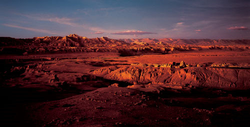

> **有一位前辈说：“曾经，我有一个梦想，叫做‘改变世界’。现在，只剩一个愿望，叫做‘环游世界’。”一番话勾起了两代人的唏嘘。**

过去，世界是“我”、是“我们”。在“我们”的眼里，它远可以好过眼前的样子。我们曾一遍遍期盼变成高年级的学长统领“晚辈”，我们曾不屑于自己在长辈眼中的“顽童”模样，我们把天空当做涂抹未来的幕布。
 
那时我们像扯线木偶被父母牵着走，仰视的角度刚巧可以看见他们头上的天。只有在蹲下身围观蚂蚁搬家时，才发现自己也可以如此“居高临下”。我们曾嘟嘟囔囔与万物对话、放空双目与未来对话、喃喃自语和镜子对话，然而这其中究竟有几句，被心听见了？在我们搜肠刮肚回忆那些儿时的言语时，可有一句关乎生命和信仰？似乎有，但它们多以问号结束。

  
比宇宙更大的是什么？

   
海水将流向何处？

   
云朵有自己的家吗？

   
长大会是什么样？

   
我会有孩子吗？

   
爸妈会不会老？

   
......

为了寻找答案，长大一点后我常关注一些浅显的生命科学研究论题，也读过些心理学论著，但心中的结还是没能解开。当我带着18年的疑问进入大学课堂时，年近半百的先生没有像科学家那样为我解释细胞的衰亡和器官的退化究竟是怎样的理所当然，也没有像心理医生一样开导我放下执念、找回自我是多么的利人利己。他只是翻起眼皮冷冷地回我：“少不宜谈生死。”隔天硬生生地把我叫到跟前说：“把这个读完，下周告诉我你的答案”。于是丢给我一本花花绿绿的图册，我单手接过来，差点闪了腰。幸亏他眼疾手快托住了书底。我笨重地握稳书，没好气地扫了一眼书皮——“摄影师的朝圣”，还有，一个脸上涂了果酱的姑娘。

翻开书我才知道，姑娘脸上的不是果酱，而是当地牧民女孩独有的“防晒霜”，叫做“土恰（Tocha）”，是用乳酪做成的“面膜”，可以保护她们不受紫外线和干燥空气的侵害。

嘿，新鲜。

##一 
由于书太重，没办法搬上搬下，我索性铺了毯子在地上，将一页页的新奇摊开在眼前。

> 她们的头饰看起来不比清廷的造型轻巧多少，但神色中的紧张不免暴露了年纪。她在观察、在搜索，当然也在被看、被审视。没错，这是一个五年一次的“相亲”仪式，但不可思议的是它竟发生在向来对性关系采取严厉态度的伊斯兰社会，塔马加拉。

> 这是位常年生活在洞穴中的修道士，一位盲人，却“毫不费力地在黑暗的洞穴中活动自如”。

> 这不是万圣节的大Party，而是国王沐浴日。光着膀子的汉子们不是社会青年，而是被称为“纳加（Naga）”的苦行僧。他们赶在凌晨四点狂欢着、振奋着奔赴浴池。

提到一丝不挂，自然也少不了非洲内陆的伙伴们。

> 对于她来讲，“不穿”才是最舒适的状态。但是没有衣服可以，没有枪却不行。这一支卡拉什尼科夫冲锋枪在当地可换6头母牛。坦荡了“胸襟”却拒绝被靠近，那么她的枪口，究竟对向谁？

> 罩着花头巾的二位，实际是祖孙俩。瞧这姑娘调笑她祖母的样子，不知道是不是已经猜到了她看似无意回避镜头的表情——这一身金花行头，竟抢了孙女的风头。此举莫不是马背上的民族，任谁也不敢对号入座。他们所倚靠的阿特拉斯山脉将地中海西南岸与撒哈拉沙漠分开，山区有辽阔的牧场，两代人都是柏柏尔的游牧民，羊群是他们终生的伙伴。

> 黑纱遮不住老妇人无名指上的戒指。她身子骨硬朗，并非是在咳声叹气，而是在开罗市中心的清真寺内，虔诚地向圣人表达敬意。作者说：“对于老年信徒，清真寺真的是休息和尽情沉思的地方。”

沉思？何故沉思？既已有了信仰，不就应该万事万物都有真主来摆平吗？
 
眼前托腮的自己竟让我想到儿时趴着看《西游记插图版》的画面。我还记得那时候看一页，就要停下来盯着墙上的世界地图遐想一会儿，想自己也能翻个跟头就从长安飞去西域。因为“十万八千里”在地图上看起来不过是六岁孩子脚丫子的长度。那时世界在我心里是被云团覆盖的神奇，是逃不出的“五指山”，是凌空遥望的风景，是所有人对“唐僧肉”的垂涎……
 
然而书中作者却说：
> “在我环游世界、经历各种气候和环境的旅行途中，许多人向我敞开了心胸。让我和我的相机进入了他们神圣的宗教仪式。”      
 
环游世界。你是否也想过带着一颗朝拜的心去环游世界？还是只带着一双猎奇的眼睛和丈量路程的双脚？
 
我在这一刻发现了自己的答案。
 
儿时的课本中，似乎从未深刻探讨过“灵魂”这个词。狭义的唯物主义者认为它并不存在于自己的生存空间中，因为没有一个实体能够将之赋予他人。然而问题是，在那些朝拜者的心中，就真的肯定这种“实体”从而来和唯物主义者唱反调吗？简而言之，他人的灵魂是否可以被揣度？我们自己的旅行，又应该有怎样的风景？
 
每每说起“环游”，我们习惯以地理为坐标，统计自己的足迹；我们还会以金钱为前提，估量自己的行程；我们甚至以相识为谈资，炫耀自己的社交。唯恐自己看不尽，拼命放大眼角到“寰宇之巅”——也许神气地踏上铺满丝绸的阳关道；美滋滋地招呼歌舞升平美食飘香的阿拉伯；一路惬意聆听斯堪的纳维亚的神话；再接二连三幸运地看到极光、北极生物、雪中世界；最后从阿拉斯加踏上“自由领土”，飞越美利坚，从海滨风光、赌场风云到五大湖胜景、金融帝国……于是你以为一到东瀛就算是彻底网罗了太平洋的海浪，最后尽兴满载而归。
 
但实际上，纬度跨度还不到世界的六分之一。

##二
再来看作者野町和嘉先生的“环游”。

> “两位朝圣者从东部藏区的阿坝，虔诚地爬向1800公里外的圣城拉萨”。

> “商队出发之前，赶骆驼的人面朝麦加的方向祈祷”。“他们白天靠太阳指路，晚上则靠月亮”。

> “身着黑色服装的阿拉伯妇女”和她们背后的婴儿。

> 持续通宵的“吉祥之夜”。朝觐者沿逆时针方向进行7次“巡礼天房”（围绕天房步行）。

> 在等待伊玛目（Imam，领拜人）时，朝圣者用心准备祈祷。

> 亚的斯亚贝巴的主显节（Timqat）期间，修道士将圣碑从修道院抬往公共广场。

> 拥有11所岩洞修道院的圣城拉里贝拉。它的地名直接来自《圣经》——奥利夫山、约旦河和受难所。
> 

##三

再来看看作者镜头下的地貌风光。

> 察卜让山，光秃秃的表面上是古格王朝的废墟。作者说四周的寂静暗示着世界末日。然而我愿把它叫做“落日余晖”。

> 马赛（Masai）部落的山神、非洲最高山乞力马扎罗（Kilimanjaro）。中间由于气候影响不断缩小的，是它高峰处的冰河。

> 马赛（Masai）部落的山神、非洲最高山乞力马扎罗（Kilimanjaro）。中间由于气候影响不断缩小的，是它高峰处的冰河。

我曾立下豪言，要去耶路撒冷，那个以和平命名的城市，那个因宗教汇流而注定不得安宁的地方。然而看过了野町和嘉先生的作品后，忽然觉得要来一场放得下浮华，敢走进灵魂维度的环游，现在动身为时尚早。因为，以宗教和灵魂为龙骨的叙述，绝不是以掩人耳目的“地域框架”铺陈的。
 
朋友，你若放话“环旅世界”，别忙掂口袋里的铜板，不妨先问问自己：可曾梦见过撒哈拉沙漠上被伊斯兰当场剥皮宰割的恶臭的骆驼？可曾触摸青藏高原上，一张张附着污垢的脸颊？可敢在几乎不流动的、成千上万人沐浴的恒河中舔舐“甘露”？可敢在圣城拉里贝拉的方形教堂外独宿一晚？可自信受得住麦加城中“巡礼天房”的阵势？
 
从沙漠到高山，从高山到平川；从冰雪源流到满盈江河，从流着血色的峡谷回到星雪朝圣……坑坑洼洼、深深浅浅……我们看到的远不及我们的世界。那个“在修道院将自己浸入充满海藻的水池中渴望获得神佑”的埃塞俄比亚女人，那个用牛尿洗头的努尔男孩让我读到两种力量——宗教和自然。

   > 印度有1300万拒绝世俗价值的苦行僧，这个数字占总人口的1.3%，却有28.5%的人不能保证三餐，混迹于朝圣者的队伍，等待乞讨——沐浴节汇集500至700万人。
 
如果你问是什么原因让人依赖上宗教而不是现世，或许他们会说：“除了向神灵祈祷，寄希望于来世，我们还能做什么？”
再不是“西天”这唯一的方向，再不是“唐僧”手中的一本经书。看看阿特拉斯山上的塔马加拉结婚仪式；看看德格印经院的雕版经书；看看阿布那阿隆修道院每天仅有的15分钟的阳光；看看努巴的摔跤赛；看看带着象牙手镯的丁卡男人……
我们都叩拜在朝圣的路上，只不过心中，各有各的“麦加”。

   
那么，人从哪里来？

   
从家，从我们的童年来。

   
人将去向何方？

   
去向他本真的生命，他所修度的人生。

