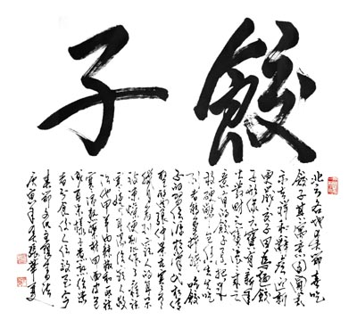
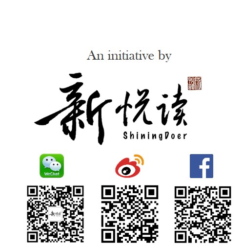

> **“水饺耳，即段成式食品，汤中牢丸，或谓粉角，北方人读角为娇，因呼饺饵，伪为饺儿。”——（明）张自烈**
> 

一个月前，就盯上了今天。从东汉的“牢丸”和“粉角”，到宋代的“角儿”；从北方的大水饺到南方的小馄饨；再从蒙古的“匾食”到俄罗斯的Пельмени、朝鲜的半月饺，它的存在跨越时间和空间。对于我们，山珍海味大概都比不过今晚的一盘饺子。擀的是一片诚心、粘的是两地情谊、包的是一份祝福，吃下去的，是浓浓的幸福。

###“形如偃月，天下通食。”

饺子不仅把新旧“交”了起来，还把人间五味“包”在了一起。不管能否回家，包个饺子总是可以有的！愿这颗“远方的饺子”能寄托一份对“家”的依恋，和对“家人”的情思。

###哪怕“在水一方”，也能“饺”在此时。
<iframe width="560" height="315" src="https://www.youtube.com/embed/3tICD6c-fxI" frameborder="0" allowfullscreen></iframe>
（腾讯视频）
<iframe width="560" height="315" src="https://www.youtube.com/embed/3tICD6c-fxI" frameborder="0" allowfullscreen></iframe>
（Youtube视频）

