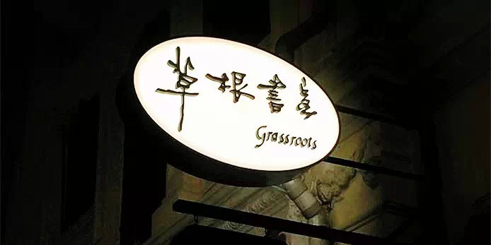
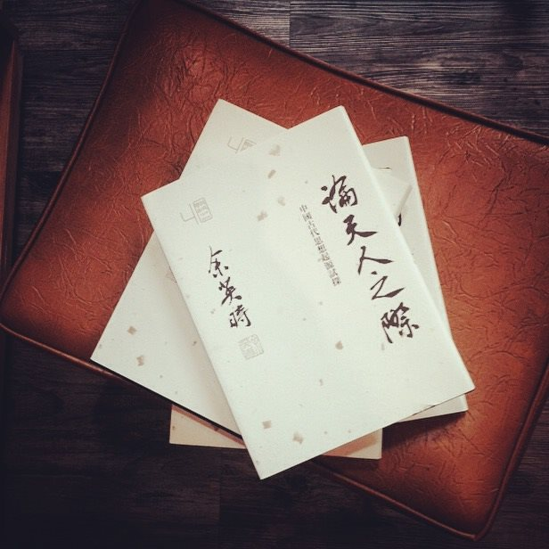
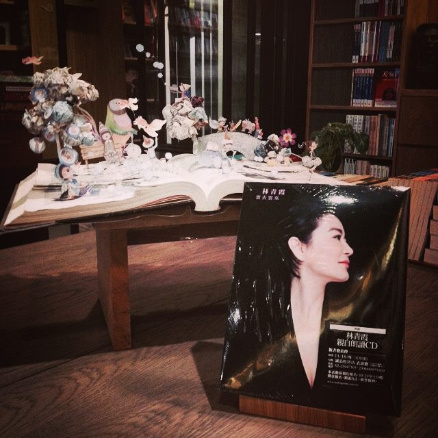

记得早先少年时，大家诚诚恳恳，说一句是一句。清早上火车站，长街黑暗无行人，卖豆浆的小店冒着热气…

木心 《从前慢》

快快快，被时代裹挟着向前，随人潮涌动，随风向转舵，心却囤上了吹不走的尘埃。我想着，是不是该慢一慢，停一停，抖一抖风尘仆仆，静一静看周遭变迁。

**世界有些冰冷，因为心还不够热。阅读用书的厚度筑成堡垒，让心不决堤，围起生活的温度。」**

书店，是城市人文风景的窗口，也是城市内涵的缩影。街角书店最招阳光待见，拿铁的香在巷弄间缱绻出某些漂浮的记忆，一本《温柔的夜》拉扯出三毛荷西的款款真情。这便是复式经营的独立书店创造出的情怀。它在丰富阅读多样性的基础上满足城市人对于安宁的诉求，为某个群体共同恪守的文化构筑一个栖息的家园。于是，宏大的文化能在小岛被慢慢具象，浓缩在这家糅杂了面包cafe创意的中文独立书店 – [草根书室]。

##记忆·那些年他们追过的书局

[草根书室]，1995年由新加坡本土作家英培安（以下简称“英”）先生创立，历经19年光载后由林仁余先生（以下简称“林”）接手，易主不易名，是延续也是启程。说起来林与英的渊源要追溯到七十年代，当年的文青们大多爱去黄金大厦的电影院追一些中资背景的社会题材电影，因此[前卫书局]的出现（70年代由英培安先生创立）与这样的氛围相得益彰，为青年人提供了一个好去处。林就是当年的文青之一，一来二去便跟英相识。这也为草根的命运拉开了序幕。

**那些男孩女孩，在匆匆那年是否也红过脸，红了眼？那些追风的少年，可还记得辗转了几排书架，只为留恋过的一句诗」 **

##接手·初心未忘，但也不求始终

**难，确实难。但世间若无大小事，何须青丝白发传？有多远，就走多远吧」 **

如果你留意过新加坡大众书局人山人海的结账队伍里，那些九成以上手握礼品和文具焦急等待的顾客，便不难理解一个纯粹的私人书室何故处境艰难。如果你看到教辅书的价格直飙畅销书却仍然供不应求；华文书一折再折也门可罗雀时，定会劝诫林先生，认清市场，做个“聪明人”。

是，中文书不受青睐，但草根却坚韧前行了19年。英培安先生把草根交到林手上时，它还是个羽翼未满的孩子。但它不是个人的，而是社会的，它从出生就肩负着使命。于是在英的牵线下，林仁余，林永心，林韦地三人为“草根”架起了防护“林”。

爱书的朋友都知道，新加坡的中文书店大多集中在Bras Basa附近，书店老板们细心经营着各自的“一亩田地”。但这样的书店，大多凌乱而冗杂，狭小而逼仄，顾客很难静下心来挑选他们喜爱的书籍。目不暇接和眼花缭乱只在一念之间，无论哪一种占了上风，阅读的心窗都会被视线遮挡；中文书局对林来说已成了一些记忆的剥落。他甚至承认了当初的“不理智”，却没有后悔自己的坚持。他说：
*“我们是在不太理性的情况下接手的，看着草根这样下去我们心里觉得很惋惜，新加坡不应该没有独立书店，应该给爱读书的人创造一个空间，因为书是可爱的。这其中也算是我们情感上的一个寄托。”*

“书是可爱的”我听后心一紧，然后是酸。除了把“可爱”和自己家的洋娃娃联系在一起之外，还有谁记得“可怜九月初三夜，露似珍珠月似弓”？此处“可怜”正是“可爱”之义。

**「书是记忆，书屋便是时光机。倘若没人去关注那些深刻而浪漫的记忆，谁还能像自己口中说的那样，给这个时代留下烙印」**

##未来·心是舞台 花开天外

**「选择，没有对错。一切的发生都是最好的安排。」**

面包店与书店的结合，意料之外也在情理之中。因为林一直有一个未完成的烘焙梦，在与另外两位合伙人商讨之后，他们用面包的醇香配上卷卷书香，碰撞出刺激味蕾和心灵的火花。他们由一本最近频频受到关注的日本漫画《深夜食堂》，迸发出关于深夜开门分享美食的灵感。草根在小心前的同时大胆创新，无限的可能，只待时间去验收。

在走访了台北、广东、上海等地，做了一些实际考察之后，林和他的合伙人便开始思考草根的品牌特性、经营理念和人文内涵。在参考了一些优秀独立书店之后，草根的轮廓也渐渐变得清晰——“逛书店”成为新的特质，林仁余说：
*“我们想要实现的是‘逛’书店，买不买书并不是最主要的，第一步首先应该是大家愿意来逛，因此这里应该是一个多元化的互动空间，应该有展览有讲座，还应该有一个café，有些面包有些咖啡…”*

##择书·“遇见”，是最美的意外

过去草根藏书多在文史哲一类，为各大高校中文系的学生提供海量的文献参考。加之上世纪七十年代，大陆的学术研究（尤其是古典文学）陷入中空时代，台湾论著便成了本地学者的重要资料，因此草根顺势而为引进了港台书籍。但是从文献书库到独立书店，它的路依然很长。

近期请辞的前中华民国文化部长龙应台说：
*“独立书店是一个城市，一个国家文化呈现的具体指标。”*
相较于大众书局，独立书店更偏爱小众市场，书店经营者往往倾注了最大的心力在书的取舍，对于他们来说，每一本书都是有呼吸、有生命的。可是每个时代都有它独有的主流诉求和美学原则，重新出发的草根，需要篆刻它的专属印章。

在保留特色的前提下草根兼收并蓄，引进了戏剧，艺术以及中日现当代文学，同时预留了10% - 15%的英文原版书籍作为市场补给，包括一些本地风土人文历史政治读物等，吸引游客的光顾。以自身的喜好和经验为参考，林也购入一些绘本读物以及食物科学、体育运动等书籍，希望通过与生活息息相关的读本，让阅读走进人们的生活。

然而另一方面，他说：
*“其实书店的特质是靠顾客群去塑造的。”*
每一次的光顾，书籍每一次的拿起与放下，都是在帮助书店固化它的素养和文化特质。草根要借助顾客每一次漫无目的地的闲逛，创造人与书之间的“邂逅”，用偶然性优化独立书店的体验，使它在大型连锁书店与网络书店的挤压下，险中求胜。

##挑战·被这世界温柔地爱着

谈到现阶段最大的挑战，林认为是资源的短缺。刚刚起步的草根“百废待兴”，书籍整理需要人手，社交媒体的维护需要专人负责，层出不穷的新书资讯也需要持续跟进和筛选，但资金短缺使得书店无法支撑更多的雇员。

可喜的是，草根现在也得到了许多社会各界义工的支持，他们常来帮忙整理书籍、策划活动，让这座“中文独立书店”从构想变为雏形。记得陈丹青在今年初在无界限讲堂《母语与母国的》的演讲中讲到：“我从未见过哪个社会像新加坡这样，如此地温良恭俭让。”是的，在这样不缺乏人文关怀的小岛，草长莺飞的日子有时慌乱有时甜美，不论是我们还是草根，都在被这个世界温柔地爱着，不徐不疾。

##愿景·窗里草根，《窗外》有林青霞吗

*“草根愿意做一个窗口，引导或者影响更多的英文阅读者发现并接触中华文化。我们希望利用仅有的资源尽绵薄之力推广中华文化，让讲中文成为再自然不过的事，帮大多数的人卸下无须有的压力，”*
林在讲到草根对于新加坡文化的具体实践意义时这样说，“创造一个中文交流的空间，看中文讲中文，甚至写中文。”在千篇一律的外文中，独立的华文媒介试图在巧妙地刺激年轻人对新知识的好奇，也为近年来新加坡政府倡导华文学习增一味“调料”。

去年七月的香港书展上，林和他的朋友特地去搜寻了不少面向英文阅读者、记述中国文化社会现实的书籍。此外与本地文化群体的跨行业合作，使这颗“春风吹又生”的新芽获得了更大生机，它将为艺术家，作家和民间手艺人培植一片土壤，让艺术和文化的生命在此繁衍、远播。像林仁余先生这样“不够理性”却“不忘初心”的人，还在增加；我们愿做他们的陪跑者，继续记述草根的风雨和春天。

这里有一扇窗，窗外有林青霞，有三毛，有林徽因，有东野圭吾，有玻利维亚的天空之城，也有阿拉斯加的极光，有纽约的星巴克，也有东京的章鱼小丸子…

等等，劳驾帮忙推开窗。让巷陌里的香气扑到我鼻翼徜徉，把小店里曼妙的音符请进来。你看，一本书，两块甜点，我多自在。

**从前的日色变得慢，车 马 邮件都慢，一生只够爱一个人…**

