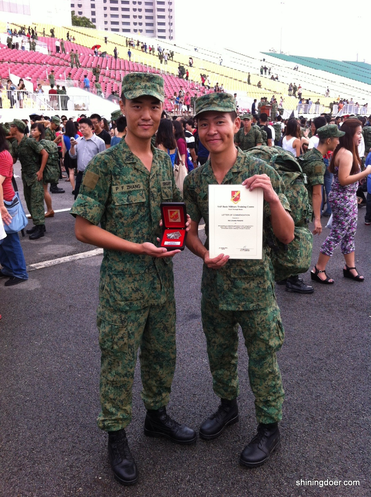

很多人都问过我，“你为什么不过了21岁再选择拿PR？” “你为什么要这么傻去当兵，浪费两年时间？”

“如果你不当兵的话，这两年可能就会有自己稳定的职业和事业了”。 对于这些问题，曾经做过铁道兵炊事班长的老爸的回答是“男人嘛，当兵不是件坏事”。事实证明他是对的。

2012年08月01日，中国的建军节，却是我去德光岛-新加坡新兵训练营 (Basic Military Training) 报到的日子。上天的眷顾，让我有幸认识了他，从此结下了不解之缘。他叫张鹏飞，山东人，个子很高，人又英俊潇洒，在兵营里显得格外出众。

我们其实本来都不属于这个连队的，因为学校行政工作上的疏忽没能把我们两个的体能测试成绩发给国防部（入伍之后，新兵会接受体能测试，国防部再根据测试结果安排兵役期的军事训练强弱和兵种），以至于我们被编排到了体能稍差的新兵部队，比现在的兵役多2个月的基础训练，也就是要2年的兵役时间。由于后来及时的协调，我们两个算插班插去了体能稍好的新兵连（1年10个月）的最后一个排，最后一个班的最后倒数第3和第4个床位。跟大家分享一下军队有个捆绑制度，两个士兵被捆绑在一起，叫Buddy。 也就是做什么事要两个人同行，上厕所另一个人也要在厕所门口等着。 我和鹏飞起这样被绑在了一起。

两个月的新兵训练（Basic Military Training，简称BMT），从最基本的站姿，基本的走步，喊口号学起，再到用自动步枪，扔手雷，我们有了比较系统的军事体验。鹏飞是个奇人，有一次肚子痛的死去活来，军医怀疑是阑尾炎，要送去樟宜医院开刀，但是因为交通的不方便就给耽搁了，第二天竟然自己好起来了， 哈哈。 值得一提的是，鹏飞是我们新兵营百发百中的神射手，整个连队的NO.1。

在所有的训练当中，野外训练是最艰苦的，但也是最令人难忘的。在野外连续几天的训练，保持身体干爽是一个很棘手的问题，我和鹏飞发明了一种野外洗澡法，用军用水袋装满水吊在树上，然后我们在下面开出水口冲凉。士兵由于没能冲凉，毛孔被阻塞，很多都起了红疹和痱子，而我和鹏飞很幸运的逃过一劫。后来这个方法被战友学去并传播开来，造福了很多士兵。另外有一次的野外训练，我和鹏飞就被罚去站岗。凌晨4点，所有的长官和士兵都在沉睡，那个时候的热带雨林的是很静谧的。鹏飞和我就在皎洁的月光下，吃着饼干，谈着人生，聊着理想，那种感觉绝对是人生一大快事。

新兵连后来以从樟宜机场到滨海公园24KM 的武装行军，再在浮动大舞台阅兵仪式作为结束。当时背着20公斤的行李行军到滨海湾的时候，我对鹏飞说总有一天我要从新加坡最西部再走回滨海湾，完成整个新加坡的步行。也就是从那时候种下了组织徒步的种子，也就有了后来的“2012-2013年新加坡东西60KM徒步”和“2013-2014年新加坡南北40KM 徒步”等的活动。

新兵连结束了，我们同时被分配到见习士官学校SCS（Specialist Cadet School）深造。又很幸运的成为了士官学校的Buddy. 同时在SCS 很有幸又结识了几个新移民朋友，温溯，高洋，陈庚和闵俊桦等。

SCS 除了可以接触更高的武器装备，比如闪光弹，地雷，轻机枪，重机枪，榴弹炮和反坦克炮等之外，更注重培养领导素质（Leadership），重视战术和战法的训练。有一项定向训练是最有意思的，就是给你一张地图，一把尺子，一个指南针和一个计步器去穿越森林找到目标点。鹏飞的方向感特别强，在茂密的森林里穿梭，可以准确无误的找到目标的方向，所以他是我们班的领队人物（Navigator）， 而我的距离掌握比较准，步量距离和实际距离不会超过50米的偏差，所以我当时做计步（Pacer）。我们天衣无缝的配合，使我们班在国外演练的定向训练比赛中拿到全营第一名。

另外，鹏飞在障碍训练(SOC)是有天赋的，12道障碍对他来说是小菜一碟，爬墙钻洞，两个字-速度，他也成为了全连第二快。而我的强项是在体能测试(IPPT) 2.4KM跑步，9分33秒的成绩，一直保持着名列前茅和200新币的奖励。但是最让我佩服鹏飞的是他的忍耐力极强，有一次32KM 的行军，因为前一天拉肚子，进啥出啥，所以他不敢进食。滴米未进之下竟然光荣的完成了这个艰巨的任务。怎一个强悍了得？

我的性格偏活泼和和平，比较容易感性，而鹏飞跟我性格正好互补，他比较偏力量和完美，比较理性。我们在一起就绝配，他可以把问题考虑的很全面，做事完满，运筹帷幄，很多情况下能够点醒我。而我比较二的性格，在最艰苦的条件下自娱自乐，行动力强，大有荆轲刺秦王之风，可以带动他的激情。他在我后面的支持，让我变得有恃无恐。而他说因为我，两年的兵役生活才过的丰富多彩。举个例子来说，当时营里搞“我和国家”文艺比赛，我们连队没有人愿意去组织，而我当仁不让揭了英雄榜，开始了编剧和导演的生活。在整个过程中，鹏飞都一直大力支持我，一边参与我们的彩排，一边帮我找背景音乐。最后整场幽默搞笑的舞台剧受到了长官和战友们的热烈欢迎。

我们以上士军衔（Sergeant）从见习士官毕业，鹏飞和其他新移民战友被分配到德光岛的新兵连做教官，而我被留下在见习士官学校任教。一个在最东部，一个在最西部，虽然联系少了，但丝毫没有影响我们之间的感情。

从被教到教人是一个逼着你自己成长的过程，但是我和他不在一个兵营，但我们做的工作的性质却是一样的，那就是带领和教导士兵。我每次都调侃他是在做初成品（From boy to man），然后送到我这里再加工 (From manto leader)。我们很欣慰能把我们的战斗精神（Fighting Spirit ）和对战友的关爱（Care for Soldiers） 教导给了一批又一批的新兵，出色的完成了我们的光荣使命。借用鹏飞的总结：“当看到我们的士兵顺利的走在阅兵仪式上，当看到办公桌上一封封感谢信，但已经复员之后在大街上偶遇他们还叫自己一声长官的时候，感觉我们所有的付出都是值得的。”

一年零十个月的兵役，很快就结束了。我很感谢老天给我安排这么一个给力的战友。是我们的互相谅解，互相扶持，才能有这么深厚的感情。如今我组织了自己的徒步团队，有了一个自己的品牌“新加坡徒步哥”。也很庆幸鹏飞的加入，我们准备共同筹备 “2015新加坡环岛徒步马拉松”的徒步活动。也希望有更多热爱运动和健康的朋友们加入。

> **关于作者**

> 刘宇航，河南人，06年來新留学，09年就读新加坡理工学院营养保健学，12年服兵役，13年在见习士官学校做教官，“新加坡徒步哥”品牌创建者。