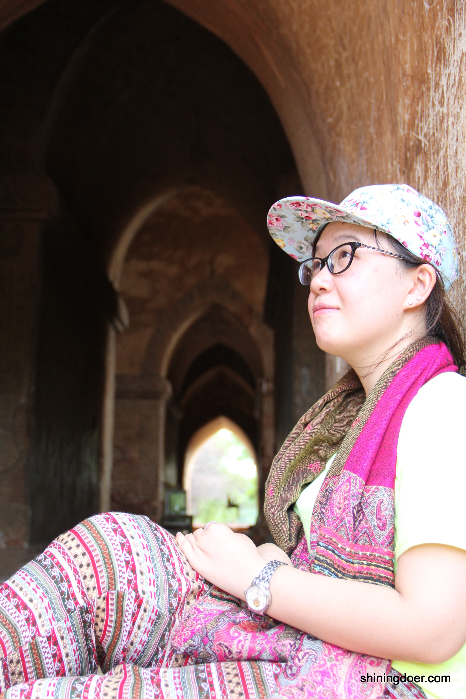

原本想写一篇青春励志的文字，但是现在我被困在了暴雨里，回不了家。时不时有雨点打过来，我很哀伤。**大部分时候，我觉得自己像抗日剧里的小兵，在泥泞里翻滚着往前爬的那种。抗日最终胜利了，我希望我也会。**

但是现在我被堵在瓢泼大雨里，拼尽了全力的雨，像天劫，隔断了我跟MRT。我在这头，MRT在那头。不只是今天，昨天也是，前天也是。我哀伤了，新加坡为什么总是下雨，我为什么总是出门不带伞，我当年为什么要来到这里？

 
大学毕业的时候，爸爸跟我说，回南通吧，考个公务员，结个婚，买房买车，小日子就过起来了。我很焦躁，我不想做公务员，也不想被安排。协商的过程是漫长而曲折的，结果是我可以申请国外的学校，但是失败的话，就安心回家去。不成功便成仁。
 
结果我来到了新加坡，不安分的。结果是我爸在之后的两年时间里都在反复强调他觉得他的规划比较好。结果是我得认真地在这里生活，遇到问题也要自己想办法。不能再像以前一样打电话回家嚎啕大哭，要不然我爸会说：**你看你看你看**，叫你不要去的吧。**你看你看你看**，遇到问题搞不定了吧。**你看你看你看**，还是我说的对吧。
 
不行的，无论现实怎么样，我有傲骨。
 
我可以经历风吹雨打，我要自由的飞翔！
 
**当时的我，多么年轻。**
 
犹记得下飞机的时候，打开手机，中国移动的信号收不到了，心底触动了一下。同行的小伙伴欢呼雀跃的：吖！天真蓝！

在新加坡的每一天，都要自己解决问题。提前早到新加坡导致没宿舍住啦，第一次英文对话憋得发不出声啦，通宵赶论文第二天还正常工作啦，加班到凌晨害怕电梯有鬼啦，最后还是有惊无险的活下来了——我觉得自己更加独立成熟啦！
 
我本科在国内学的biology，到南大读研究生选了bioinformatics做专业，也是在做了一番研究后觉得是个不错的方向，也得到了前辈的大力推荐！只是实际学起来困难却有那么一点点：专业入学不要求有编程背景，但上课的时候学的都是算法，代码，程序……我一生物专业的跑来新加坡用英文学习编程。笑中带着泪啊！
 
来坡后第一节课是统计学，讲师是一个印度人，说话声音糊成一团在嗓子里打转，傻眼了，很想上台去piapia扇他一顿，声如洪钟的斥责他：好好说话，你丫的！此生忘不了这位老师，给了我生命中一个闪亮的C，嚎！

 
班上就两个中国学生，想抱团学习，只能找印度妹子了。最熟悉的一个妹子爽快的跟我说：好啊好啊一起学习，我也不会编程。我又傻眼了，不会编程抱什么团！那时住在Graduate Hall，窗外绿树茵茵，鸟语蝉鸣，我坐在屋子里，面对满满的代码，骗自己说：嗯，对，应该就是这个意思，我大概懂了。
 
过程苦兮兮的不累述，最终跌跌撞撞的毕了业，毕业典礼的时候感觉傲娇极了。**觉得心有多大，舞台就有多大！**觉得bioinformatics很有意思，跑出结果很有成就感，但也没法去申请一份bioinformatics的工作——编程是永远的痛。

还没有毕业的时候在一家培训公司做兼职，一边写论文一边找工作。生物的工作不好找，biology的职位问我为什么不去做bioinformatics；bioinformatics的职位笑弯了眼地问我are you good at programming？Executive的职位问我是不是PR。艰难并且迷茫，恰巧我兼职的公司需要一个全职，愿意给我offer。**我当时想，接了再说嘛，结果拖延症犯了，一接就是2年。**
 
现在觉得这个决定是错误的。我无意转行，喜欢呆在实验室。毕业的时候职业规划不很清晰，找工作两个月，有困难有压力，便轻易地接受了培训公司的工作。工作的时候我常在想，我是不是想做这个工作，我喜不喜欢这个工作，要做一辈子吗？不行，真的不行，我不能被生活给温水煮青蛙。
 
**这便是硬要自己飞翔的弊端了。一意孤行的，感觉跑偏了。**
 
但另一方面，我觉得每一段经历都是有意义的。虽然第一份工作不甚中意，却也不是万分后悔。作为理工女，我借此机会，接触了新加坡的方方面面，拜访众多政府机构，企业高层和中国大使馆，现在讲话也不害羞啦，腰也直啦，腿也不酸啦。平时工作压力也比较大，也常常遭遇挫折，工作到深夜。这些经历锻造了我，让我变得更强壮。所以我还是很珍惜这样的经历的。
 
接下来呢？我申请了NTU的biology PhD。**就是觉得既然选择，便当风雨兼程。**
 
或者回国，回南通，拥抱简单的生活。我是独生女，我的爸爸妈妈也很传统，不想我大富大贵，只希望我在他们身边生活，周末可以回家给他们修个电脑。这一直都是他们的心愿。我以前不喜欢这样的安排，现在在外面久了，也开始想家了。想爸妈忙前忙后的样子，想我一个人在家的午后，还有亲戚给我送各种茶点的日子。偶尔回趟家，还能享受王一样的待遇。以前总想着自己长大要远走，现在远离家了才发现还是在家的时候睡得最安稳。如今爸妈初现老态，我自己也觉得心疼，想着一家人能常常围着火锅唱着歌，也是蛮好的。
 
**二选一。我有半年时间权衡**。不是一个励志的故事，一直都是个纠结的人。我也心疼自己。

我喜欢坐在地铁里，看来来往往的人。每个人都看起来很平凡，但都有自己的故事。我们在选择生活，生活也在改变我们。我们可以选择安逸，可以选择奋斗，可以纸醉金迷，也可以简简单单。选择不同，我们便朝不同的方向去了。
 
我没有后悔走过的路，也没有后悔来新加坡。至少这里，妆扮了我最好的年华。我相信，一切都是最好的安排。
 
**向前跑吧，带着赤子的骄傲。**
 
**愿无岁月可回头。**

----------
> **关于作者：**
> 
> 王凌旭，江苏南通人。南京理工大学。2011年来坡，南洋理工大学硕士。培训公司工作两年，现正申请NTU Biology PhD。
> 

