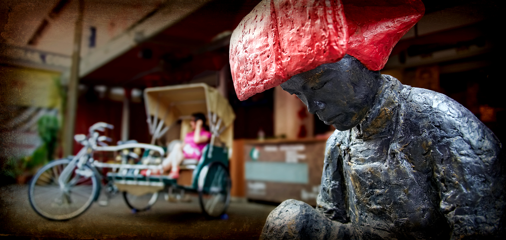
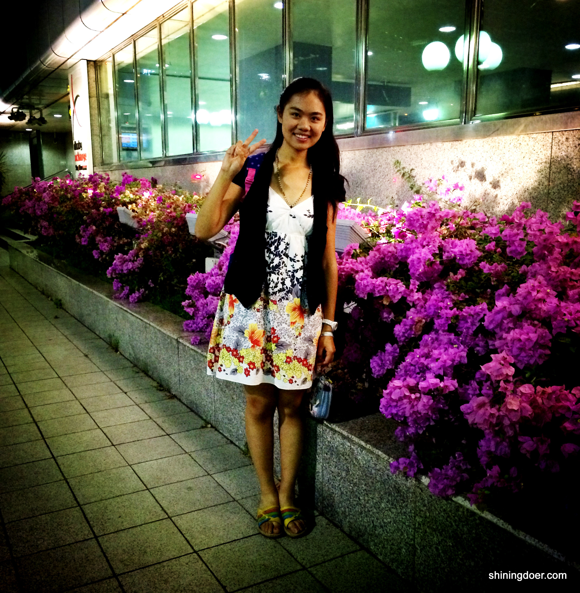

在来新加坡之前就对新加坡充满了无限的憧憬。听说这里是世界上最干净的国家，道路纤尘不染，被誉为“花园城市”；据说这里是亚洲最廉洁的国家，政府公正清廉，人民单纯正直，中国政府曾经派人来学习新加坡的政府制度；听闻这里的人口素质极高，人人遵守规则，谦逊礼让，路不拾遗。这样的社会，不就是人间天堂吗？所以，接到新加坡管理大学预科录取通知书后,我真的是喜不胜言。

去年十月，我在父母关切的目光中，怀揣着激动的心情和对未来的憧憬，登上了前往新加坡的飞机。

但到了新加坡，才发现很多美丽的想象只不过是我的一厢情愿。比如我们的宿舍，破旧的楼房，简陋的家具，缓慢的网速，住宿条件和很多国内宿舍根本没法比。我们楼下的海南鸡饭店，或许是由于顾客较多，应接不暇，地上残留的饭粒引来了不少个头吓人的小强。通往学校的道路边的草坪上，也有些刺眼的饮料瓶和丢弃的餐巾纸。那个时候，突然有些失望，原来所谓的“花园城市”，也不过如此。
 
随之而来的就是六个月的预科生活。预科生活倒是轻松和多彩的，一周12.5小时的课，除了需要准备SAT的考试，其它时间都无比闲暇；学校有很多高逼格的讲座，不仅可以练练听力，也可以享受丰盛的自助餐；各个社团也举办了各种各样的活动，让我们的学习生活充满了娱乐色彩。我甚至找了一份饭店服务生的兼职工作，经常跑去挣些外快。每天仰望着基本保持湛蓝的天空，习惯性地看那些不怕人的鸟在脚前吃食，穿梭于大街小巷找找物美价廉的美食，甚至有时候会到圣淘沙看看海景。这样的日子，虽然平淡无奇，比不上我想象中的样子，但至少还是十分轻松。
 
这样的生活一直持续到预科结束，在准备进入本科的面试过程中，由于他人不公平竞争而致使我最终没能进入我想上的学院。那个时候心情真的特别糟糕，不仅仅是对没能进入理想学院的失落，还有对于不公平竞争的愤怒，更重要的是对于新加坡的彻底失望。难道这就是中国千辛万苦跑来学习的榜样吗？难道这就是我漂洋过海来追求的公平廉洁的竞争环境吗？
 
那件事情直接让我对新加坡的好感降至零点，以至于很长一段时间，每每遇到像我当初一样“天真”的人说新加坡如何好的时候，我都以冷笑回应。那段时间，我都已经打算不再留在新加坡了，但父母本着出国上学可以拓宽视野的看法，还是坚持送我来新加坡继续大学生活。
 
今年本科开学前，我又独自一人登上了来新加坡的飞机。不同的是，上次来的时候踌躇满志，满心欢喜；这次我却痛哭了一场，为只能独自面对那些残酷现实而恐惧。
 
开学后，身边的同学由原来相熟的预科生变成大都陌生的新加坡本地同学，他们有着相同的上学经历，共同的语言口音。预科的阴影和面对新加坡同学而产生的被孤立感，让我整个人变得不爱说话，不爱交流，做事畏手畏脚，完全与以前外向的我判若两人。
 
幸运的是，在这样的环境下，我遇见了很多不错的同学。当我和他们一起出去吃饭时，他们为了让我不感到被排外，集体讲着不流利的中文。上课的时候，我的新加坡好友总会问我能不能跟上教授的节奏，如果不行，就主动给我讲解。我的寄宿家庭，经常带我出去吃新加坡的美食，带我到他们教堂的音乐节唱歌。我所在的武术社团，甚至选举我进入EXCO（社团的领导层），成为EXCO成员中唯一的非新加坡人。尽管我也遇到了些难以相处的人，但大部分人却让我感受到了来自新加坡的善意与欢迎。
 
我开始在这样的环境中学会反思，反观我这一年的生活，想想其实新加坡也不是那么差。不然我怎么可能在晚上十一二点独自回家仍然不担心安全问题？不然我怎么可能在图书馆随意放置电脑手机也不担心被顺手牵羊？不然我怎么可能在打工的时候一点不担心工资被拖欠？不然我怎么可能得到那么多人的关心和帮助？
 
慢慢的，我渐渐想通了。添油加醋的描绘，天花乱坠的宣传，让我把这里想成了一个人间天堂，但实际上，这里，只是一个国家。一个坐落在东南亚的小岛，很多东西都依赖进口，却是东南亚唯一的发达国家。这个国家，能在邻近国家国内治安混乱的情况下，保持着本国的治安井然有序。这个国家，能在这片弹丸之地上，创造出令世界惊叹的经济繁荣。这个国家，能基本保证人人安居乐业，路不拾遗。这些，便足以令人佩服。又正是因为这里不是人间天堂，所以还是会有很多缺点，很多不足，很多不和谐的地方。而我们需要做的，是要学会去接受，去包容，去坦然面对这些不和谐，然后在努力去除这些不和谐的过程中推动社会的进步。
 
我发现我渐渐爱上了这个国家，这个不是人间天堂，却有血有肉真真实实的国家：新加坡。

----------
> **关于作者：**
> 
> 刘益君，2013年入读新加坡管理大学的预科，现为新加坡管理大学经济学院大一学生，喜欢音乐，舞蹈，国画和读书。“在这短短的一年中，我经历了很多，有欢笑有奋斗有失望有痛苦，但对生活的热爱，以及父母朋友对我的关怀让我在这些经历中得到历练，获得成长。现在回想起来，只觉得每一份的经历都是那样美好。我希望我的故事可以带你认识一个更加真实的新加坡。”

