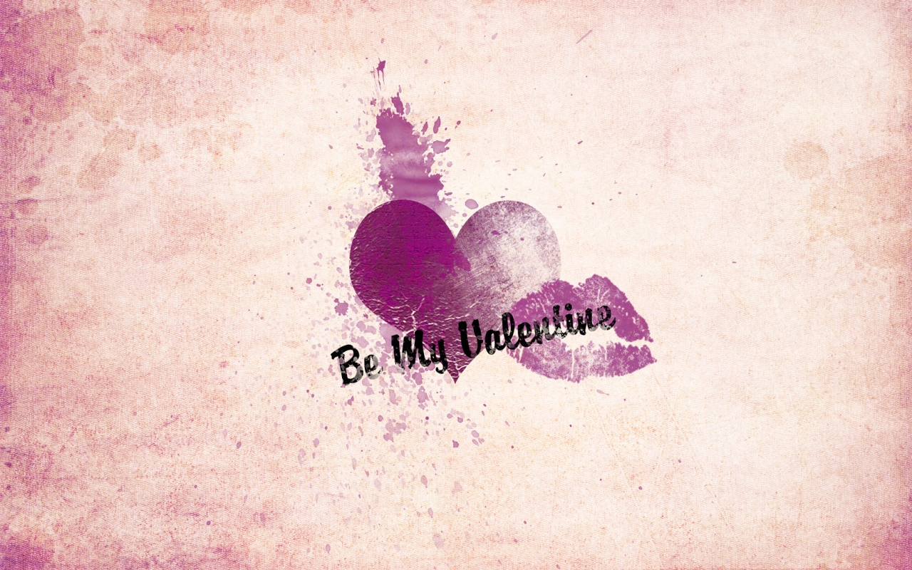

**今天放下个体，让我们说说“爱情”。**

**曾经，爱情是想象，是少数人的经验。**“临川四梦”之一的《牡丹亭》荡气回肠，讲的却是神鬼异境之下的爱情，它可以让杜丽娘生而又死、死而复生。梁祝相爱，却要化成蝴蝶才能相守。而那些“终成眷属”的爱情，却多是抵不过“现实”，《西厢记》的百转千回换来一纸休书，《孔雀东南飞》刘焦一对恩爱夫妻终成悲剧。爱情被认为是稀有的梦幻，是“别人的故事”。

**后来，爱情开始被解放，并被相信。**胡适和江东秀成了最幸福的包办婚姻典范，千金小姐林淑华爱上了自己的家庭教师徐惠民，沈从文和张兆和这段最老实却又霸道的爱情也为人津津乐道，当然还有鲁迅和许广平、冰心和吴文藻。爱情被认为是文明的果实，是“先锋人物的故事”。

**如今，我们仍然会歌颂爱情，但是爱情已经跳出了“圣杯”，成了“家常话”。**在这个谈“爱”不红脸的年代，“爱情”可以变得更通俗、更亲切，大大方方，磊磊落落。然而正如“两指弹出万般音”，两个人世界里，“说爱”其实并不简单。

如果暂且放下老生常谈的“一见钟情”、“执着专一”和“生死不弃”，跳出时间、地域和外围的框架，“爱情”究竟是什么？

**你是否想过，“爱情”也许是“误会”（Love is a misunderstanding）。**

它可能是我们对别人的误解，也可能是对自己的误解。我们爱的，是心中的那个Ta，如果爱到了，就爱屋及乌接受现实中那个部分的Ta，如果爱不到，Ta就成了未来之梦，如果爱到了却不接受现实的Ta，那么也许真正的Ta还在路上。

但无论爱到爱不到，我们都该感谢那个和爱有关的人，**他们让我们走进了他们的“梦想”，让我们的躯体物化了他们对爱的勾勒，成就了他们心中“爱的模样”。**

情人节这天，无论你正在爱着、被爱着，还是爱过、被爱过，都请对自己轻轻说：祝我们在爱的“误会”中越发幸福。

###❤陪你过一个不一样的情人节❤

【新悦读】是一只有心的耳朵，也是一个真诚地传播者。本期情人节特辑，我们没有大人物，没有大故事，我们想从稀松平常的琐碎里听听爱情的絮语，从平凡中的小确幸里看看身边爱情的模样。

**如果：
你哼着歌，TA自然地接下一段
你的任性吵闹，都是TA眼中的可爱
你的名字恰好解释了TA来时的路
TA牵着你的手，你就觉得你抓紧了全世界
TA是你的软肋，你是TA的铠甲
TA是一匹野马，而你也愿意为TA搬去草原
那些悸动的瞬间，时过境迁，你和TA依旧历历在目
…**

你和你的TA就是我们要寻找的“小爱情”！有木有很多话想要讲，有木有很多歌想要唱？一句话，一个故事或是一张照片，我们欢迎也期待着你的分享。暖男暖女们，我们一起在新年来之际始把气氛燥起来~

**如果：
TA温柔了你的时光，却因为胆怯，让你忍出了内伤
TA 体贴了你的忧郁。却因为矜持，让暧昧阻隔了圆满
你祈愿这不是惊鸿一瞥，能成永恒
你不想浪费这匆匆年华，愿能相伴
…**

你和你心里的TA就是我们要寻找的“类似爱情”！那么，新悦读愿做一天的红娘，在情人节当天2月14日为你代言~什么听过很多道理还是过不好这一生，什么只要爱对了人每天都是情人节…听得都醉了，新悦读陪你一起大声说出爱。

**爱情的模样，你来告诉我们。互动参与方式：**

1. 我们就是暖男暖女：直接回复“小爱情+你想要分享的幸福时刻/照片” （我们会选出最甜蜜的三对安排相应采访哦）
2. 我就是要你为我代言：直接回复“类似爱情+你希望说的话”

*（原文发表于新悦读微信平台 Wechat ID: xin-yue-du）*