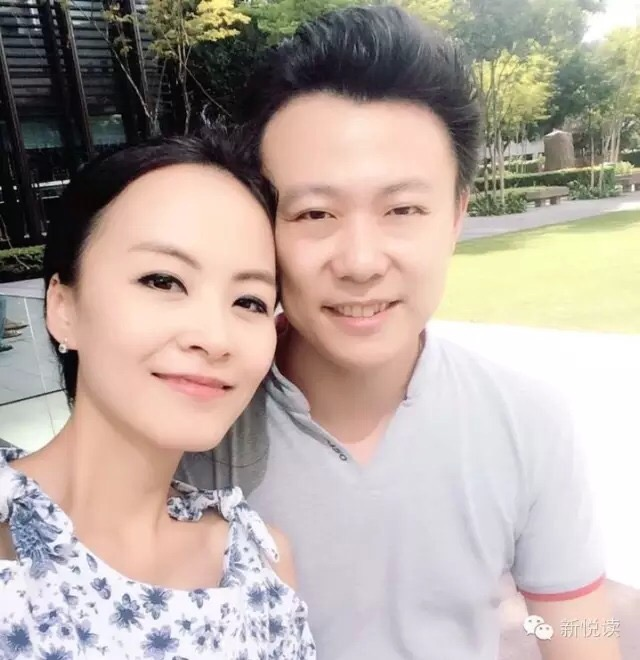
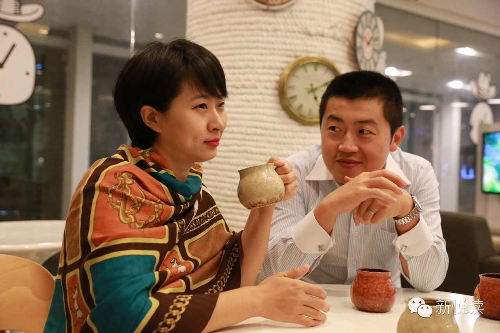
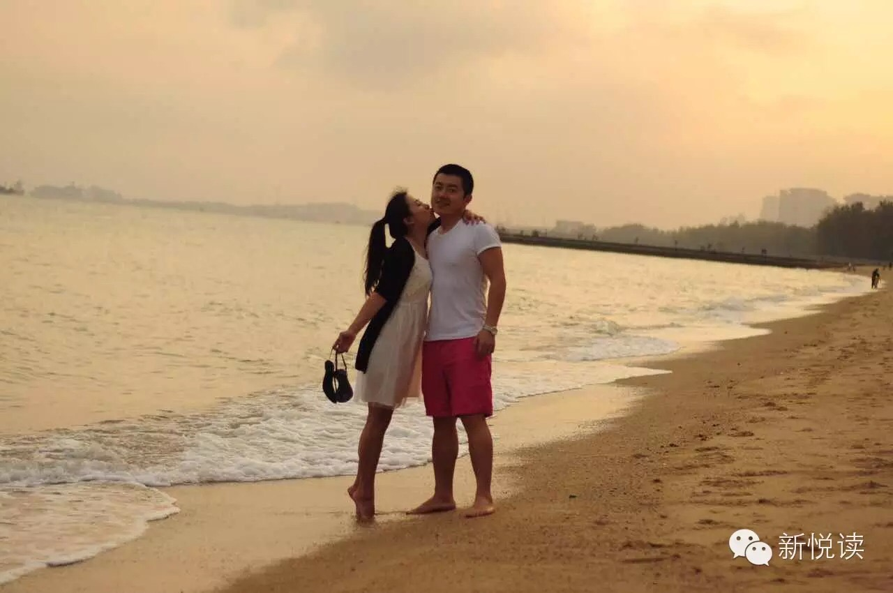
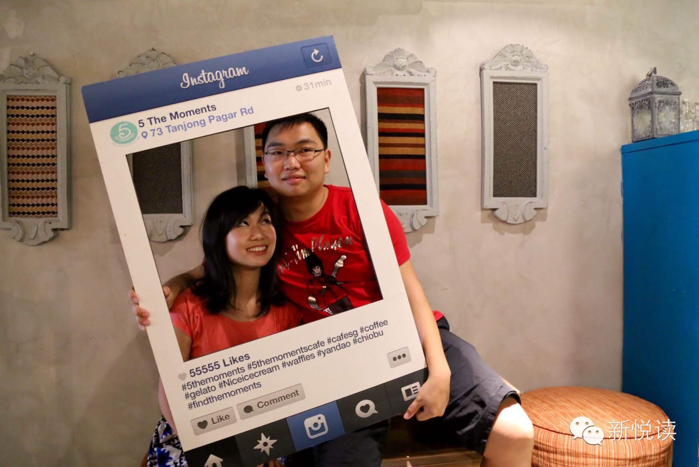
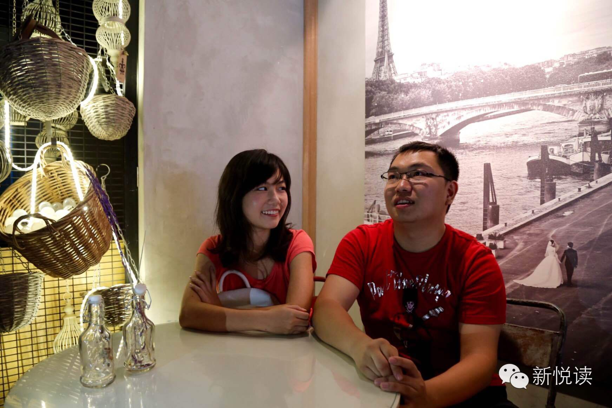

**还记得一周前新悦读的【情人节预告贴】吗？**

**奔涌而来的故事着实让小编的“婚恋观”在一周内被彻底洗刷了一遍。甜的腻的、苦的涩的，原来那些令人感怀的故事，早已有了原型，平凡到朴素，却真诚到深刻。在这个夜晚，不论你有谁陪，我都想把他们，讲给你听。**

##冲动与感动        

> Felinka和黄总

**2.5个月是她和他相识的时间。6天，是他们谈恋爱的时间。然后他们去中国大使馆注册结婚了，那一天是2010年1月5日。那一年他们都26。到现在，他们依旧幸福。**

时间回到2010年1月4日，她站在街头给妈妈打电话：

“妈，我新交了一个男朋友，感觉还不错~”

“你都26了，对待感情要认真些……”

“我们认真的！”

她转过头对站在身边的他说，我妈觉得我们不是认真谈，不如明天我们去注册吧。

他听了还来不及高兴，行，咱们明天就去注册！

他是一个四川的小伙，SM3国家奖学金获得者，03年来坡在南大攻读电子工程系。她来自一个四川和内蒙古结合的家庭，05年来坡，EASB毕业又读完了MBA。他们相遇时身份是同事，她早已是top sales of the year， 他却还是个刚入行newbie。

“你是怎么注意到他的？”

“有一天我看见有个男生在公司新人榜上排名比我还靠前，我就在想这是谁啊”

“那是怎么就开始谈恋爱的？”

“就有那么一天，觉得好像几天见不着这个人还挺想念的。”

注册当天，他们瞒着同事在公司打印结婚注册表格，悄悄地填。证件上的合照是穿着工作服照的。

在新加坡没法办婚礼，就分了三天请同事喝酒，啤酒，因为便宜。

没有足够的年假，便在一周之内快闪回国，在四川和内蒙古办了两场婚礼，随即又飞了回来。

“那就是他没向你propose咯？”

“没啊，连戒指都是随便买的”

“蜜月旅行呢？”

“也没。”

他们一起倒腾过婚纱，从国内进来，最后大多卖不掉，只好自己穿上，借着朋友办婚礼的机会去补拍婚纱照（外拍）。

他们一起经营过啤酒，他们的啤酒曾经入住亚龙20多家餐馆。

他们还一起做过室内装修，算是个夫妻档包工头。

也在这些过程中，他们自己研究了如何清关报税、如何申请创业准证，如何申请知识产权保护，如何申请投资移民。到最后，他们一起创办了一家经营至今且发展良好的公司，福智霖。

“1月5日恰好是他生日，嘿嘿。” 她甜蜜地说。

##巧合与注定
> 西莹和魏总

**她说：“结婚了，我们开始谈恋爱了”**

**他说：“找伴侣其实是在找一个partner而不是谁依赖谁，或是谁依靠着谁，更多的是相互进步”**

**凑巧1： 他的初中闺蜜是她的高中闺蜜**

时光悠悠，可青春有张不老的颜。如果说这是个拼“颜值”的年代，他们的青春许是你最羡慕的“颜”。

早些年发黄的信纸上，那些字字句句重读依旧闪耀。尽管书信本身并不是他写给她或是她写给他的，而是其中一位审阅了另一位和他们共同闺蜜的全部书信。这个共同的闺蜜总能捎带着讲讲两边儿的事儿。因此中新之间的纯洁友谊便从间接书信开始了。

是怎样的人格才能让还未见过面的她如此笃定 － 他是个靠谱的人？

是怎样的情怀能让书信这种质朴的形式传递出－ 她是跟我契合的人？

他们相识在美好的季节，顺着这一路走来，他们把友谊走成了友爱，把朋友走成了小伙伴，一走就走到了2008年。

**凑巧2:   他的第一份工作被外派回老家，有了第一次重逢**

2008年，大学毕业的他本应该安心留在新加坡好好工作好好生活，“本应该”和“本不应该”这相差的一个“不”字，造就了第2次凑巧。他的“不”情愿让公司在机缘巧合下也就把他外派回国，刚好是他的老家。那一年，他们重逢了。相识到相知，像是走了许多年，可正是这些年拼凑出了后来的相爱和深爱。

用她的话说就是“我们靠着双“Fei”走过了这些日子”。飞机和FaceTime, 一个缩短了空间的距离，一个改变了空间的认知。但是同时的，它也能在你毫不经意时，见缝插针进你的生活，告诉你：“嘿，我可不是任由你摆布的。”

于是乎，这就注定了他的出场是以一个特别“2”的方式开始的。

对于当年喜欢在QQ上偷偷潜水的人，一个叫“彩虹外挂”的插件简直就是一面照妖镜，令你无所遁形。不但能窥探隐身达人还能获悉他们的具体定位。

她总在线，他总隐身。她总开彩虹外挂～

她以上帝的视角俯瞰着一切骚动，而他很傻很天真地 Q她：“你猜猜我在哪儿”
……

重逢，她送了他一张唱片。歌者唱出了她对梦想的眷恋，于是她要他也听听，尽管出国在外多年，他早已对国内的演艺圈知之甚少。但他听了，并且保留到现在。

在被外派回国之前，他到法国交换学习了一段时间，于是被养成了一个“胖纸”，而她偏偏觉得，那时的他是个安静的美男纸。

**凑巧3: 她听得懂他的笑话 他读得懂她的心思**

怎么说他也是混新加坡演艺界的 （相声界），怎么说也是被联合早报有薪邀请去参加晚会过的，怎么说也是代表新加坡去参加过国际相声表演的。说他是段子手可一点儿不为过。

她说：“我是他的小粉丝，他娶了众多女粉丝中的我是因为我能听得懂他的笑话。”

他说：“找伴侣，三观这些不说了，笑点得相同。其实她是我最好的partner。” 

她为了他漂洋过海，从小公主蜕变车小厨娘；她又为了意外骨折的他变身医护小能手，他还为了他突破心理障碍，勇敢地在太平洋上了第一节游泳课。

她从不说，凑巧他都懂。

他懂她包干一切装修事务是为了让他安心工作；他懂她如今做得一手好菜也是为了能把他照顾好；他懂她更愿意把那带病在家的3个月看成是蜜月；他懂她去学游泳也是想跟他分享更多的美好。

**正是这样那样的凑巧，迎来了现在的刚好。**

**岁月长，衣衫薄。愿那些相爱的人们，始终牵手。愿那些真心，不被辜负。**

##欢喜与宁静
> 清鉴与楚雯

**我负责能说会道,你只管妩媚动人。**
 
清鉴像是定了个内置闹钟，每天下午6点，准时开始收拾手头一天的工作，第一个冲出办公室，连老板都尽量给绿灯。倒也不是有其他什么神秘活动，能从老板和同事那得到所有理解与支持其实都源于他一早就跟大家坦白的了原因：每天顶着下午的太阳穿过大半个坡县回家，可能意味着在家加班到深夜，可只有这样才能赶上每一个准时的晚饭，那是每天最开心满足的时刻，因为每个晚饭，都有楚雯等着他。

一个自小书香门第的美萌妹子，跟随博士后父母走南闯北，从成都到上海，再从上海跟随父母求学跨过半个大陆移居德国，而如今只身一人来到赤道岛国成为南洋理工的工科女一枚，转眼就是第二个年头了。多年的海外生活，一点也没有改变楚雯纯正标准的普通话和南方妹子娇羞的笑意；另一个能说会道各种文艺范的东北汉子，读着小说写写段子度过了18个零下三十几度的冬天之后，终于把话剧演到了四季如春的坡县，在南洋新生晚会上过了回编剧加演员的瘾。

一年半前，他是大三学长，她是大一学妹。按说同是南洋校友，相识本是情理之中。可是楚雯不知道的是，清鉴为了等这一天，已经准备了有足足两年。那时候清鉴刚大一，自打从哥们那里听说有个乖巧水灵的小学妹要来南大读书，心里便装满了期许。虽然从未见过真人，哥们也不过是轻描淡写的一带而过，可心里这股激动劲儿却莫名的强烈，跺跺脚，等吧！没想到这一等两年就一晃而过。
 
终于盼来了新生入学，这个从未谋面的小学妹果然没有让清鉴失望，留着个三寸小平头，换一般人估计不堪入目，可这妹子却驾驭自如，一脸清纯灵动中平添了几分干练。*很多人不相信一见钟情，可清鉴这一回，估计算是未见就钟情了吧。*为了打败众多竞争者最终胜出，清鉴决定主动出击，抢先制胜，在认识了楚雯一个月后，就鼓足勇气精心策划了东海岸的深情表白。
 
其实所谓精心策划，无非就是巧克力配蜡烛，红酒伴音乐。老套么？俗气不？嗯，小编也承认确实是毫无新意。但是你能看到，当这个“毫无新意”的表白过去一年多，我们再次聊起时，一个不乏大场面邀约的姑娘，仍然是一脸羞涩里满满的透着幸福。清鉴坐在一旁，一字一顿的说，“我想，是因为用心吧”。

**楚雯：**

“第一次见到他? …… 就觉得，这人胖乎乎的” （害羞捂嘴）
 “之后？ 哈哈之后觉得，这人真奇葩” （害羞再捂嘴）
“再后来啊？ 才感受到，别看他表面花里胡哨一套套，其实是个靠谱的人”。（一脸真诚）

**清鉴：**
“男人么，外表可以豪放不羁，但内心必须细腻坚强。”
“对别人那怎么忽悠都行，对她，那不行。”
“我这个人看起来确实是不拘小节，有点随心所欲，但是这一次，我真的很用心。”

清鉴最擅长在谈话时包场，一口浓重的东北腔时不时还串出几句段子，可是每次转头望到楚雯的时候，目光马上温柔下来，整个人亢奋的神经都变得平静安详… 

----------
**讲了这么多，总该有几句“我们说”。小编（的朋友们）也有各自的心灵角落，这些话就藏在隐蔽的文尾，见者是缘**

###【你说|最后没能在一起】
“他曾经在大年初一，从新加坡飞机加火车辗转来到我家的东北小县城，就是为了在冬天的雪夜放烟火给我看，他说青春很快就跑掉了，要为最爱的人疯一次...虽然已经分手了，但我相信曾见过爱情的模样，也还相信这世上总有一个人，会让我知道，遇到他，我的青春才真正绽放，而爱也会长久。”
小编想回你：青春短暂，但爱可以很长。有人为你疯一次，有人会为你“疯一生”。

###【我说|其实相爱就是“好好的”】
2015年2月14日星期六，是我和他异国重聚的第一天，也是他住院的第五天。这个被医生告诫必须10:30就寝的男孩还是守在白云机场的到达大厅傻傻等到了凌晨1点。1点20分我如约拖着行李走出来，远远看到一个熟悉的人影和一副陌生的白口罩，和口罩背后，他的笑。
 
已经是第三个情人节了，我却是第一次陪他去医院。他的右手手背插着一根输液管，床头挂着三个滴瓶和密密麻麻的病历本。电视上正用粤语播放着广州早春盛景之下玫瑰花泛滥从60元一束降至15元的新闻，我握紧他的左手，他安心地睡着，这一刻胜过窗外的千万朵玫瑰。

**亲爱的，“情人节”并不是“恋人”的专属，而是“天下有情之人”的盛宴。世间万种情愫无非都在向自己证明：我来过，我爱过。**