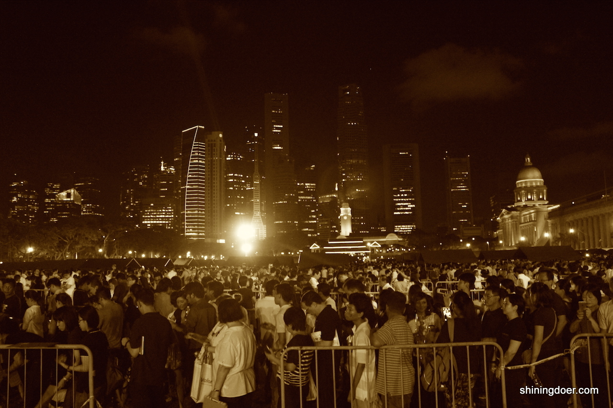

新悦读图志第1期

简单画面，记录2015年3月27日晚，上万群众到国会大厦排队致哀的现场。

###静静地跟着人群移动，就像无数个下班回家的路。不同的是，手里有鲜花，心中有默念。

###需要水吗？给孩子带瓶水吧？喏，给，拿着。

###饼干和面包，需要请过来这里领取。

###这里是来自stand up for sg的卡片，咱们大家排队等待的时候，一起来想想还能为新加坡做点什么吧！

###来吃吧，这是我一整天在家亲手烤的番薯，有很多，分给大家！

###爸爸，不要难过，你不是说李爷爷没有走吗？再说，你还有我。

###妈妈， 到我们了吗？

###看，这就是李爷爷年轻的时候。

###－还走得动吗？爸爸来抱你走吧！

###－走得动，要自己走！

###请注意脚下台阶，这里有台阶！小心点走....

###腿脚确实是不方便，但还是要来，一定，要来。我们来看看他，不是告别，是问候。

> **小编寄语**
> 
> 今夜无眠，灯火长明。
> 
> 也许是社区吊唁处的一束鲜花一个签名一个深深的鞠躬，也许是站在远处面朝国会方向那几分钟的默立，也许是坐在家里给孩子细细讲述这位老爷爷一路上平凡又伟大的故事，也许是走上街头和亲友一起重温这个城市，重温那些个在平时匆忙的脚步间被渐渐遗忘的繁街锦巷；也许，就是简简单单给Ta一个拥抱，给父母的一个问候的电话，给同事一个关切的短信，给路边的吉他歌手一张小钞，给无意间目目相对的陌生人一个真诚的微笑；也或许，就是继续做好手边的每一件事情，同这个坚强而又深情的国度一起继续她繁荣的脚步，那么，你已经给天堂的这位老人，送去了最动人的问候。

