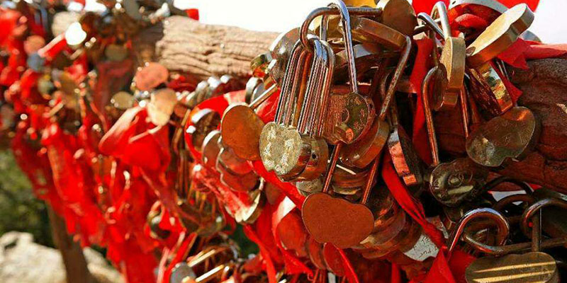

故事的起源是在2009年，那个时候我在新加坡做一个叫做「不可不信缘」的相亲活动，还算名噪一时，每次都能凑到一两百人来参加。

我发了篇博客出来，做了个觉得还挺好玩的参与者的统计：你是什么样的背景，你是怎样的性格，你喜欢做些什么。

（*具体统计结果见文末）从统计的数据来看，大部分的男生女生条件都非常不错，尤其是女生，大部分都是1米60到1米65之间，体型合宜，长相也都真心不错，有良好的教育背景，性格开朗，大部分喜欢唱歌喜欢旅游。我当时写出来就是聊博一笑，我说，原来这么好的女生都是嫁不出去的呀！还有很多朋友回帖附和，说“我终于找到自己嫁不出去的原因了！”

组织另一次活动的时候我又统计了一些别的，比如说，你希望和你另一半的关系是怎样的。挺大一部分的女生会希望有一个兄妹一般的感情，也就是说她希望对方像一个哥哥一样疼爱着自己，也有很多会说平等的关系；而男生绝大多数选择了平等——这个绝大多数的比例一定会比你想的大，因为只有一个男生选择了其他，并且注明“大家商量着办”。也就是说，其实这个年代，男生比女生更要求男女平等。我就在博客里面站在一个很高的位置说，
**你看，你要是想嫁出去就要调整好自己的心态了，你要适应这个环境。**

但实际上，这就是个奇淫技巧。
**我用了一个奇淫技巧的方式，还振振有词：你看，我用统计学来说话的，你最好听我的。**
其实是因为统计学是我的专业，我就有这个习惯。而我说的这些话也无非是教人些奇淫技巧，你要让对方喜欢你，女生和男生你就需要如何如何。

但是后来，我个人的一些经历，包括感情上一些失败，也包括在上一篇提到过的师父，给我拍醒了一点点儿。

有一次我们几个人去找师父喝茶。其中一个朋友就问也要去喝茶的静静，说你可不可以开车把我捎上，静静说好。静静又问我住在哪里，说要不我也带上你吧。第一次见到静静就觉得这个姑娘气场特别柔和，很美，总是笑着，有亲近感，但是也说不上来为什么。那天静静就兜了一大圈，从她的家绕到碧山，绕到多美歌，然后到东海岸，那天下着大雨。喝了许久的茶之后，师父悠悠丢过来一砖：“静静去接你们，那是她，可是你呢，你怎么就没问一句她去接你们方不方便呢？你可以坐个地铁从碧山到多美歌然后你们在那里等她，也不麻烦。
**说浪漫一点，你不如静静那么有爱。心的问题。”**
我心里就咯噔一下。我想我怎么就变得不够有爱了呢？我有这么多的朋友，难道不是因为爱么？我也一向挺和善的呀。怎么就不够有爱了呢？我其实想了要问问静静方不方便，可是为什么我没问呢？我当时就觉得我的眼泪要掉下来，我需要茶压一压。我就捧了茶杯对师父说：“茶。”师父就给我沏上一杯。这个时候我意识到自己混蛋啊又错了！我怎么就只想到了自己这个时候难过需要茶，然后就跟师父用了这样一个如此简单的字！一个祈使句。谁也没有这个义务给我倒茶，虽然我需要，虽然我难过，虽然之后我可以说谢谢……就好像静静没有义务来接我一样。
**我在接受，我在索取，可我何曾给予了什么呢？这一个“茶”字，就是心的问题。**

说回到之前的那个相亲的问题上来。除了不可不信缘以外，其实有非常多的相亲活动都会遇到一个问题：报名的女生非常之多，男生总是懒洋洋不大有兴致。「女生一方面想早点嫁掉，一方面还觉得自己各方面条件不错不想轻易嫁掉，怕所托非人。」她们大多有自己的事业不需要另一个人来养活自己，她们是想找一个可以在感情上依靠的人。而男生又是那么的不着急，有若干死党男生朋友跟我说，「我要先赚钱，要找好工作，到时候自然会有人，而且不乏年轻漂亮的美眉贴上来」——这确实也是一个现实。可内心，他们也会有隐隐的缺憾：“如果我哪天没钱了她们还爱我吗？”

**我身高ok，长相ok，智商ok，赚钱ok，可这对我的另一半来说有什么意义呢，我可能还是只是单纯的在索取而已。**我尝试去成为一个上得厅堂下得厨房的人，于是我学会了做饭，但是心里有时会有另一个倔强的声音：“我会，但是我不愿意为你做。

我明明不想被当成生育的机器，不想为了一个我压根不在乎的传宗接代的目的放弃一个真正的伴侣，明明叫嚷着真爱叫嚷着关怀。
**可是，去衡量这些外在的条件并以此作为评价一个人是不是宜室宜家好像已成为我自己下意识所为。**当呼唤着暖男的时候，我是一个暖女么？是我自己在计较对方有没有爱我，用了怎样的表达方式，这个表达方式是不是我想要的。我还可能教导对方，你要这样去爱一个人会比较好，即便那个人以后不是我，我要你幸福。我还以为这种趾高气昂的样子就是为对方好，做了多大贡献似的。用交换的方式去算计两个人的幸福——我就是个笑话！

不是赚钱养家不对，不是调整自己的心态适应对方不对，而是那个最初的心错了。
**我爱，我要做所有让你开心的事；而不是，我要，所以我要“爱”你。**

静静有个弟弟，全家都很宠他。在回家的路上我们问静静，他会恃宠而骄吗？静静说：“会啊，但是这就是他的福报啊。”除此没有别的话了，没有说他别的方面有多好，没有说他会回报什么，没有说他如何爱这个家，都不需要，因为他是弟弟。

我顽固的骄傲还在，师父不在身边的时候，我时而忘记他拍我的那块砖。只是在我偶尔可以低为尘土的时候，真切感到世界的美好。

**太把自己当回事儿，是我缺爱的根由。那你，是否和我同病相怜？**

多的是，我不知道的事。

##聊博一笑的统计

