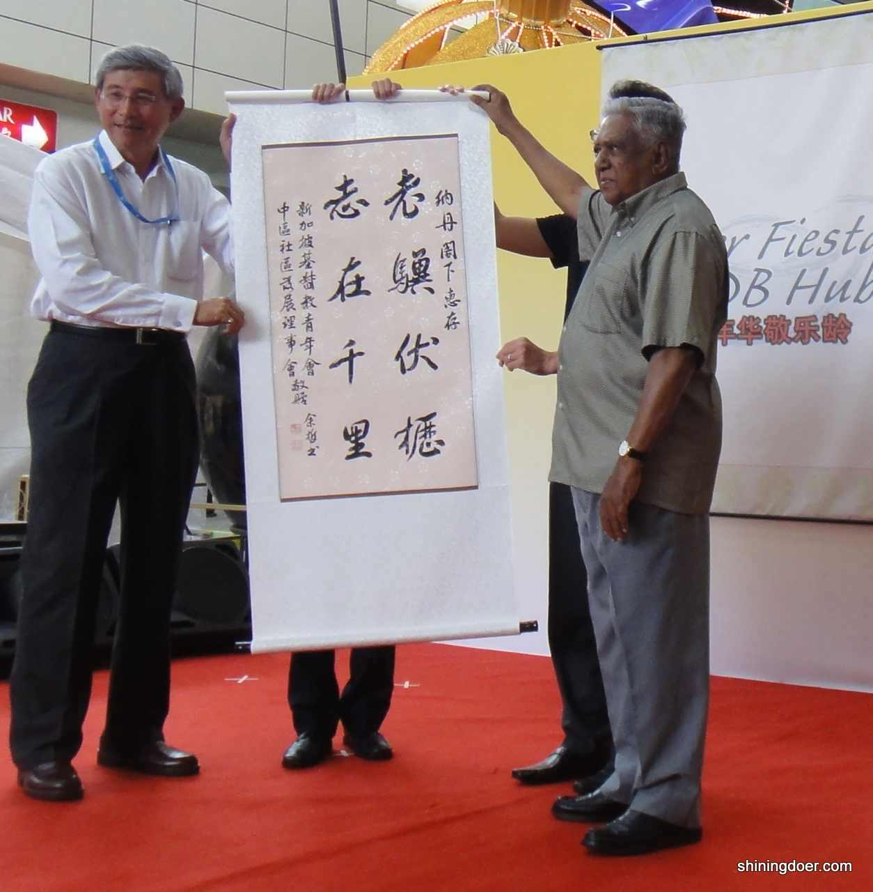
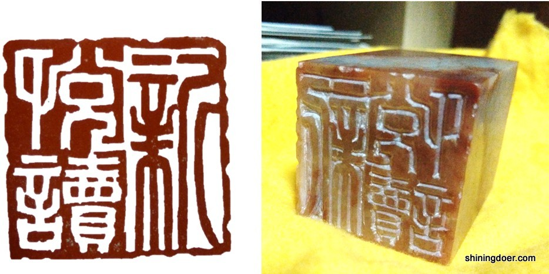

余哲者，柳江人也。（哪？）广西。

据说早在80万年前，此地便有了人类栖息的足迹。（这事儿余哲知道么？）关系不大。

五万年前，也就是新石器时代的晚期，“柳江人”已经开始在此地幸福地磨石头、丢石子了……~（说人话。）好嘞~

以上的年代，余哲统统都是没有经历过的。

别急着骂人，不过这厮的生活倒像是从某一个我们没经历过的时代搬运过来的，不可谓无关。遥想当年，你我还在跳皮筋、被爹妈满楼追着捉回家吃饭的时候，余哲已经遥望窗外，悲秋伤春了。（这孩子多大？）10岁。（妹子？）不好意思，纯汉子。

是日，余母像往常一样和一众姐妹玩嗨了，一甩门进屋发现他还在“静坐修禅”，大惊失色：“孩子，你是从我这个年纪穿越回来的么？”哲不语，起身拿起一副书作。（嘛玩意？）书法><

余母看后，再惊失色。遂觉已无力辅导，将之送至永宽老师门下，拜师习书。书门从师有讲究，余君多年坚持寅时（这是什么时候？早五点！）起床跑步到老师家练字，十年笔耕不辍。命有漂洋过海之运，于是19岁下南洋至今八年有余。谁曾想如今这位新加坡书法协会最年轻的会员当年却是带着一身技艺进了“化学系”。（屈才！）别忙，且听我慢慢道来。说到化学系，小编是个十足的门外汉，但若说常被余哲蹭课的中文系，那小编就是“东家”了。质疑书本？挑战老师？这都是小事，敢在“国大书画苑”这块匾额上弄墨的，非余哲本人莫属。

毕业之后，这厮又开始了一边赚钱一边“四处留墨”的生计。（别人留情他留墨？咳咳…注意格调！）不过，谁说留墨就不留情了？（捂脸，我什么都没看见。）据说余哲给小学生上的书法课上，必须安插一位女教师在旁“监课”，以便及时扼杀女学生暗恋的苗头。余哲本人被教导主任叮嘱最多的就是：我只有一个要求：不许让女孩子喜欢你。（余君已雷焦：我请求下雪！）

至于余哲和小编嘛，说来话长。经良友介绍、互生敬仰（哈哈哈哈，我是有多谦虚。）就被作为“特殊人才”引进了新悦读，并慷慨担纲了新悦读Logo的主创之一。说到这个Logo，我们老大“仁君”可是蒙屈不浅。（哈哈，谁让他如此草率地用Ipad和他那天生未得到认证的美术资质鼓捣出了一个工科生才看得懂的……菱形。。。。）不过老仁，你也是尽力了，我们懂得（虎摸）。

说回余君。两度书法比赛折桂之后他也是忙得不亦乐乎。然而百忙之中还是贡献了他的墨宝供大家鉴赏。采访的时候小编才知道，「新悦读」这三个字可真不是随便写写的，还被这厮说得头头是道：“清新亲和是我们的风格，所以字体清秀，不花俏。字的写法也都是古而有之，但看起来却是和先行的简体十分接近，认得清、记得住。”

对于如此满意自己作品还能说会道的书法家，小编已醉。（先护住膝盖，高潮才刚开始！）

你以为一个人就可以为新悦读定Logo么？难道仁君和以Amy领衔的设计师团队是酱油党么？！当然不会。老仁搬出了他工匠精神的理论：“字体位置、大小、字距，英文名都是重要细节，图章精致，那也得有整体性才能凸显风格。”设计师Amy连夜赶工，不仅把Photoshop中的字体试了个遍，自己还下载了不少，然后英文字母间距也是调了又调，最终在某一个清晨确定了现在大家所看到的版本。

**小编也想借此机会向各位述说下新悦读Logo创作动机和寓意。**

- 书法乃中国国粹，白底黑字配上手工篆刻的印章，是为东方文化，再加上上英文名成为一个整体，是为东西文化结合。

- 新悦读是以人物为核心的平台，我们相信每个人背后都有闪光、感人的故事，是为Shining Doer。(恰巧“读”和“Do”谐音哦^ ^）