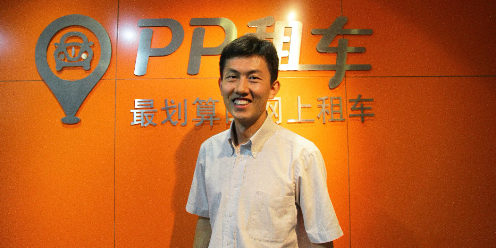

> **“创业者判断创业项目可行的三个标准是：你认可它的价值、且能搞定、且它是一个很大的事儿。”**
> 

从三元桥地铁站出来准备去接客户，拿出手机打开“PP租车”app，定位，最近的一辆车刚好是宝马5系、自动挡，周三不限行，车主郑先生9条评论皆好评，下单，走过去用手机开车门，轻踩油门，走起。

**在过去的两年PP租车的增长速度着实惊人。这家起源于新加坡并且在2012年就获得了新加坡政府直接投资的公司，并于2013获得A轮融资一千万美元，两年内从4个人扩展到700个人、从北京延展到全国的17个城市。这个平均年龄只有26岁的庞大军团背后的CEO，就是张丙军博士。**

“我想先做一个小调查：在座有驾照的朋友请举下手。好的，谢谢，请放下；有私家车的朋友请举个手。好的，谢谢。”PP租车CEO张丙军在过去一年的多场讲座中，经常以上述提问开场。而PP租车要做的，正是“有车人士”和“无车司机”这两拨人的生意。

新悦读和张丙军博士相识在一场在新加坡举办的关于共享经济的讲座。一个月后，我们在离他家不远的地方对他进行了专访。他三岁的儿子在一旁欢快地驾驶着场地免费供应给孩子们的玩具小轿车，一个人玩的不亦乐乎。

“男孩子天生对车有一种钟爱，因为车是脚的延伸。”丙军看着儿子说。

这位当年清华大学计算机系的学生会主席，其实从小学就有过“无照驾驶”的“灰历史”。家在河北保定，张丙军几乎摸遍了农用车、拖拉机、大卡车、吉普车等各种带轮子的代步工具。那个时候，河北的天还很蓝，甚至蓝过北京；丙军身边有好多车可以开，而且可以“随便开”。

“穹顶之下”，有人为柴静家里车的排量究竟是4.0还是3.7争得不可开交，有人埋怨自己有车却开不出去而不痛快，有人排了两年队愣是摇不着号干着急——究竟谁错了？究竟谁来管？

有抱怨就有商机，因此P2P租车在近两年持续升温。张丙军曾预计“PP租车”在今年年底交易额超过号称中国最大租车公司的神州租车，紧接着神州CEO陆正耀就表示：“今年三月将入局P2P租车。”

这年头，车到底是买着合适还是租着合适？
P2P租车究竟是怎么回事？
它和传统租赁行业有没有什么仇怨？
汽车经销商对租车怎么看？

做租车平台的张丙军并不认为“一定是租车好”，而在这个开放的租车平台背后，他还有一个关于“共享经济”的蓝图。

**（“新”：新悦读；“张”：张丙军）**

##**一 从无到有的那些事**
****新**：在做租车项目之前还做过哪些事儿？**

**张**：我大学毕业之后来新加坡博士，博士毕业之后加入了一家创业公司，但很快就遇到了发展瓶颈。我开始问自己：我是真的要创业吗?还是去读个MBA？还是干脆换一份工作？最后想明白了，还是决定去创业。但是前两个项目都失败了，一个是做到一半发现已经有人在做了，而且做得很成熟，我们才意识到自己走错了。错在没做市场调研，上来直接写代码。第二个项目是做基于购物达人的电商，做到后来发现新加坡市场不够大，加上自己搞不定库存这件事，所以就卡住了，陷入了迷茫期。也是这段迷茫期让我想通了确立项目的三大准则：你认可项目的价值、且能搞定、且它是一个很大的事儿。

****新**：这两个项目加起来的失败周期是多久？**

**张**：挺快的，各三个月吧差不多。

****新**：所以P2P租车符合了你们的三大准则？**

**张**：对。其实当时找到跟车有关的三个项目，一个是类似于汽车之家的门户网站，第二个是拼车，第三个就是P2P租车。最后这个整个亚洲当时没人做，虽然很复杂但我们有把握能搞定，并且能增加环境保护和道路交通方面的价值，以“分享”的形式来促进社交，这也是分享经济的一种模式。

****新**：怎么有把握“能搞定”？**

**张**：“能搞定”是一个感觉（笑）。我们当时把项目的各个环节都想到了。开发软件和硬件，线上线下运营和服务的支持，还要和保险公司谈保险，这些其实我们都能搞定。2012年6月开始决定做这个项目，同年11月我们就通过TIS (Technology Incubation Scheme)拿到了政府和风投的联合投资。

****新**：听说中间拿到了几个投资的offer，但是你们没有要？**

**张**：对。因为还没有达到最理想的期望。我们申请的TIS比较像VC的模式，比较轻快友好。虽然是政府做投资人但请的是美国的VC来规划投资体系，比较专业一些。

****新**：但是拿到投资之后立刻就回中国了？**

**张**：对。其实还是因为想把这件事的影响力做到最大。加上当时在中国也没人做，团队又都是大陆的背景，所以第一时间就决定把国内市场启动起来。

****新**：新加坡的投资人对此是什么态度？**

**张**：我们跟大家达成了一致，他们还催我们过去（笑）。在新加坡我们把保险、用户流程以及软件硬件的系统都建立起来了，这个对后期迅速适应中国市场的帮助非常大。

****新**：还记得租车的第一单吗？**

**张**：在新加坡的第一个装智能盒的以及第一天被租的都是我的车。在新加坡只有你上线了、有保险了才能租车，所以在12月12号上线的当天，当时就有一个人来租车。是我们上线前一直接触的老用户。看到我们上线的邮件提醒他就赶紧来租车了，当时非常兴奋，而且整个流程还比较顺利。

在北京第一次租车是在13年10月10号正式上线，但是在我们正式上线之前，9月30号我们唯一的客服说：哇有人下订单了，还支付了！我记得那人还特意去测试我们的手机开关车门设备，发现手机可以开关车门他还特别惊讶，说哇还有这么神奇的事情（笑）。

##**二 P2P租车如何实现**
****新**：手机开关车门这个技术是如何实现的？**

**张**：车里装一个智能硬件，和服务器可以通讯，并且连接车的门控马达，这样就可以通过网络来控制车门的开关。

****新**：您说中国3亿多人拿着驾照但是只有1亿人有私家车，2亿人拿着驾照没有车开。当然这还没有把像您六年级时的那种无照驾驶的情况计入。（张：笑着点头）这1亿多人中究竟有多少人肯把自己的车租出去？**

**张**：这个我们调研过。12年刚上线的时候，我们在新加坡、北京和上海三个地方调研。新加坡19%，北京上海均是17%的人愿意把车租出来。这个比例还是很高的，而且它也只是一个初始的比例，据目前估测，在我们推广过的城市这个数字应该达到了30%，随着这个概念普及以后我们希望这个比例能到60%。

****新**：车险是一个让车主愿意租车的保障，但是从长远来看车的维修对车寿命的折损所引起的折价该怎样补偿给车主？**

**张**：对，这对车主是有损害的。所以一个半月前我们升级了我们的保险。我们的保险经历了几个阶段的进化。开始的时候是100万的保险，1500元以内租客赔偿、1500元以上是保险赔偿，修好了就好了，不考虑折价问题；第二步我们把1500的免赔额去掉了，不管费用多少我们全赔；第三步就是我们现在的模式，不但要把车修好，而且一旦维修费用超过一万、对车辆产生质的损害的时候，会按照维修金额的比例给车主现金补偿，而且维修费用超过十万块的时候会给车主买一辆新车。

##**三 直击P2P的“前后事”**
****新**：您曾经说相较于传统租车行业PP的租车门槛降低了很多，并且PP致力于把这个降低门槛做到极致，对此你们都做过哪些努力，目前有多极致？**

**张**：这个问题问得挺好的。传统租车行业当前最大的几个门槛，一个是车离得远，而我们利用私家车和定位技术可以解决这个问题，让租客就近找到车；第二个是传统租车行业的车是非常贵的。他们巨资买了车还要盈利所以定价很高。那把私家车出租实际上是在减少浪费，把浪费的部分出租车主还会觉得是自己赚了，所以我们的定价要比传统租车便宜30%；第三传统租赁行业不够灵活，只能租一天或者租满规定的天数，私家车租赁的话由于我们有系统支持，你可以只租一个小时或几个小时，去接朋友、去购物。如果你要打车去30公里以外的地方，3个小时租一辆车只需要50块钱，比打车还要划算。

除了价格、距离和灵活性之外，后续我们还在优化（用户体验）。如果较近的范围内没有可以订的车，那我们还有送车上门服务，我们的工作人员或者车主就可以直接把车给你开过去；而且用完之后也不必还回，只需要停在原地，由我们来上门取车，这样一来用户会发现比开自己的车还方便，前后只需要等15分钟。

****新**：还减少了停车和存车的时间和成本。**

**张**：是的。

新：如果这个模式走到极致的话，有没有想过路上跑的车会比现在更多？
张：这个问题之前和新加坡政府以及北京政府深入研究过。
首先有两个问题：一是社会的道路现状能够容纳多少车在路上开，第二是社会最基本的自驾车用车需求。

目前中国的基础设施可以容纳3亿辆车，但是当前的1.37亿小轿车的分布非常不均匀，导致了重点城市的拥堵。而剩下的近2亿的持照者又得在门槛极高的状况下去争着买车，我们也要满足这些人的基本用车需求。解决方案目前是引导车辆分布均匀化，比如限购政策，但是这种极致的办法就会影响人们的用车需求，所以需要兼顾二者的话就需要最大化地增加私家车利用率，这就只能是共享的模式。P2P租车的形式能够使造车资源、停车资源以及他要配备的加油站的资源最小化，所以如果我们把P2P租车放开，他可能会出现短时间内路面车辆的增加，但是长线的话我们看2020年，如果没有P2P租车，当时会有10亿人有驾照，他们会挤破了头去买车，它会使整个社会的私家车增长压力极大，人们用不到车反而责怪政府的限购，既满足不了需求又恶化了拥堵；而如果使用P2P租车的话也许10亿人里面想买车的就只有1亿。到那个时候车辆增长造成的压力会小非常多。这对长期内社会车辆的减少和车辆使用量的减少是有极大地帮助的。这是我们13年的时候和新加坡的陆路交通管理局（Land Transport Authority）沟通达成的共识，双方都认可P2P租车是一个既控制车辆增长又满足用车需求的两全方案，政府限购或提高车牌价格都是不完美的方案。

****新**：好。那这里有两个衍生问题：从租客的角度来看，如果长期使用租车还是要比买一辆车贵，那么他们“变客为主”的可能性会不会很大？另外是否考虑过“人多车少”的话车主会购入更多的车用租车来赚钱？**

**张**：问得好。首先用车频率如果非常大，那么买车确实会更经济。传统租赁行业的数据是当你一年需要用车153天以上的时候，其实你买辆车更划算。但是P2P租车由于价格便宜30%，所以如果你一年要租200天以上的时候，我们还是建议你买车更划算。但是你会发现用车人群中，有200天开车需求的人占比是非常低的。
第二，在我们的平台上，那些出租率最高的车确实会赚钱，但作为一个平台我们不会保证绝对会赚钱。所以如果要把它当做一个投资工具的话是不靠谱的，收效远远不如把钱投在股票、基金、外汇、黄金等领域大，这个投资回报率是无法保证的。

****新**：那如何看待用租车收入来偿还车贷的行为？会是对买车的鼓励吗？**

**张**：这确实会让买车的人痛苦更少一点，但不会让不愿意买车的人去买车。我们希望在P2P租车推广之后，反向拉动这些愿意买车的人不去买车，让买车的人更少是一个综合的结果。

##**四 传统租赁和汽车厂商怎么办**
****新**：A轮投资之后PP和广州的瑞卡租车建立了合作关系，和传统租车公司的合作顺利吗？**

**张**：还挺顺利的。我们的愿望是联合传统租赁公司去促进整个租赁行业的产业升级。从三个维度来讲，第一我们做的是一个信息平台，欢迎传统租车公司把车辆放到平台上来。只要他们的车辆能够满足租客的租车需求，我们愿意把订单倒给他们，提高他们的出租率。第二我们愿意把智能盒这种新的技术安装到他们的车上，实现手机开关车门，从而使他们去门店化、减少管理人员降低运营成本。第三点就是PP租车作为一个统一的信息管控平台可以帮助整个行业降低行业风险。过去租赁公司之间的信息是不能互通的，一个租客可以骗租20家公司的车而不被察觉，但是我们可以帮助行业来统一管理租客的信用，这样一个租客有劣行的话整个行业的车都能被保护起来。所以就是发挥PP信息管理的能力和传统租赁公司拥有资产且运营资产的优势。现在不仅在广州，在北京我们也合作了几家公司，反应都非常好，我相信这是一个过程。

****新**：他们的租车价格会维持原价还是服从你们平台的整体价位？**

**张**：他们可以通过一些差异化服务来维持原价，比如配宝宝座椅、配GPS导航等等来寻找差异化的生存空间。

**新：有考虑过汽车经销商和主机厂商的感受吗？**

**张**：有。首先经销商的趋势是去中介化，他们可能会比较难受。而主机厂商则是找到了一个越来越重要的销售渠道。过去的车生产出来都是要卖出去的，它的收益是卖车和维修保养服务的收益。但是买车的钱其实不如租车的钱多，未来可以以试驾或租赁的形式让更多的人把车用起来，因此维修保养的需求会更大，从而产生比卖车更大的价值。

##**五 PP社区计划和共享经济理想**
**新：听说PP有意从社区建设的层面推广P2P租车，把车主和租客的关系连接起来，这个项目预计何时启动？**

**张**：现在我们是相对轻快地做一些市场宣传，但是在产品和预留收入方面还没有开始做，因为目前的抽成全部补贴给车主了，预计一两年之内正式启动这个项目。

**新：如果真的启动了，PP会扮演一个什么样的角色？**

**张**：我们希望做一个早期联合的发起者，以开放的心态把社区空间的热情调动起来之后，让有这样热情和兴趣的人去运作。我们只希望做一个火种，而不会控制这个事情，只有这样才能给社区内其他志同道合的成员以最大的空间。

**新：2014年在新加坡成立了亚洲的第一个共享经济协会，听说PP也会希望在中国成立第一个共享经济协会。您对此的展望是什么？**

**张**：我们会是一个发起者，最大化地团结共享经济的商业力量和非商业力量，包括个人和慈善机构。在这个平台上最重要做两件事情：一是共同对市场发声，让每一个人感受到共享经济对他幸福度的改变，比如从压力巨大的买房买车变为每天可以开不同的车，这个自由度的提升；另一个是对政府发声，让政府意识到共享经济是一个大潮流，并且制定政策去促进和支持它。

**新：PP在2020年之前的蓝图是什么？**

**张**：我们希望尽快把这个项目推广到全国去。希望它在每个城市增长的速度能够和限购和交通拥堵、尾气污染的恶化程度赛跑。2020年的中国如果只需要一亿人想买车、五千万人愿意把车租出来，满足七亿多有驾照没车开的人的日常用车需求，那这个社会就会变得更舒适，这就是我们要达到的目标。但是现在城市恶化的速度是很快的，但是我们现在做得还不够快，还要再快一点。

> **采访手记**
> 
> 采访中我问张丙军，您现在还会把自己的车租出去吗？他不假思索：会啊，当然会。把我的车租出去就意味着我可以开更多想开的车而不是买各种车存在车库或者新车旧车之间倒买倒卖，省去不少精力和时间。
> 
> 当PP走入人们的视野时，“共享经济”的概念也随之而来，我们心中对P2P平台有多大的信任、就将享受多大的自由空间；同样，我们对社会资源负担多重的责任感，社会就会回馈给我们多大的便利。如果没有人能够像政府一样限制他人出行，不妨索性把自己的闲散资源贡献出来，方便那些有即时需求的人。和“金字塔”模式不同，“共享”是一个圆形的概念，教人上下求索、能量永动。 
> 

