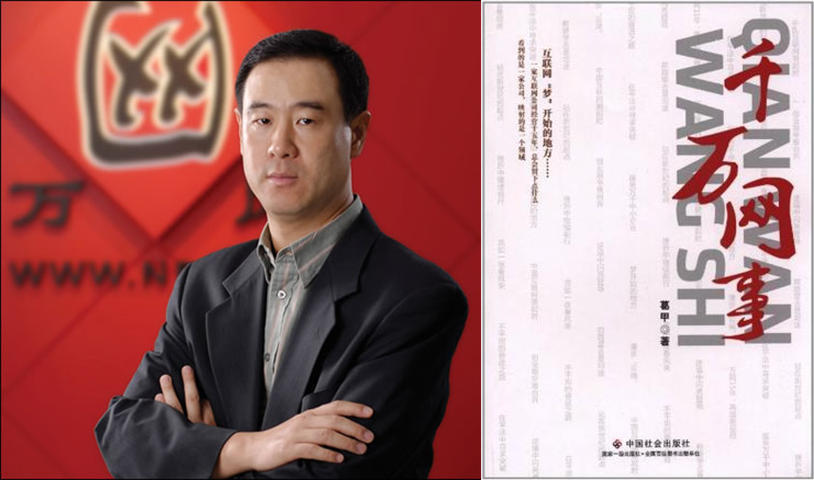
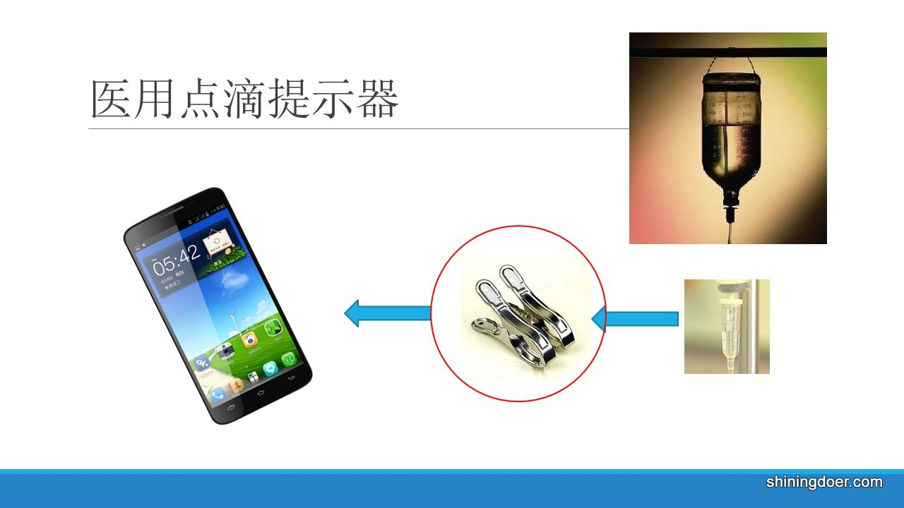

> **张向东** 

> 前万网创始人兼CEO，现软银合伙人。2013年万网成为阿里巴巴集团全资子公司，继续引领中国域名服务和云计算行业。

访谈就在向东家进行，他家中陈设很典雅，家具多是木制，由于空间大，也透着一股简约。墙上的画有不少西方作品，很有中西结合的味道。一见面他就招呼我们喝茶，语速平和，对话从创立万网的初衷开始。

*“大概94年知道互联网的概念，我是搞计算机的，隐约觉得这将会是一个很了不起的东西，所以决定做点事情，96年便创立了万网。”*向东坦言一开始他也彷徨了很久不知具体该做什么，所幸是找对了大的方向，现在回过头来看他把这种“幸运”归结为一种潜在的判断，也是他自己口中的“前瞻性”。

大多数成功的创业者都是因为他们杰出的成就被大众所熟知，殊不知背后经历了多少鲜为人知的困境。回顾创业经历，向东感慨万千，和新悦读分享了创业期间他“印象深刻、比较大的三次挫折”，就让我们一起先来读读他的千万网事。

##第一次挫折：建网站跌跌撞撞

那是在公司刚起步的时候，当时我们的想法是去帮中国的企业使用互联网，具体怎么帮，我们看到当时中国基本没什么网站，而那些国外大公司都有自己的网站，像是微软，HP，IBM。所以我们就自然而然地想到中国的这些大企业也应该有网站。但我们沿着这个思路做下去发现非常难，我们等于是一个市场宣传的先锋，我们跟很多大企业去谈，告诉他们互联网时代来啦，你看国外大公司都有网站你们也应该有，但这些人就比较含糊，说：嗯，你们说得对，那我们应该干什么呢？我说你们也应该有网站啊，我们给你们提供一个方案你们就可以有网站了，但是这些人就说好呀让我回去研究研究，然后就没消息了。再加上那时一个客户方案做下来会比较贵，大概都要一二十万人民币，他们可能觉得这个投资还有点高，摸不着头脑，所以也下不了决心，别人还没做的时候为什么我们要花这个钱呢。

总的来说因为建网站这个概念比较超前，所以进展很缓慢，一年下来没做几个客户但我们却雇了不少员工。

我们当时为了有一些其他的营收，还做电脑代理，那个花费也不小，但正因我们不够专心，所以代理做的也不怎么好，赚的钱也不多，也就没办法继续支持互联网的生意，很快钱就花得差不多了。所以我们在96年后半年就非常困难，一方面我们还在试图游说那些潜在的客户，但同时我们又入不敷出。

##第二次挫折：二轮融资烧钱过快

过了几年，万网在国内算蛮有名气了，我们也融了一次资。2000年我们进行第二次融资，在融的时候就觉得气氛有点不太对，所幸我们动作比较快完成了那笔融资，之后市场就骤然地对互联网十分怀疑。融资前我们的业务做的还不错，市场份额第一，增长速度也非常快，年增长好几倍，营业收入客户量都这样同比上去，也正因为如此我们当时融资的时候跟投资人承诺的比较多，或者说做的市场预期比较激进，所以融资后为了做到承诺的数字，钱也烧得很厉害，2000年一年时间一多半的钱就烧掉了。

原来的想法是都能接替上，就是这一轮做到多大规模的时候，又可以接着融到下一轮的钱，甚至就可以上市了什么的。可是这样下来以后发现市场气氛完全不对了，不可能很快找到下一轮投资者。

当时的大环境也让很多公司就这样死掉了，我们也是倒计时算我们还有多少钱，还能烧几个月，因为那时我们弄了很大的办公室，也请了一些很贵的人，有着豪华的团队。虽说我们的业务模式是盈利的，但是因为支出太大，每个月就都是烧钱的状态，那个阶段压力是非常大的。投资人那边给的压力也很大，董事会开会的时候大家也都黑着个脸，恨不得咬对方一口的感觉。

##第三次挫折：SARS突袭

2003年在北京遇到了非典，不知道会怎么发展，你看机场没人坐飞机，酒店没人住，办公楼里面有一半的人都不在，大家挤到电梯里恨不得觉得对方都得了非典似得，所以当时我们也很紧张，担心团队里面谁会得（非典）。当时有个传言说，（要是得了非典）送到某个地方就再也见不着了，就治不好，一盒骨灰就送回家了（笑）。

试想如果你是彼时的向东，你会如何应对？

##针对第一次挫折:从网站到域名

**“山穷水尽疑无路，柳暗花明又一村”**，96年的时候正是因为我们快山穷水尽了，也是因为我们走在前面，在丛林里探索，然后悄然发现了泉水——**域名可以作为产品去卖。**之前提到我们一开始是建网站，当时建网站是一个传统的系统集成的概念，那是很贵的，所以很多企业下不了决心，但是域名需要先保护起来，恰巧我们发现域名又有人抢注，这些也是因为我们走在前面率先发现的情况，所以我们决定把域名抢注的这个现象向社会予以公开、宣传，果然引起了高度的重视。我们写了一些宣传稿，给了报纸，第二天就有记者来采访我们，第三天就见报了，后来陆续又有不少媒体来采访，我们媒体公关的工作做得好，我们公司的电话上了报纸，结果呢我们的客服电话就被打爆了，这样我们就迅速成立了一个域名注册的部门。*“应该说在我们之前没有人把域名注册作为一种业务来看待，是我们率先提出要先注册域名把它保护起来。”*

所以96年我们通过域名注册打响了第一炮，过了几个月才有好多公司学我们，但我们一直一路领先，到现在都是number one。

域名注册我们在97年做到了将近1000个客户，当时我们的定价不低，一个域名连同某些增值服务在一起，我们收到3000块。当时注册域名的成本也很高，成本大概是100美金，加上当时的人力成本也比较高，不像现在自动化程度很高，但总的来说我们的利润也很好，当然我们的服务也都非常周到。

接着我们就趁热打铁，因为企业有了域名，自然得有网站啊，而且你得做内容，所以我们就帮企业做网站。更重要地是我们学会了做一种叫**“虚拟主机”**的东西，实际上就是把服务器资源拆分，给更多的人用。最早是一台物理服务器上面只能跑一个网站，这也是为什么那时候价钱高，但也幸好我们走在前面，我们通过学习摸索，掌握了怎么做虚拟主机，这样我们就在机房里放一台服务器，把它切分成小的服务器，卖虚拟主机。
**这是一个划时代的东西，这样一来用户建一个网站的成本就降低了许多，至今这依然是万网的一个主要的收入来源。**

这样万网的业务就得到了巩固，域名我们是老大，虚机主机我们是老大，而且我们也不断创新，提高客户满意度。现在很多的技术也是沿用了我们当时的一个思路。然后97年、98年业务节节攀升，到98年我们就赚钱了，99年我们就融了第一笔风险投资，然后就到了2000年。

##针对第二次挫折：开源节流亦是人力“涤荡”

2000年怎么过去的呢，我跟全体员工开会，把当时的困境都说明了，告诉大家必须开源节流，把所有可能的措施都摆出来。

一方面不能让销售额下降，一方面要大幅度减低支出，最后我们做到了！

我们把办公楼从两层变成一层，员工也有一些自然流失，特别是有些工资特别高的海归，一看这种情况也觉得没前途，他们一动摇走了我心里挺高兴的，正好我的负担降低了，这样就欢送他们走，当然这个特别棒的反倒不能走，咱得好好留下。

我也是在那个时候学会了看财务报表，每一项都得特别精细地去看，办公室租金、员工工资、通讯费、交通费……看哪个地方能够减下来，好在我们大家能够上下一心，那个时候虽然压力特别大，但是气氛特别好。

最后在2001年11月份开始实现break even，从现金流的角度来说只要账上还有现金公司就能活下去。

**“话外的体会是跟一些海归打交道相当痛苦。”**当时我们花很高的代价请了一些海归，以比我们的员工高十几倍的成本请过来奉为上宾，但是期待的作用他又起不到，并且也不是特别的负责。

有一次出现紧急情况，就是黑客进了我们的服务器，恶意地删了我们的数据。我们当时服务器也就是100多台，结果破坏了70多台，这个损失多大啊，当时客服电话就打爆了！

那阵子我们请的那个高人CTO跑美国度假去了，事发时他还没走，他就说要按计划去度假，当时我这个心里就特别的灰凉，你想想，在这么困难的时候，说走就走，你是CTO啊。好在我们那时候管理非常认真，数据都做了备份，但也经过两个星期才把所有服务器给恢复起来。并且我们给所有受损的客户都赔礼道歉，还补偿了几个月的服务期。这样，才度过了一次危机。”

##针对第三次挫折：有预案才有峰回路转

当时我们做了很多预案，包括管理团队分成两队，一三五这些人上班，二四六那些人上班，不上班的就在家里呆着，这样尽量降低“中毒”的概率。但是从结果来看呢，03年因为大家都不出门，反而促进了互联网的发展，03年我们反倒做得还不错，当时的情况现在想起来也是跌宕起伏。

**“我们曾经很调侃地说，如果我们垮了，那么中国几分之一的网站就不见了。这里面既有一种成就感，也是一种责任。”**03年后的万网就一直健康成长，营业规模持续上升，每年都是盈利的状态。同时我们也不断探索新的业务模式。从万网自身的定位来说，我们觉得我们定的没错，无论是服务大型企业还是中小型公司，我们都给他们带来了很强的价值，这家公司对于整个社会的经济起到某种贡献甚至是支撑的作用。

##Feature丨特写

**Q: 您创业成功的原因？**

A: 有几个要素。一个是在对的时间里选对了要做的事，抓住了时机。还有就是找到了一些合适的人，这些人帮助你取得了成功。这些要素缺一个都成功不了，特别是这个人的要素在里面非常重要，不成功一定有很大原因在人。所以我们现在做投资，尤其是早期投资，最重要的也是看人。当然，还有很多关于城市、环境、政治及社会问题的系统研究模型。模型帮助我们解释那些现象为什么会发生，什么会因此而受到影响，以及什么情况下实施干预会有效果，因此他是一个政策制定的有利工具。就好比我们坐飞机的时候，都希望飞行员早已能娴熟地操作飞行模拟器；在社会上，我们也希望政客们在制定政策前，有供他们演练的模拟器。

**Q: 您怎么看这个“人”？**

A: 一方面，责任心是一个最最基本的（条件），进一步来说是看他的人品，他有没有一种「德」在里面，在有利益冲突的时候能不能均衡各方面诉求，而不是损害别人的利益只为自己去考虑问题。还有一方面就是这个人的能力，你指望他去实现什么他做不到这也是不行。当然这个人也是在过程中不断发掘的，假如说公司有幸能起步了，那么你选人和用人肯定是持续不断的。

**Q: 您曾说甘愿做一个“小股东”？**

A: 我不认为我们作为创始团队主动要去做小股东。其实这些年回过头来看，我们很多事情下不了决心做也跟我们创始团队股份过早被稀释太多有关系。这有历史原因，在第二轮融资的时候我们稀释的太多，造成了一个没法逆转的情况，这也是我自身资本规划里面的小小的遗憾。如果放在今天我们会更审慎地去做这个融资。

**Q: 在接受阿里巴巴的投资时，想必您是经过深思熟虑的。那么从这些年的结果来看，这其中的协同效应是否达到了当初的预期？**

A: 这是一个非常好的问题！首先我觉得当时阿里巴巴决定跟万网走到一起的原因是万网在互联网行业跟阿里巴巴要做的事情是一样的，同时我们所提供的产品是不一样的。比如说阿里在刚开始做的云计算，其实就是万网做的虚拟主机的概念，就是资源分享，只不过用的技术不一样。我们的客户群有重叠部分但是也有很多不重叠，所以最后走到了一块。

从后期来看我觉得协同效应还是比较强的。那时阿里相信云计算能带来下一场革命，所以就投了很多钱在云计算上，但是投入产出很不对称。当时是09年阿里跟万网走到一起，同时也是09年阿里投资成立阿里云，我们股东关系确立以后两家就开始合作，当时虽然团队上没有直接合作，但是业务上已经开始合作了：阿里云做出一些东西就放到我们这边做一些进一步的技术开发后就拿给万网客户去使用，获得了很多的反馈和体验。实话实说一开始的用户体验是很差的，经过了很多次改进以后才好了很多。也因此万网的人跟阿里云研发的人就走到一起，一起做了很多后续产品。

至今我觉得阿里对万网非常的尊重，也非常保护，表现在对万网的同学非常的尊重和肯定，同时也有效的保护了万网现在的品牌，并且推动了它的发展，到现在万网还是继续在领导这个行业。**阿里云的强研发再加上万网强的市场营销和客户关系，就有了一个很好的配合，大大促进了阿里集团云计算的落地。**所以在我看来这是相当的成功和有意义的。当然对万网的同学来说，也算是一次挑战，因为从万网以前独立的经营到合并以后要接受阿里集团的一些管理方式，这是一次洗刷和熔炼的过程，有一部分同学经受住了磨练留了下来，有一部分离开了，这也算是一种人生体验，这是两个公司在一起合并整合不可避免的，但高层的战略目标我认为是实现了。现在也有些万网的同学在创业，我也尽可能地给他们一些支持和帮助。

**Q: 可以比对一下国内与新加坡的创业环境吗?**

A: 这也是个好问题。
*“我认为中国的创业环境是非常好的，可以说是未来若干年推动中国经济继续强有力发展的一个动力，也是中国由过去的世界工厂转化为创新发源地的这么一个局面的开端。*
“原因有这么几个：第一，由于互联网的存在，存在于全球信息上的时差消失了，以前是美国发明一件东西，5年以后中国才知道，现在是，有一件东西在美国产生，第二天中国就知道了，然后一个月以后中国这边就发生了，copy to china的模式就是这样形成的，时间delay非常短，甚至现在是一线东西先原创在中国。第二个就是从人才角度来说，过去可能最优秀的一流人才在美国，中国可能是二流或者三流人才，但现在事实上是一流的人才很多已经到中国去了。这个就造成人才的梯度几乎已经消失了，现在如果说美国可能还有一些优势，但是那个优势没那么强了。第三个原因是地方政府非常支持，无论是来自于中央的一些政策还是地方政府的一些扶持，资金支持、人才引进、税收优惠，提供办公室孵化等等，很多措施吸引初创企业去落地。第四就是大家看到不少年轻人创业成功的案例，大家都磨刀霍霍想成为下一个腾讯、下一个阿里巴巴，具有极强的创业热情。最后一个就是大量的钱在中国转悠，大量的投资人涌现。这几个原因叠加起来，我觉得中国今后会出来很多成功的创业公司，很多有意思的产品。

那再说回新加坡，
**我觉得新加坡相对来说，在创业环境上可能处于一个比较次等的地位，**
原因我觉得似乎有这么几个，一个是因为新加坡的市场太小，第二个是因为本地人才似乎不太愿意创业，可能因为日子过的太舒服了，尤其是一些优秀人才在毕业后很容易找到一份称心的工作，这样他会觉得创业代价太大，动力不足。第三个客观上讲可能是公司经营成本比较高。你想每个人工资都那么高，一创业就得养活别人，搞不好一出来就会被创业所需的费用吞噬掉。

针对这几个问题，我觉得好像都有一些解决方案，针对第一个原因你做的产品可以不只面对新加坡，可以面向全球。你如果能做出一个对全球人都有用的产品，这事在新加坡也不是不可以发生的。第二个就是从人才的舒适性来说，我现在也看到有很多人跃跃欲试，相比国内来说少一些，但也不乏很多优秀的人才，像是一些来自NUS、NTU的留学生，他们都很年轻、很有想法、非常有创业热情。最后一个成本高的问题，我觉得新加坡政府也认识到了，所以给了很多扶持措施。

我也想借这个机会去强调一点，
*“创业公司千万不要将政府给的这个钱当成了自己的商业模式，你要想这个钱只是帮我在创业期间降低成本，但是我一定要找到自己的客户，找到独立生存之路。”*
我跟我投过的一家公司也强调，我们在没有（政府）这个钱的时候也要能撑着，这样来自政府的钱就是锦上添花，但是如果你成立之初就一直惦记着怎么拿这笔钱，这个公司肯定就搞不起来。

另外在我看来又有一波新的机会在起来。IOT(Internet Of Things) 国内叫“物联网”，表现在什么地方呢，第一，由于互联网广泛的渗透，这个用途极其广泛。第二就是随着硬件的成熟，它可以做到超小型，超低功耗，超低成本。

它首先是智能的，里面的芯片集成了所有的功能，带CPU带memory带通讯，你可以再上面写代码，也可以通过Wi-Fi连接，体积微小，功耗很低，再加上微型传感器的成熟会催生出一个全新的行业。举个例子，比如电动汽车，它是个大玩具，它的核心是智能的东西由若干电脑组成，再进一步呢是智能汽车，免驾驶员，自己开。再往远就是智能机器人世界。另外比如说无人飞机，从大型的去喷洒农药到小型的去执行拍照任务等，这些都会是发展非常迅速的行业。

**Q: 可以谈谈您作为天使投资人的投资偏好吗？**

A: 我的模式其实是这样，一方面我很乐意有人带着idea来找我，另一方面我也很乐意有人说可以实现我的一些idea，那咱们合作一把。因为我现在基本停留在idea，如果有人能够拿出一些可实现的方案的话我就可以作为投资方来帮助他。就是在一起玩嘛！所以我下一步可能会成立一个孵化器，把有想法的人弄过来，免费让他们使用孵化器，提供一些设备和这么一个环境。

----------
最后让我们来看看

